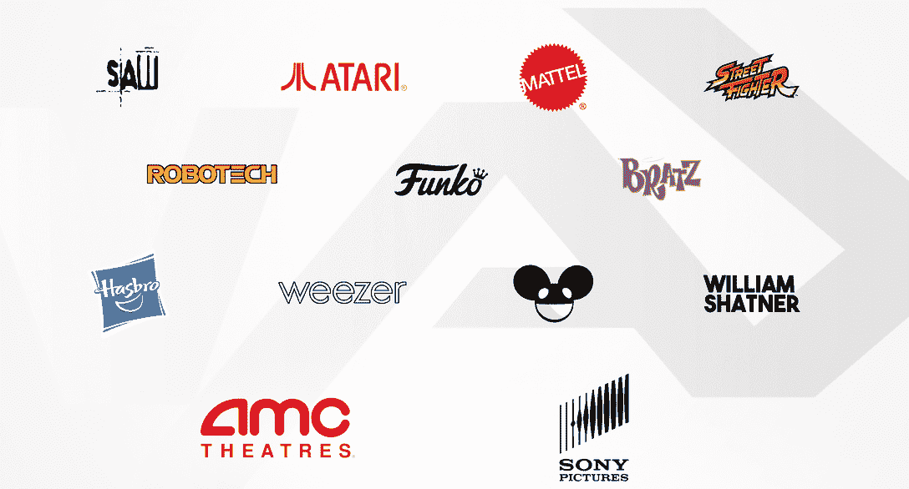
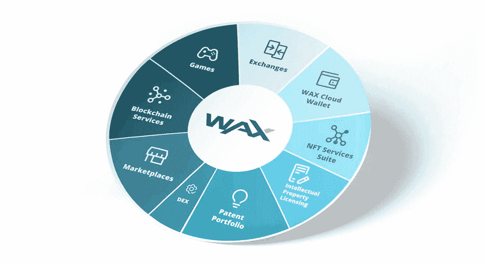

# 什么是 WAX:最成熟的游戏和非功能性游戏的 Web3 生态系统

> 原文：<https://web.archive.org/web/https://dappradar.com/blog/what-is-wax>

## 蜡像区块链及其生态系统的权威指南

**WAX 是一家领先的区块链网络，成功促进了数百万笔非金融交易。它为 NFT 项目、dapps 和游戏提供了一个可扩展的、生态友好的、分散的生态系统。WAX 致力于为用户创建、购买、出售和交易加密资产提供最安全、最用户友好的方式。**

游戏产业持续增长，每年创造数千亿美元的收入。[根据埃森哲的估计，](https://web.archive.org/web/20220921031652/https://www.accenture.com/us-en/insights/software-platforms/gaming-the-next-super-platform)全球游戏市场的总价值已经超过 3000 亿美元。然而，如此巨大的市场价值主要被集中的游戏公司获取，这些公司决定了用户应该如何游戏和付费。

突然，区块链的出现给了用户一个全新的视角来重新定义游戏。目的是创造一个玩家拥有的经济，允许数字资产所有权利用区块链技术。

值得注意的是， [WAX](https://web.archive.org/web/20220921031652/https://dappradar.com/rankings/protocol/wax) 站在实现这一目标的最前沿。像[外星人世界](https://web.archive.org/web/20220921031652/https://dappradar.com/wax/games/alien-worlds)、[农民世界](https://web.archive.org/web/20220921031652/https://dappradar.com/wax/games/farmers-world)和[采矿网络](https://web.archive.org/web/20220921031652/https://dappradar.com/wax/games/miningnetwork)这样的蜡像游戏在最受欢迎的区块链游戏中排名靠前。

内容:

*   [蜡是什么？](https://web.archive.org/web/20220921031652/https://dappradar.com/blog/what-is-wax/#what-is-wax)
*   蜡像区块链是如何工作的？
    *   [WAX 使用委托利益证明(DPoS)共识。](https://web.archive.org/web/20220921031652/https://dappradar.com/blog/what-is-wax/#dpos-consensus)
    *   [WAX 服务层提供全套开发工具和服务](https://web.archive.org/web/20220921031652/https://dappradar.com/blog/what-is-wax/#service-layer) [s.](https://web.archive.org/web/20220921031652/https://dappradar.com/blog/what-is-wax/#The WAX Service Layer provides a full set of development tools and services.)
        *   [蜡云钱包](https://web.archive.org/web/20220921031652/https://dappradar.com/blog/what-is-wax/#cloud-wallet)
        *   [Cre](https://web.archive.org/web/20220921031652/https://dappradar.com/blog/what-is-wax/#nft-creator) [在蜡上吃了 NFTs](https://web.archive.org/web/20220921031652/https://dappradar.com/blog/what-is-wax/#WAX NFT Creator)
        *   [蜡快递贸易和蜡市场](https://web.archive.org/web/20220921031652/https://dappradar.com/blog/what-is-wax/#expresstrade) [地点](https://web.archive.org/web/20220921031652/https://dappradar.com/blog/what-is-wax/#WAX ExpressTrade and WAX Marketplace)
*   [什么是蜡令牌？](/web/20220921031652/https://dappradar.com/blog/wp-admin/post.php)
*   [蜡上有哪些流行的 dapps？](https://web.archive.org/web/20220921031652/https://dappradar.com/blog/what-is-wax/#popular-dapps)
    *   [游戏](https://web.archive.org/web/20220921031652/https://dappradar.com/blog/what-is-wax/#games)。
    *   [市场](https://web.archive.org/web/20220921031652/https://dappradar.com/blog/what-is-wax/#marketplaces)。
*   [继续用 DappRadar 跟踪蜡](https://web.archive.org/web/20220921031652/https://dappradar.com/blog/what-is-wax/#track)

## 什么是区块链蜡像？

WAX 代表全球资产交易所，是一个专门为最活跃的加密领域(如游戏和虚拟世界)提供支持的区块链。WAX 被称为“NFTs 之王”，它为希望利用 NFTs 来升级其收入模式的企业提供了一个高能效、高性价比的数字资产生态系统。

它成功地支持了许多合作伙伴，包括 Topps(美国职业棒球大联盟)，Capcom(街头霸王)，Funko，Atari，索尼的 Funimation，以及著名的电影(公主新娘和锯)，世界知名的艺人(Deadmau5，Weezer，和威廉·夏特纳)，等等。

## 蜡像区块链是如何工作的？

WAX 平台结合了 WAX 协议区块链和微服务层。特殊设计的 WAX 架构高效、安全、环保。得益于其基于区块链的全套工具，开发者可以利用 WAX 平台更好地满足他们用户的需求。

### WAX 使用委托利益证明(DPoS)共识

WAX 使用委托股权证明(DPoS)共识模型，在该模型中，一组 WAX 行会管理大宗生产。DPoS 共识模型将实时投票机制与授权流程相结合，以在整个区块链达成共识。在蜡像区块链，21 个蜡像公会因生产砖块而获得奖励。

DPoS 提供比 PoS 和 PoW 更快的交易。此外，它更节能。授权过程通过民主投票系统进行，确保公平。

### WAX 服务层提供了一整套开发工具和服务

WAX 服务层提供了一整套基于区块链的工具和服务，允许开发人员在 WAX 上构建项目。以下是一些关键的微服务，可以护送团队顺利整合蜡区块链。要了解更多关于如何在 WAX 上开发项目的信息，开发者也可以[访问开发者门户](https://web.archive.org/web/20220921031652/https://developer.wax.io/)。

#### 蜡云钱包

WAX 网络拥有自己的免费加密货币钱包，允许用户轻松访问 Wax 区块链应用程序。用户可以用电子邮件注册一个帐户，或者用他们的社交媒体帐户登录。

如果您想了解更多关于蜡云钱包注册流程的信息，DappRadar 创建了以下分步视频教程。

[https://web.archive.org/web/20220921031652if_/https://www.youtube.com/embed/0U1VTx8owbQ?feature=oembed](https://web.archive.org/web/20220921031652if_/https://www.youtube.com/embed/0U1VTx8owbQ?feature=oembed)

这款钱包简单易用，但功能强大。它让用户交换 ERC-20 蜡令牌，赌注任何蜡协议令牌，投票支持提案，查看 NFT，等等。

#### 在蜡上创建 NFT

WAX Creator 是一款免费工具，支持任何人在 WAX 区块链上几分钟内创建收藏品、游戏内资产和数字艺术等 NFT。用户不需要精通技术就可以用 WAX 创建 NFT。来自各个加密部门的项目已经使用 WAX Creator 在 WAX 区块链上创建了 NFT。

DappRadar 的这篇文章深入探讨了[用户如何构建 NFTs 并开展 WAX 销售。](/web/20220921031652/https://dappradar.com/blog/how-to-build-nfts-on-wax/)

#### 快速贸易和市场

WAX ExpressTrade 使游戏和元宇宙项目可以轻松地将他们的数字资产交易服务升级到点对点服务。WAX ExpressTrade API 为 marketplaces 提供了进入数十亿美元数字资产市场的途径。

世界上任何地方的任何规模的市场都可以利用 WAX ExpressTrade 来创建一个交易平台，以促进其内 dapp 经济。

## 什么是蜡令牌？

蜡像区块链的生态标志也叫做[蜡像](https://web.archive.org/web/20220921031652/https://dappradar.com/hub/token/eth/WAX/ETH?from=0x39bb259f66e1c59d5abef88375979b4d20d98022)。WAX Token 模型旨在帮助发展 WAX 生态系统的多种活动，包括赌注、奖励、投票和交易结算。

赌注蜡令牌使令牌持有者能够在蜡区块链上投票，并获得蜡赌注奖励。个人用户可以使用蜡代币从生态系统中领先的市场 AtomicHub 购买物品。

通过此链接了解更多关于蜡像模型[的信息。](https://web.archive.org/web/20220921031652/https://github.com/worldwide-asset-exchange/whitepaper#wax-token-model)

## 蜡上有哪些流行的 dapps？

《异形世界》、《农民世界》和《夹板地》等游戏 dapps 不时挤掉 DappRadar 游戏排名。随着蜡上的游戏 dapps 不断获得牵引力，它自然会促进蜡市场的繁荣。现在我们来看看哪些 dapps 在 DappRadar 上的排名是板上钉钉的，哪些是后起之秀。

#### 游戏。

[根据 DappRadar BGA Q2 报告](/web/20220921031652/https://dappradar.com/blog/dappradar-x-bga-games-report-q2-2022/)，在 2022 年熊市期间，玩赚游戏和游戏相关的非功能游戏表现优于区块链其他行业，并继续推动区块链的大规模采用。蜡像游戏也是如此。

30 天用户量排名前十的游戏如下。

1.  玩并赢得[外星世界](/web/20220921031652/https://dappradar.com/blog/what-is-alien-worlds/) | [单人 Dapp 页面](https://web.archive.org/web/20220921031652/https://dappradar.com/wax/games/alien-worlds)
2.  如何玩[农民世界](/web/20220921031652/https://dappradar.com/blog/farmers-world-fastest-growing-play-to-earn-game-on-wax/) | [单人 Dapp 页面](https://web.archive.org/web/20220921031652/https://dappradar.com/wax/games/farmers-world)
3.  如何玩[矿网](/web/20220921031652/https://dappradar.com/blog/the-miningnetwork-game-on-wax-attracted-more-than-800k-users-within-30-days/) | [单人 Dapp 页面](https://web.archive.org/web/20220921031652/https://dappradar.com/wax/games/miningnetwork)
4.  [袋熊地下城主](https://web.archive.org/web/20220921031652/https://dappradar.com/wax/games/farmers-world)
5.  [探矿者](https://web.archive.org/web/20220921031652/https://dappradar.com/wax/games/prospectors)
6.  [玉米卷](https://web.archive.org/web/20220921031652/https://dappradar.com/wax/games/taco)
7.  [区块链格斗家](https://web.archive.org/web/20220921031652/https://dappradar.com/blog/blockchain-brawlers-join-the-rowdiest-game-in-the-metaverse-and-earn-brwl)
8.  [龙之谷](https://web.archive.org/web/20220921031652/https://dappradar.com/wax/games/dragons-valley)
9.  [平面图](https://web.archive.org/web/20220921031652/https://dappradar.com/wax/games/r-planet)
10.  [火星上的数百万人](https://web.archive.org/web/20220921031652/https://dappradar.com/wax/games/million-on-mars)

#### 市场

Wax 于 2017 年推出，现已发展成为一个全方位的生态系统。“NFTs 之王”从来没有辜负过这个称号。每天，超过 500，000 名用户访问 WAX，并产生数百万次转换。NFT 蜡像馆的繁荣是其成功的有力证明。

下面我们来看看哪些市场是 WAX 的前三名。

1.  [原子丘](https://web.archive.org/web/20220921031652/https://dappradar.com/wax/marketplaces/atomicmarket)
2.  [石油区块](https://web.archive.org/web/20220921031652/https://dappradar.com/wax/marketplaces/neftyblocks)
3.  越冬

## 继续用 DappRadar 追踪蜡

毫无疑问，Wax 是业内发展最快的区块链网络。DappRadar 将继续监测和报告蜡及其生态系统的演变。

有一些有用的链接，让用户跟踪蜡的最新趋势。

*   [蜡上的趋势斑点](https://web.archive.org/web/20220921031652/https://dappradar.com/rankings/protocol/wax)
*   [蜡 NFTs](https://web.archive.org/web/20220921031652/https://dappradar.com/nft/protocol/wax)

在 [Twitter](https://web.archive.org/web/20220921031652/https://twitter.com/dappradar) 、 [Discord](https://web.archive.org/web/20220921031652/https://discord.gg/4ybbssrHkm) 和 [Youtube](https://web.archive.org/web/20220921031652/https://www.youtube.com/c/DappRadar) 上关注我们，跟上区块链世界的动态。