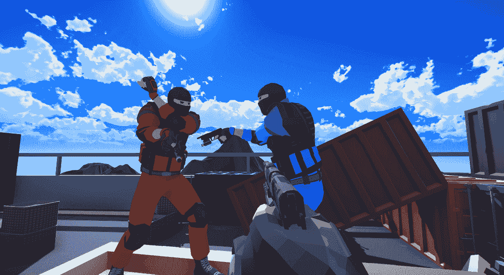
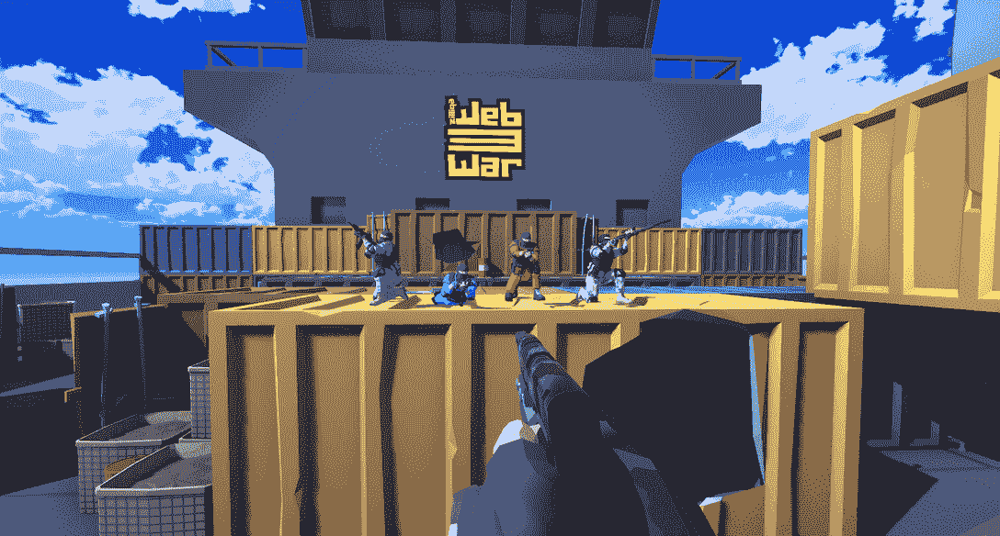
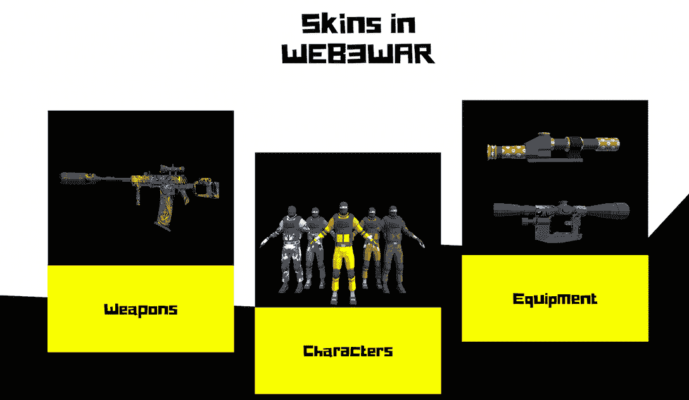

# 什么是 web 3 war:Zilliqa 上的一款面向铁杆游戏玩家的 FPS

> 原文：<https://web.archive.org/web/https://dappradar.com/blog/what-is-web3war-an-fps-on-zilliqa-targeting-hardcore-gamers>

## 由 Zilliqa 支持的支持全交叉播放的 PC 竞技射击游戏

Zilliqa 推出了其全新的第一人称射击游戏 WEB3WAR。射击游戏拥有令人难以置信的控制感和视觉效果，确保玩家获得 AAA 级体验。

总结:

*   当前的区块链游戏收到了很多铁杆玩家的负面评论。
*   Zilliqa 希望通过其新的高质量游戏 WEB3WAR 来扭转这种印象。
*   WEB3WAR 是一款技能驱动的第一人称射击游戏，奖励玩家出色的游戏表现。
*   那些动作干净利落、目标明确、武器装备选择有策略的人将会赢得现实世界的奖励。

由于大多数区块链游戏产品缺乏设计良好的游戏性和用户体验，我们不能责怪铁杆玩家讨厌 NFT 和加密游戏。有时，我们不确定将这些项目称为游戏是否合适。或许，称之为象征性投机的游戏化活动更有意义。

如果你对区块链游戏领域发生的事情感到好奇，可以看看 DappRadar 游戏排名

然而，这种现象的根本原因不是 NFTs 或 cryptos，而是使用这些工具的人的动机。区块链和 NFTs 无疑可以以各种方式为游戏提供支持，例如数字资产认证、所有权验证、玩家拥有的经济，或者只是简单的收集乐趣。

因此，当非功能性游戏增加了游戏的价值，可以为玩家提供真正的迷人体验时，他们可能不再需要在非功能性游戏和游戏之间做出选择。

Zilliqa 是一个高性能、安全和低成本的区块链网络，最近宣布了其即将推出的游戏名称 WEB3WAR。

[https://web.archive.org/web/20221206011758if_/https://www.youtube.com/embed/xmJqLB8QcvM?feature=oembed](https://web.archive.org/web/20221206011758if_/https://www.youtube.com/embed/xmJqLB8QcvM?feature=oembed)

## WEB3WAR 是什么？

对于《使命召唤》、《CS: GO》、《PUBG》和其他射击游戏的爱好者来说，WEB3WAR 也很有吸引力。看了预告片，不难体会到，Zilliqa 承诺把这款游戏做成 3A 级别的制作是相当靠谱的。此外，看 Zilliqa 与老牌游戏区块链网络如 [Polygon](https://web.archive.org/web/20221206011758/https://dappradar.com/rankings/protocol/polygon/category/games) 、 [Wax](https://web.archive.org/web/20221206011758/https://dappradar.com/rankings/protocol/wax/category/games) 和 [BNB 链竞争绝对值得期待。](https://web.archive.org/web/20221206011758/https://dappradar.com/rankings/protocol/binance-smart-chain/category/games)

WEB3WAR 为铁杆射击爱好者打造了一种精准的操控感。玩家可以选择自己的角色，手持不同的装备和武器，围绕各种具有挑战性的地图进行战斗。但是，最重要的是，在这个无情的战场上，技能和勇气会得到回报。

## WEB3WAR 允许玩家拥有他们所获得的

将游戏描述为“纯粹”的体验而不谈论其经济价值有点站不住脚。玩家期望他们的劳动成果和高超的技能能够带来相应的回报，这并不罕见。不然为什么那么多玩家在最终退出游戏的时候还会想方设法的卖账号赚钱？

WEB3WAR 打算通过区块链技术让这样的奖励机制更加透明和公平。在 WEB3WAR 中，从皮肤到游戏中的货币 FPS，玩家获得和解锁的一切都是他们的，可以保留、交易或出售。

此外，WEB3WAR 是一个高技能游戏，不仅奖励玩家的时间，还奖励他们的出色表现。为了证明自己是狙击手并有资格获得奖励，在 WEB3WAR 中参加常规战斗和季节比赛。

## 如何加入 WEB3WAR

WEB3WAR 的游戏上线准备工作正在紧锣密鼓的进行中。该团队将很快发布白皮书来解释游戏性、令牌组学、NFT 等等。一旦白皮书发布，我们将立即更新这篇文章，为您带来更全面的游戏介绍。与此同时，DappRadar 将继续关注 WEB3WAR 的最新进展。

如果你想体验市场上已经有的区块链游戏，请查看 DappRadar 游戏排名。在 [Twitter](https://web.archive.org/web/20221206011758/https://twitter.com/dappradar) 、 [Discord](https://web.archive.org/web/20221206011758/https://discord.gg/4ybbssrHkm) 和 [Youtube](https://web.archive.org/web/20221206011758/https://www.youtube.com/c/DappRadar) 上关注我们，跟上区块链世界的动态。

## 随身携带您的 Web3 之旅

使用 DappRadar 移动应用程序，再也不会错过 Web3。查看最受欢迎的 dapps 的性能，并关注您投资组合中的 NFT。您在 DappRadar 上的帐户会与我们的移动应用程序同步，这样您很快就可以选择实时接收提醒。

[Download the DappRadar app now](https://web.archive.org/web/20221206011758/https://dappradar.app.link/blog)[<picture></picture>](https://web.archive.org/web/20221206011758/https://play.google.com/store/apps/details?id=com.portfolio.dappradar)