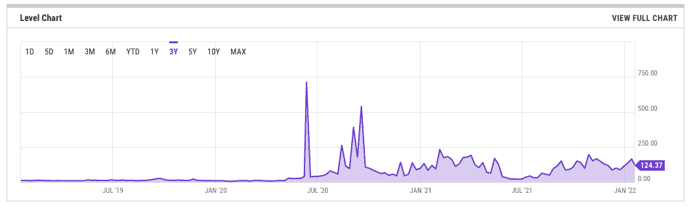
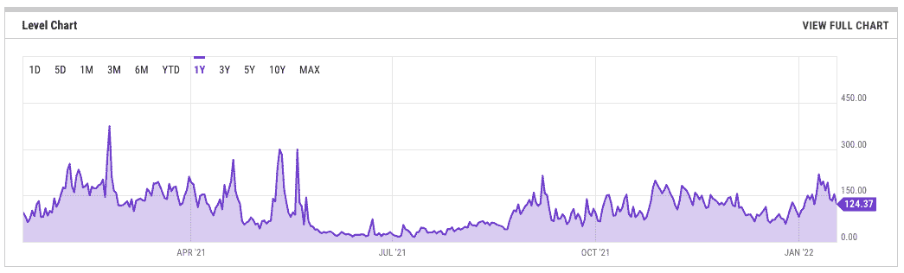
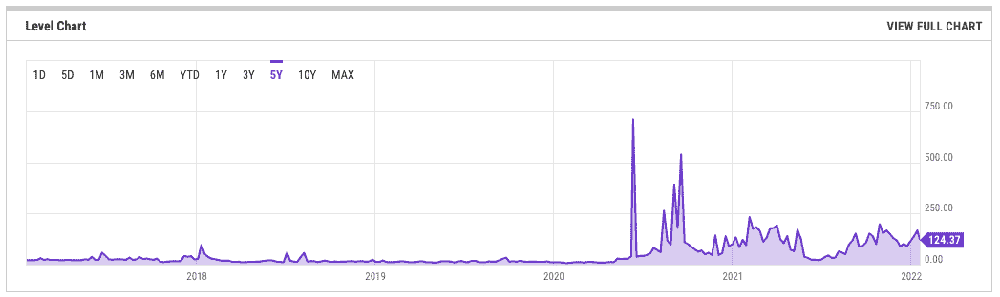
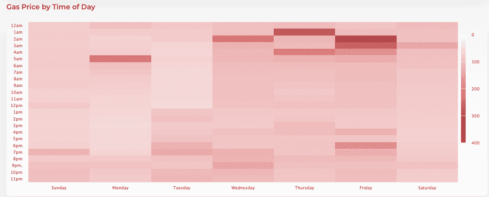

# 以太坊燃气费什么时候最低？

> 原文：<https://web.archive.org/web/https://dappradar.com/blog/when-are-ethereum-gas-fees-lowest>

## 有些日子和时间比其他日子和时间更好

什么时候以太坊的汽油费最低，什么时候是在以太坊上购买、交易和发送交易的最佳时机？作为一名 NFT 爱好者、投资者或交易者，你如何以尽可能低的油费优化你的活动？如果你想从投资中获得最大收益，这是至关重要的信息。

所有 ETH 交易都有费用，必须用汽油支付。天然气费的成本各不相同，由矿商根据当前的供需状况设定。本质上，以太坊燃气成本取决于:

*   目前对天然气的需求
*   处理智能合同的计算能力需求
*   交易总数
*   您希望执行的智能合约的大小

在以太坊网络上处理交易需要交燃气费。然而，燃气费可以随着高活动而暴涨。既然你已经了解以太坊网络是如何工作的，以及执行智能合约必须支付的费用，那么让我们找出飙升的主要原因，以及异常高的燃气费。什么时候会发生这种情况，是什么原因造成的？

## DeFi 导致了第一次高峰

以太坊是引入智能合约的第一个区块链。然后，反过来，允许开发人员在其上构建分散的应用程序或 dapps。随着越来越多的 dapps 抵达区块链，网络很快变得拥挤，天然气价格上涨。2020 年夏季，ETH 天然气价格上涨了 20 多倍，DeFi 对此做出了贡献。2022 年， [DeFi 是 dapp 活动的支柱](https://web.archive.org/web/20221201211733/https://dappradar.com/blog/2021-dapp-industry-report/#defi)。通过以太坊每天推动数千笔智能合约交易。

## NFT 的铸币和交易更是火上浇油

NFT 可以代表艺术或任何其他数字资产，任何人都可以通过在区块链上铸造它来创建 NFT。铸造过程需要收费，专门的 NFT 平台可以指导人们如何铸造和销售非功能性食品。

第一批 NFT 之一是一组名为 CryptoKitties 的虚拟猫。2017 年，CryptoKitties 推出，由于链上活动频繁而堵塞了以太坊网络。将汽油费从最初的 0.002 ETH 提高到 0.008 ETH。导致以太坊网络交易数量达到历史新高，都需要燃气费。

如今，[NFT 受到了前所未有的关注](https://web.archive.org/web/20221201211733/https://dappradar.com/blog/2021-dapp-industry-report/#nfts)，OpenSea、LooksRare 和 Foundation 等平台正在引导新投资者进入数字艺术和收藏品领域。更不用说现在越来越多的游戏加入了 NFTs。然而，这股巨大的 NFT 热潮导致天然气价格飙升。

## 指耗油量大的设备

在过去的三年里，随着越来越多的 dapps 和公用事业公司为 ETH 持有者提供服务，我们可以清楚地看到天然气费用的模式。纵观以太坊迄今为止五年的汽油费，我们可以看到明显的峰值导致现在正常化的情况，平均汽油费可能高达 100 美元。主要受“玩到赚”和“NFT dapps”的推动，dapps 在 2021 年 8 月底左右开始流行。

值得注意的是，这有助于一些著名的第 1 层、侧链和 EVM 兼容网络的兴起和发展。Polygon、Solana、Avalanche 和币安智能链脱颖而出，成为明显的领跑者。

## 雷达资格和申请

2021 年 12 月 14 日，DappRadar，即现在的全球 Dapp 商店，[发布了 RADAR](https://web.archive.org/web/20221201211733/https://dappradar.com/token/overview) 。用于[奖励平台用户和绑定社区](https://web.archive.org/web/20221201211733/https://docs.dappradar.com/v/radar-token/why-radar)的代币。作为一种启动方式，我们开始向 DappRadar 上以太坊 dapps 的历史用户空投雷达令牌。

迄今为止，大约 35%的合格钱包已经认领。这些钱包和用户索赔的截止日期是 2022 年 3 月 14 日。以太坊天然气费可能在社区的一些索赔能力中发挥作用，或在 SushiSwap 目前可用的 2x 产量农场中设立雷达。

虽然我们不能创造一个神奇的公式，使天然气费消失。我们可以洞察何时采取行动并获得关注。

[<picture></picture>](https://web.archive.org/web/20221201211733/https://dappradar.com/token/airdrop)[<picture></picture>](https://web.archive.org/web/20221201211733/https://docs.dappradar.com/v/radar-token/radar-tokenomics )[<picture></picture>](https://web.archive.org/web/20221201211733/https://discord.gg/dappradar)

## 以太坊燃气费什么时候最低？

下面的热图使用撰写本文时前两周的数据计算了每个 1 小时窗口的标准天然气价格的平均值。如上所述，重要的是要记住，在任何给定的时刻，特定的事件都可能大幅增加汽油费。一次性事件，如新的 NFT 系列正在铸造或新的赌注或空投机会。虽然下面是一个很好的指标，但用户可以随时[查看实时数据](https://web.archive.org/web/20221201211733/https://ethereumprice.org/gas/)以获得准确的日常信息。

Source: [https://ethereumprice.org/gas/](https://web.archive.org/web/20221201211733/https://ethereumprice.org/gas/)

世界协调时周一至周五的凌晨 1 点至 5 点是以太坊交易最昂贵的时间。星期五只是一个热天，应该完全避免。如果你想支付最低的以太坊费用，你应该在 UTC 晚上 9 点到 11 点之间进行交易。周末也更有利，UTC 时间晚上 10 点到 11 点之间费用最低。

您应该考虑到大多数交易是在美国、欧洲和亚洲进行的。从历史上看，周六和周日是汽油费较低的日子，因为不是每个人都在工作。从以太坊较低的燃气费中获益的一个简单方法就是避开人们在办公桌前的时间。

你可以在一天中的[时间](https://web.archive.org/web/20221201211733/https://ethereumprice.org/gas/)之前在以太坊上看看汽油费的价格。您还可以在[这里](https://web.archive.org/web/20221201211733/https://gitcoin.co/gas/history)实时查看 gwei 的气价。使用[这个](https://web.archive.org/web/20221201211733/https://nomics.com/markets/gwei-gwei/usd-united-states-dollar)将 gwei 转换成美元。

 NewsletterUnsubscribe at any time. [T&Cs](https://web.archive.org/web/20221201211733/https://dappradar.com/terms) and [Privacy Policy](https://web.archive.org/web/20221201211733/https://dappradar.com/privacy-policy)

***以上不构成投资建议。此处给出的信息仅供参考。请行使尽职调查，做你的研究。作者持有 ETH、BTC、AGIX、HEX、LINK、GRT、CRO、OMI、不变 X、ENS、GALA、AVASTR、GMEE、CUBE、RADAR、FLOW、FTM、BNB、SPS、WRLD、ATOM 和 ADA。***