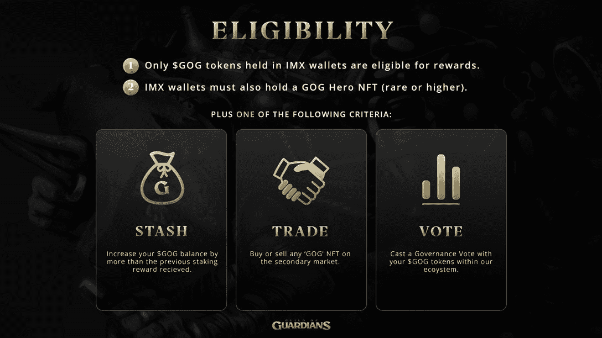
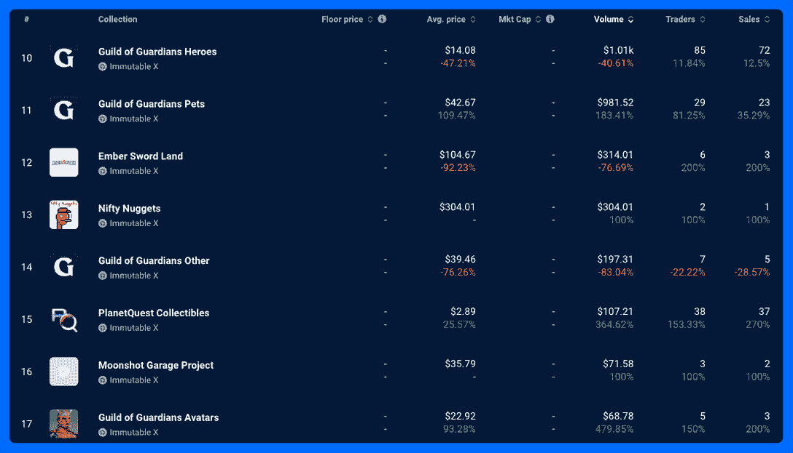

# 为什么 NFT 守护者协会的交易量上升了 480？

> 原文：<https://web.archive.org/web/https://dappradar.com/blog/why-are-guild-of-guardians-nft-trading-volumes-up-480>

## 引入赌注后，英雄的销售额增加了 35%

11 月 7 日，手机角色扮演游戏守护者协会为其 GOG 代币推出了一个新的赌注计划，其 NFT 销售额的连锁指标飙升。代币价格下跌，加密货币市场的其他部分也是如此。但是守护者协会社区显示了它对游戏的承诺。

**亮点**

*   英雄的每日交易者增长了 11.84%，而销售计数增长了 12.5%。在守护协会的其他非功能性食物系列中，他们的链上指标有了更大的增长。
*   守护者协会为其游戏中的象征 GOG 引入了一个新的赌注程序。赌注奖金池坐拥价值 500 万美元的 GOG 代币作为奖励。赌注将持续六个月。
*   早期的支持者将获得更多的奖励，那些将 GOG 放在不变的 X 钱包里并长期持有其代币的人也是如此。

[Check GOG NFT Sales](https://web.archive.org/web/20230120063746/https://dappradar.com/nft/protocol/immutablex)

## 守护者联盟

Guardians guild 是一款基于 Immutable X 的移动角色扮演游戏。他们于 11 月 7 日启动了赌注计划，赌注者已经开始累积奖励。用户需要满足各种标准和一些奖金奖励，下注者应该知道，以最大限度地提高他们的收入。

> 𝐆𝐎𝐆 𝐀𝐜𝐭𝐢𝐯𝐞 𝐒𝐭𝐚𝐤𝐢𝐧𝐠 𝐑𝐞𝐰𝐚𝐫𝐝 𝐂𝐥𝐚𝐫𝐢𝐟𝐢𝐜𝐚𝐭𝐢𝐨𝐧 & 𝐫𝐞𝐥𝐨𝐜𝐤!
> 
> 守护者，这里有一些重要的说明，&如何有资格&计算奖励🧵👇
> 
> — GuildOfGuardians (@GuildOfGuardian) [November 4, 2022](https://web.archive.org/web/20230120063746/https://twitter.com/GuildOfGuardian/status/1588399763187437568?ref_src=twsrc%5Etfw)

Guild of Guardians staking announcement

要赢得 GOG 赌注奖励，用户需要有一个 IMX 钱包，其中包含一些 GOG 代币和一个稀有(或更高)的守护者英雄 NFT 公会。此外，奖励期间需要发生以下三件事之一。

GOG staking eligibility criteria

首先，用户可以增加他们的 GOG“余额超过以前的赌注奖励收到”。第二，他们可以在守护者协会生态系统中用他们的 GOG 令牌投治理票。

最后一个选择，这也解释了过去一周 NFT 销量大幅上升的原因，希望获得赌注奖励的用户可以“在二级市场上买卖任何 NFT 守护者协会”。

Check GOG Token Price

## 守护者协会 NFT 销售爆炸

看看《守护者协会》在 NFT 的 24 小时销售，我们可以看到他们全面增长。英雄、宠物和头像系列的环比指标都有所上升。

英雄非战斗堡垒略有下降，因为持有英雄非战斗堡垒是获得 GOG 代币奖励的标准之一。上周每个人都争先恐后地买卖它们，我们已经看到交易量随后下降，因为大多数人都这样做了。

Data source: [DappRadar](https://web.archive.org/web/20230120063746/https://dappradar.com/nft/collections/protocol/immutablex)

在过去的 24 小时里，宠物 NFT 集合在我们追踪的每个指标上都上升了。平均价格上涨了一倍多，交易量增长了 183%以上。交易商的数量和销售额也有了可观的增长。

头像系列也是如此。同样，百分比的增长是巨大的，但重要的是要注意，这里的基数很小。因此，尽管统计数据有巨大的增长，但实际上，变化并不大。有趣的是，不适合其中一个收藏的守护协会非功能物品的交易已经减少了。

## 一些增加奖励的必做之事

以下是你如何在《守护者协会》中最大化你的收入潜力:

*   [设置 MetaMask 钱包](https://web.archive.org/web/20230120063746/https://dappradar.com/blog/what-is-metamask)购买下注所需的各种代币。例如，你需要[联邦理工学院](https://web.archive.org/web/20230120063746/https://dappradar.com/hub/token/eth/ETH)来支付过渡汽油费和 GOG 作为赌注奖励。
*   任何在 11 月 13 日之前将代币存入 [IMX](https://web.archive.org/web/20230120063746/https://dappradar.com/hub/token/eth/IMX?from=0xf57e7e7c23978c3caec3c3548e3d615c346e79ff) 的人都将获得双倍奖励。
*   在该计划的第一周下注的用户将在 12 个月内开始他们的连续下注，而不是零天。所以早点来是值得的。
*   你的 GOG 必须存放在不可改变的 X 上，并且你必须拥有一个稀有或更高级的守护者协会英雄 NFT 才能获得奖励。

最后一件事:守护者协会将在 2022 年 12 月发出第一批奖励。

[Explore GOG Dapp Data](https://web.archive.org/web/20230120063746/https://dappradar.com/multichain/games/guild-of-guardians)

## 随身携带您的 Web3 之旅

使用 DappRadar 移动应用程序，再也不会错过 Web3。查看最受欢迎的 dapps 的性能，并关注您投资组合中的 NFT。您在 DappRadar 上的帐户会与我们的移动应用程序同步，这样您很快就可以选择实时接收提醒。

[Download the DappRadar app now](https://web.archive.org/web/20230120063746/https://dappradar.app.link/blog)[<picture></picture>](https://web.archive.org/web/20230120063746/https://play.google.com/store/apps/details?id=com.portfolio.dappradar)