# 为什么 NFT 避开了加密崩溃？

> 原文：<https://web.archive.org/web/https://dappradar.com/blog/why-are-nfts-sidestepping-the-crypto-crash>

## 挑衅的独家报道

*注意:为什么 NFTs 避开了 Crypto 崩溃:[2022 年 1 月 28 日由《挑衅者》首次发表](https://web.archive.org/web/20221207010728/https://thedefiant.io/dappradar-nft-report/)*

最近几周，一系列宏观经济事件震动了市场，提醒所有人该行业的潜在风险和无处不在的波动性。哈萨克斯坦围绕比特币挖矿的问题掀起波澜。随着新的 COVID 爆发，对美联储可能加息的不安以及乌克兰最新的政治问题创造了一个不利的环境，拖累了资本市场。

加密市场和传统市场之间的相关性使得区块链资产普遍感受到了这种效应，比特币和以太坊(Ethereum)的 ETH 自去年 11 月创下历史高点以来已缩水一半。BNB、阿达、索尔、阿瓦克斯、桑德、马纳、加拉和其他几个历史上表现良好的加密货币也是如此。在此期间，加密技术的总市值从 2.9T 美元缩水至 1.6T 美元。

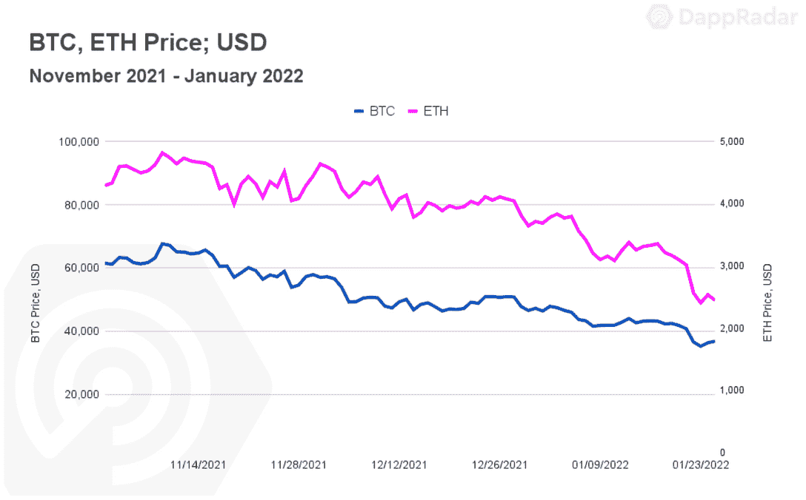

毫无疑问，加密市场目前正经历一个充满挑战的时期。市场情绪显示出恐惧。然而，与 NFTs 等[特定区块链垂直市场的绩效相关的指标可能会有不同的暗示。](https://web.archive.org/web/20221207010728/https://dappradar.com/nft)

## 理解 NFT 宏观经济学

虽然一系列事件阻碍了加密市场，但一系列因素在宏观经济层面对非加密技术的前景产生了积极影响。

首先，NFT 世界对名人和大品牌的包容似乎与日俱增。像小内马尔(在推特和 Instagram 上拥有+2 亿粉丝)和 T2(在推特和 Instagram 上拥有+1.92 亿粉丝)这样拥有广泛社交影响力的明星已经公开宣布他们最近加入了无聊猿游艇俱乐部(BAYC)，这是 NFT 的首要项目之一。

为了使影响更加深远，Twitter，也许是最受加密和 NFT 爱好者欢迎的社交媒体平台，几天前在社交平台中推出了第一个 web3 功能。社交媒体平台 Instagram 和脸书预计将紧随其后。与此同时，零售巨头沃尔玛已经为 NFT 申请了几个商标。

这些资产越来越受欢迎。对“NFT”一词的搜索第一次超过了对“密码”的搜索。此外，来自亚洲的兴趣增加是有希望的。由北美和欧洲用户主导的市场现在将欢迎亚洲 NFT 观众。

## NFTs 链上指标讲述了一个看涨的故事

[NFTs 单枪匹马创造了](/web/20221207010728/https://dappradar.com/blog/2021-dapp-industry-report/)去年我们在区块链行业看到的最令人印象深刻的指标之一。仅在 2021 年，这类资产就创造了总计 250 亿美元的收入。这比之前四年的总和高出了 18，414%。

在加密货币苦苦挣扎的时候，[NFT 似乎正在蓬勃发展](https://web.archive.org/web/20221207010728/https://dappradar.com/nft)。将分析范围缩小到以太坊，它占去年交易量的 75%，我们看到了积极的趋势。NFT 在区块链的销量和用户数量都有所增加，与 NFT dapps(收藏品和市场)相连的独特活动钱包(UAW)也是如此。

自 2021 年 12 月以来，平均每天有超过 53300 名 UAW 连接到[以太坊 NFT dapps](https://web.archive.org/web/20221207010728/https://dappradar.com/nft/protocol/ethereum) 。这比去年第三季度的数字高出 43%。

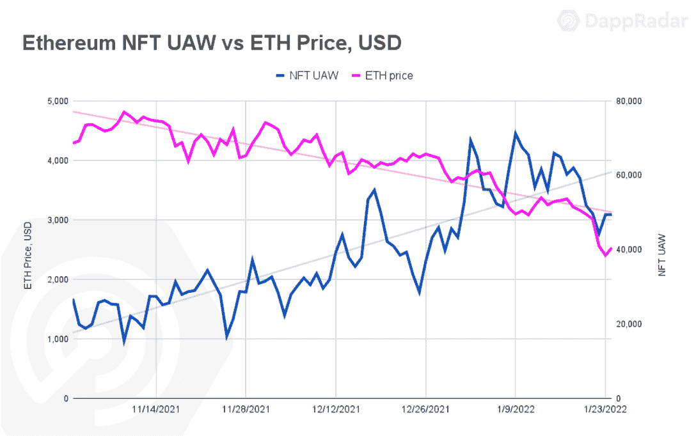

除了积极的宏观经济事件，尽管加密货币指标不利，但 NFT 在“玩到赚”和元宇宙叙事中的核心作用也有助于看涨链指标。寻求一种分散的、可互操作的元宇宙有益于 NFTs。

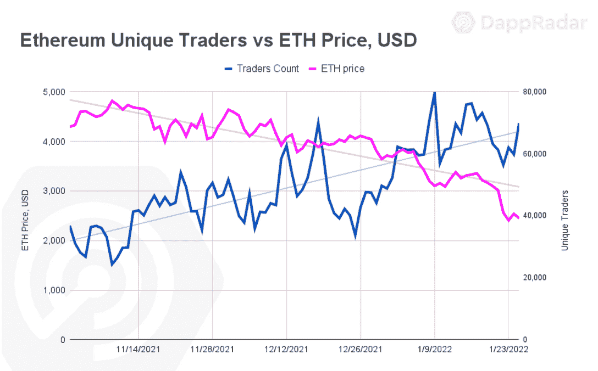

此外，由于支持 NFTs 的基础资产的价值处于下行，个人可能会将加密货币的负面趋势视为买入机会。虽然一月还没有结束，但独特的交易者比以往任何时候都多。

创纪录的 160 万独立交易者推动以太坊 NFT 创造了超过 37 亿美元的销售额，[不包括旁观的人](/web/20221207010728/https://dappradar.com/blog/marketing-genius-or-foul-play-two-wallets-generate-1-1-billion-on-looksrare/)，并有望打破 2021 年 8 月创下的 45 亿美元的纪录。

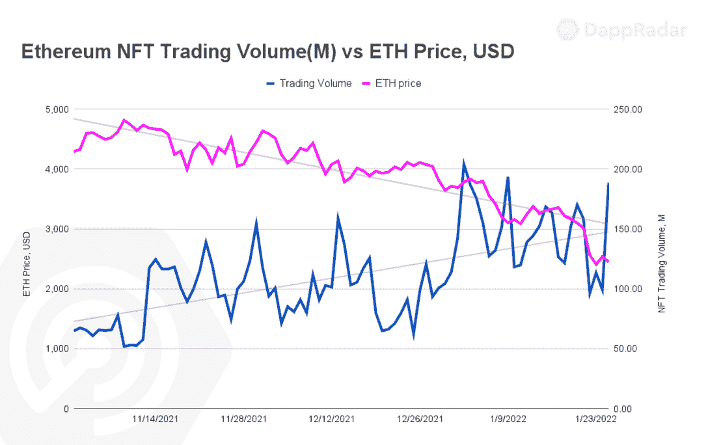

这组链上指标讲述了采用新资产类别和市场积极情绪的故事。尽管如此，另一个衡量标准让 NFTs 的升值更加明显:底价。

## 底价分析

底价是评估 NFT 藏品最重要的指标之一，尤其是从投资者的角度来看。NFT 系列的底价是最低的要价，也是最低的进入门槛。

最近对一些基本以太坊收藏品的底价分析表明，非功能性交易就像是储存价值的资产。一类资产的表现优于重要的加密资产，甚至优于黄金或标准普尔 500 指数等传统资产。

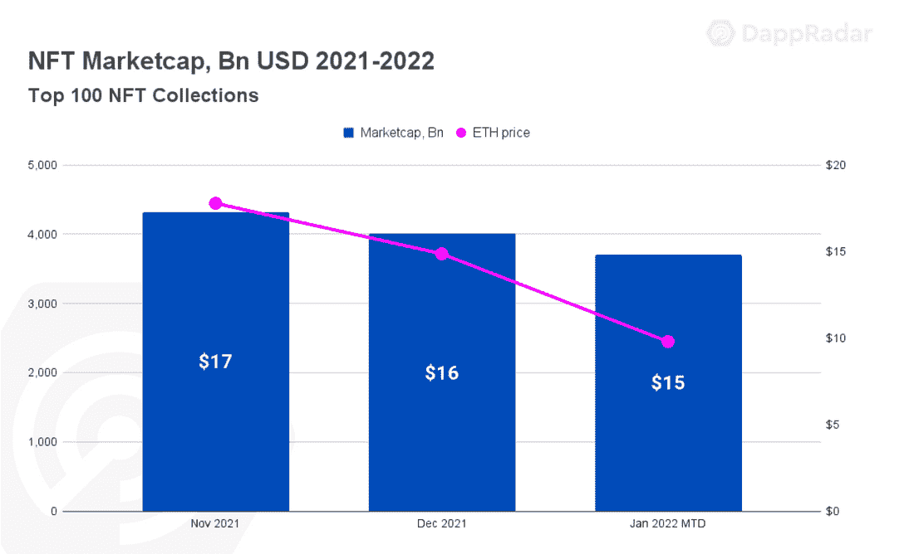

NFT 空间的价值作为一个整体正在增加。根据 NFT 前 100 名藏品的底价市值，NFT 的价值比 11 月份下降了 24 亿美元，目前估计为 148 亿美元。尽管 ETH 遭受了 50%的打击，但交易最多的藏品的价值几乎没有受到 15%的影响，这表明该类别抵御了崩溃。

对积极的 NFT 趋势有直接影响的 NFT 系列之一是 BAYC T1。11 月初，当 BTC 和 ETH 达到顶峰时，该系列的底价在 30 ETH 左右浮动。一周后，尽管 ETH 的价格下跌了 15%,但 BAYC 的地板价格上涨了 60%以上，超过了 50 ETH。

到年底，60 ETH 就可以买到最便宜的 BAYC，已经超过 90 ETH 了。这意味着，要购买最实惠的 Bored Ape，按照目前的 ETH 价格，一个人必须花费超过 225，000 美元。

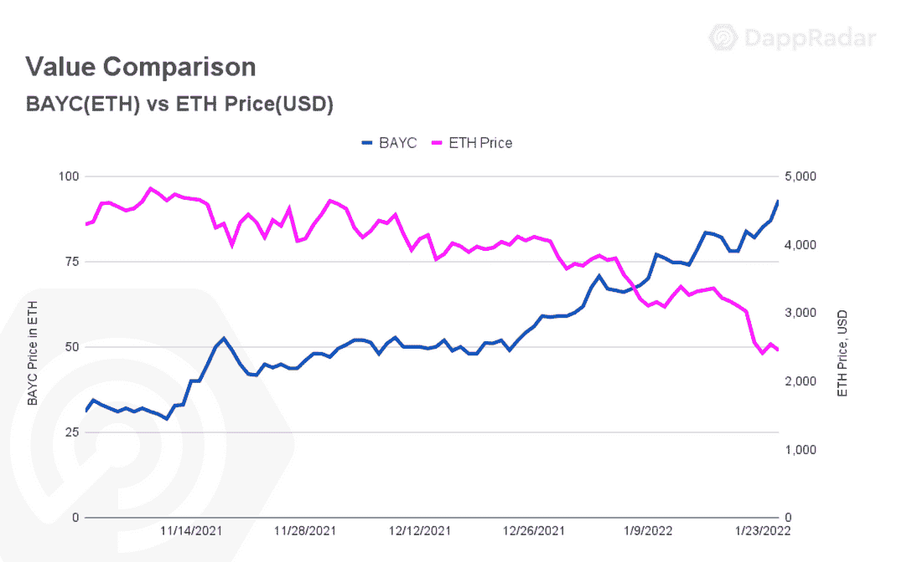

虽然最重要的加密技术在过去两个月里损失了大约一半的价值，但从 11 月 10 日起，BAYC 的 ETH 指数上涨了 207%。但最重要的是，以美元衡量，该系列的实际价值已经上涨了 14%。从 11 月 10 日到今天持有 BAYC 将代表 14%的资本收益，而持有任何相关的 cryptos 将净损失约 50%。公平地说，BAYC 已经成为一种储存价值的资产类别。

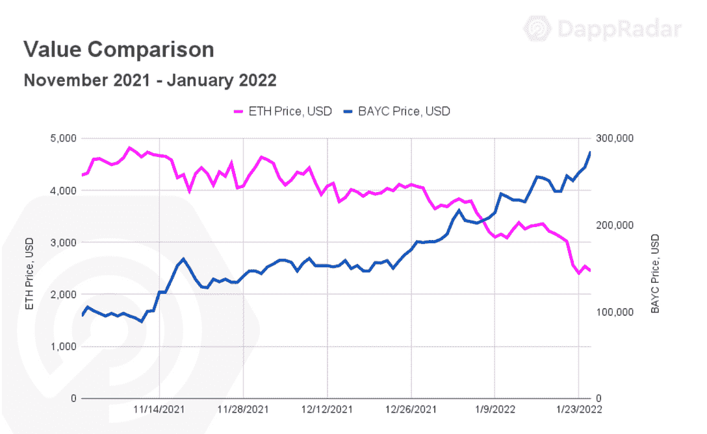

BAYC 并不是唯一一个增值的头像收藏。从 11 月 10 日起，以太坊的另一个虚拟人物系列《女人世界》的 ETH 上涨了 383%，同期的实际价值上涨了 185%。自去年 12 月以来，CyberKongz 和他们的体素(VX)版本的实际价格分别下跌了 27%和 68%。Doodles 也是如此，其底价自去年 11 月以来已经上涨了 224%。

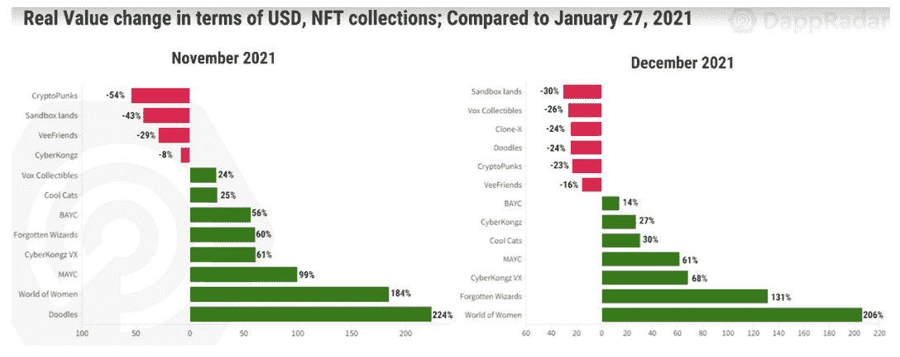

在与历史相关的 NFT 收藏品 CryptoPunks 的案例中，分析起来更加棘手。尽管这个系列的表现不如其他同类，但朋克仍然胜过了一些基于加密的资产。11 月 2 日，Cryptopunks 下限达到 100 ETH，一周后降至 83 ETH，同一天，BTC 和 ETH 达到历史最高水平。

自该日起，ETH 的底价下降了 9.6%。而实际价值仅从 254，000 美元缩水到 229，000 美元。尽管如此，可以肯定地说，密码朋克是储存价值的资产。

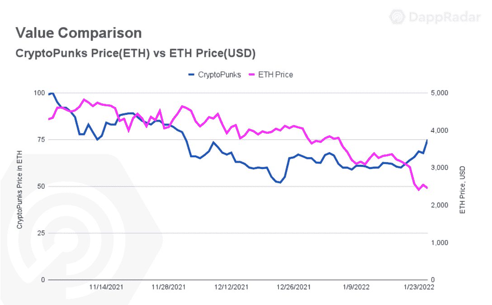

虚拟角色的价值显著增加，但与虚拟世界和游戏相关的非功能性游戏表现异常出色。这就是被遗忘的符文巫师的情况，他们在瑞士联邦理工学院的底价从 11 月 10 日起上涨了 210%，其实际价值比 12 月高出 132%。同样，自去年 11 月以来，按照 ETH 计算，Gala Games VOX NFTs 的底价上涨了 145%。

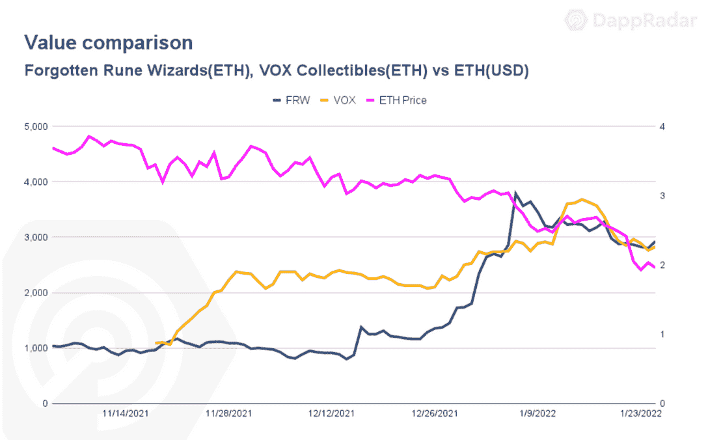

代表虚拟世界的 NFT 持有从元宇宙炒作周期中获得的价值。例如，[沙盒](https://web.archive.org/web/20221207010728/https://dappradar.com/ethereum/marketplaces/the-sandbox-marketplace)和[分散土地](https://web.archive.org/web/20221207010728/https://dappradar.com/ethereum/marketplaces/decentraland)中的虚拟土地保持了脸书更名公告后的底价水平，尽管其实际美元价值有所下降。

与此同时，尽管出现了负面的加密趋势，但自去年 11 月以来，全球 Webb 内部虚拟公寓的地板价格已经上涨了 242%,而 Cryptovoxels 的地板价格比 11 月高出 17%。

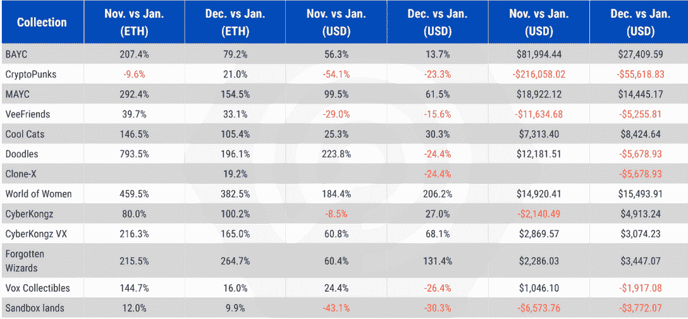

从投资角度来看，分析藏品的底价有助于了解项目的稳定性。最近的分析证实，一些非金融交易抵制了整个市场的负面趋势。但是为什么会出现这种情况呢？为什么 NFT 能够抵抗加密货币价格的变化？

这个问题的答案可能不那么简单。某些因素的结合使得一些非上市公司对理性投资者有吸引力。

## 文化价值和采用

有一种观点认为，某些非物质文化遗产应该被视为文化遗产，而不是数字资产。就像某些艺术品一样，某些非金融资产可能会被一些人视为真正的投资机会。通过佳士得 6900 万美元的拍卖，毕普拍卖行的“前 5000 天”向新观众介绍了不可替代的代币。像 Fidenza、Ringers 或 Autoglyphs 这样的生殖艺术收藏正在以新的表达方式出现，至少价值数千美元。

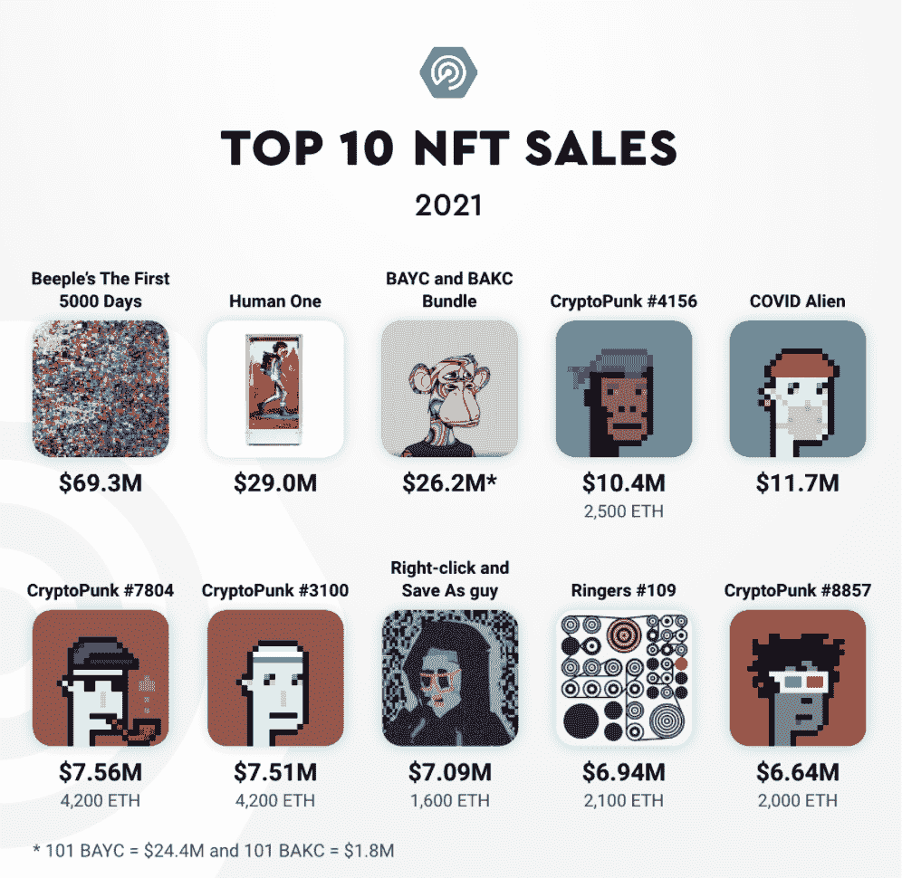

以同样的方式，BAYC 和 CryptoPunks 进入了主流舞台。8 月 23 日，VISA 宣布以 15 万美元收购 CryptoPunk #7610，巩固了 Punk 作为资产储存价值的地位。此外，BAYC 收藏的 101 件作品在苏富比以 2400 万美元的价格拍卖。

目前，只有少数几个系列达到了这一水平。尽管如此，在音乐、门票、体育和时尚方面的潜在应用即将出现。总而言之，NFT 融合了人类深层的情感。只有时间能告诉我们，一些非传统文化是否会产生超越几代人的文化影响。

## 效用

成功的 NFT 项目共享的一个重要方面是给予其社区成员的回报:通过持有这些项目的 NFT 而继承的附加值或效用。

例如，在 CryptoPunks 所有者收到一个免费的 Meebit 后，幼虫实验室推广了一个实用蓝图，增加了初始投资的实际资本收益。对于酷猫(ETH 的底价从 11 月 10 日起上涨了 150%)、Meta Key (370%)、Doodles 或 BAYC 本身等项目来说，情况也是如此。

效用也可以在高产 NFT 中找到。每天分发本地实用令牌的项目，如 CyberKongz 和他们的香蕉令牌。Genesis Kongz 的持有者在写作时每天会收到十个价值 24 美元的香蕉代币。在 SupDucks (35%)和 VOLT token 以及酷猫和它们未来的牛奶 token 中也发现了类似的情况。

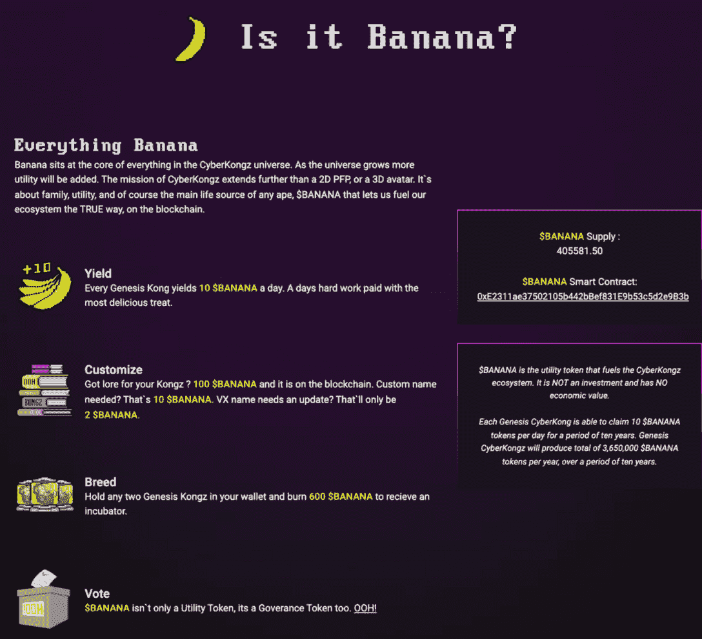

*BANANA utility framework;* **source:** [CyberKongz](https://web.archive.org/web/20221207010728/https://www.cyberkongz.com/banana)

此外，NFT 与 DeFi 和游戏等其他类别相融合。DeFi 和 NFTs 融合的一个明显代表是像 NFTfi 这样的平台，它们允许用户使用 NFTs 作为抵押品。NFT 的细分，或像 Pixel Vault 这样的项目，其 meta hero Universe(57%)NFT 可以被押在农场 POW 令牌上。

当然，还有完全相关的游戏元素。尽管 ETH、SOL、GALA 和 AURY 的价格大幅下跌，但 Mirandus NFTs 和 Aurory Villagers 都保持了其底价。我们之前也观察了对被遗忘的符文巫师的评价，这是另一个带有游戏机制的 NFT 收藏。尽管保持众多游戏选择的底价是一项挑战，但可以肯定地说，对区块链游戏的需求正在上升，增加了这些类型的非功能性游戏的价值。

## 名人和传统大玩家的参与

另一个积极塑造非物质文化遗产的相关趋势是名人和知名品牌的参与。随着 NFL 的 Dez Bryant、NBA 的斯蒂芬·库里、Post Malone、Snoop Dogg 和 Eminem 等体育巨星加入精英俱乐部，BAYC 开始获得动力。

在迎来了吉米·法伦、帕丽斯·希尔顿、内马尔和凯文·哈特之后，BAYC 社区变得更加排外。名人的积极影响以《女人的世界》为例，该系列在伊娃·朗格利亚宣布购买后几个小时就经历了 250%的底价增长。Doodles 是另一个项目，它受益于著名的 NFT 人物，如 Pranksy、Loopify 和史蒂夫·青木。

[<picture>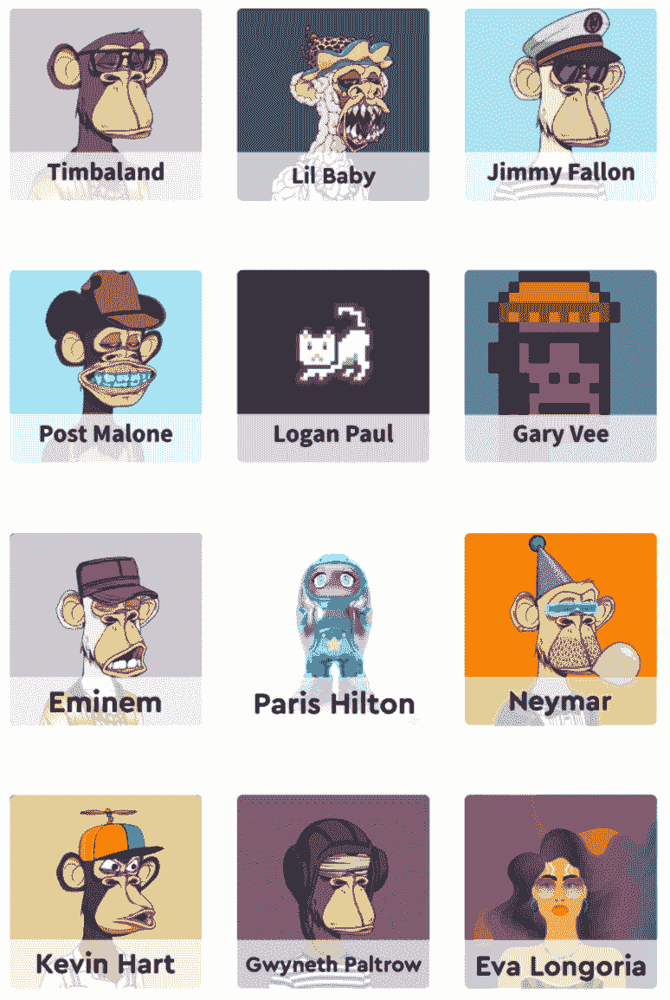</picture>](https://web.archive.org/web/20221207010728/https://dappradar.com/blog/celebrity-wallets-a-dive-into-crypto-hollywood)

*Celebrity NFTs;* **source:** [DappRadar](https://web.archive.org/web/20221207010728/https://dappradar.com/blog/celebrity-wallets-a-dive-into-crypto-hollywood)

同样的，还有传统大玩家的冲击。阿迪达斯、可口可乐、百事可乐、百威啤酒和其他一些品牌要么推出了自己的收藏品，要么与重要的 NFT 团队合作，在这个领域取得一席之地。时尚巨头古驰、杜嘉班纳(Dolce &、博柏利以及其他利用围绕元宇宙的炒作获利的人也是如此。

## 团队成为品牌

NFT 系列背后的团队对他们项目的命运负有高度责任。让有才华的艺术家和有经验的开发人员围绕团队是一些团队发现的成功秘诀。一旦一个团队成功了，他们就可以成为这个领域内真正的品牌。

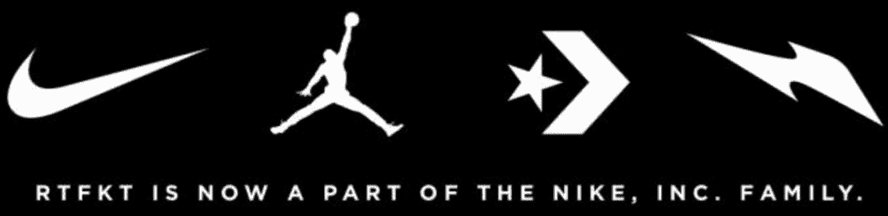

**Source:** [RTFKT](https://web.archive.org/web/20221207010728/https://rtfkt.com/home)

RTFKT 就是这种情况，它是 Clone-X 背后的团队，与 Jeff Staple 和 Fewocious 合作制作独特的 NFT 作品。这个数字设计和时尚品牌一直符合人们的期望，并妥善应对任何挑战。RTFKT 成为 Web3 领域最具影响力的品牌之一，并于去年 12 月被耐克收购，收购金额未披露。

## 稀缺资产

最后，还有稀缺因素。这是一个重要的问题，因为它直接关系到人类心理学。错过某些东西的焦虑，也称为 FOMO，与稀缺的资产和投资市场有关。NFT 结合了两者。

大多数系列推出限量供应的 NFT，永远不变。无论是 10，000 还是 20，000，特定版本的限量供应将始终保持不变。这就是区块链的魅力。

结果是，非金融资产已经逐渐成为一种资产类别。虽然由于这项技术的性质，与加密货币的相关性将保持不变，但 NFT 正在慢慢为自己创造一个经济，一个其宏观事件和市场因素对该空间产生积极或消极影响的经济。

文化价值、附加效用、名人参与、品牌知名度和这些资产的稀缺性等先前修正的因素的总和推动了最新一波的 NFT 采用。

最棒的是，我们所看到的只是冰山一角。像幼虫实验室、BAYC、酷猫、RTFKT、 [CyberKongz](/web/20221207010728/https://dappradar.com/blog/rise-of-the-planet-of-the-cyberkongz/) 和 [Doodles](/web/20221207010728/https://dappradar.com/blog/how-to-value-doodles-nfts/) 这样的项目将继续高度参与元宇宙的叙事。随着减少客户摩擦的产品的推出，来自非加密用户的摩擦和阻力将会减少，比如预计将集成万事达卡支付的[比特币基地市场](/web/20221207010728/https://dappradar.com/blog/nft-marketplaces-battle-for-pole-position/)。有很多潜在的使用案例，其中 NFTs 将被嵌入到传统的商业模式中。

没有线索表明加密货币市场目前的熊市趋势会再持续两周还是两年。尽管如此，在当前条件下，非功能性数字资产仍保持并增加了其实际价值，证明了自己是能够存储价值的数字资产。

 NewsletterUnsubscribe at any time. [T&Cs](https://web.archive.org/web/20221207010728/https://dappradar.com/terms) and [Privacy Policy](https://web.archive.org/web/20221207010728/https://dappradar.com/privacy-policy)