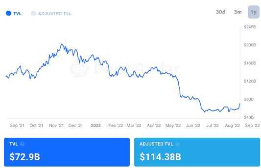
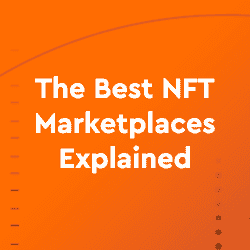
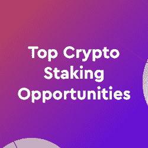

# 为什么有人看好以太坊？

> 原文：<https://web.archive.org/web/https://dappradar.com/blog/why-are-people-bullish-on-ethereum>

## 为什么以太坊的未来看起来如此光明？

以太坊已经成为区块链工业的中心，也许主要是因为 T2 分散金融的成功。当其他区块链建造桥梁时，dapps 创造了一个多链生态系统。尽管有许多选择，以太坊显然主导了这个领域。

这些年来，广受欢迎的区块链网络发展迅猛，扮演了区块链父母的角色，诞生了其他区块链和通过 ERC-20 标准构建的代币。此外，ERC-721 和 ERC-1155 令牌，也称为[不可替代令牌(NFTs](https://web.archive.org/web/20220930191948/https://dappradar.com/blog/what-are-non-fungible-tokens-nfts/) )。

这篇文章将简要总结以太坊作为区块链 dapps 之王的强大吸引力，以及如何通过 DappRadar 最好地利用它。

## 以太坊为流行的区块链游戏提供动力

区块链游戏已经证明了它在熊市中的弹性[该行业的规模估计今天超过 1750 亿美元](https://web.archive.org/web/20220930191948/https://dappradar.com/blog/dappradar-x-bga-games-report-6)。GameFi 的市值不到 4%，约为 62 亿美元。想象一下合并后的以太坊区块链运动会将会是什么样子。

下面是三个最值得看好的以太坊游戏的简要概述。

### Mirandus

Mirandus 是一款“玩赚 MMORPG ”,也是 Gala Games 最激动人心的项目之一。

想象一下类似于沙盒或者分散的 T2 的米兰多斯，除了这个世界是一个虚幻的世界，化身是人类、精灵和兽人。

### 班吉香蕉

[Benji Bananas](https://web.archive.org/web/20220930191948/https://dappradar.com/ethereum/games/benji-bananas) 很简单:玩家从一棵藤蔓荡到另一棵藤蔓，越过障碍，并尽可能长时间保持离开地面。挥杆时间越长，赢得越多。

### 淀积层

Illuvium 是一款免费的幻想角色扮演游戏，玩家可以探索一个 3D 世界并捕捉 Illuvium，这是一种生活在虚拟世界中的神秘生物

## 达普拉达河畔的以太坊

现在就把你的钱包连接到 [DappRadar](https://web.archive.org/web/20220930191948/https://dappradar.com/) 上，然后[用我们的排名工具](https://web.archive.org/web/20220930191948/https://dappradar.com/rankings/protocol/ethereum)发现以太坊 dapps。[使用](https://web.archive.org/web/20220930191948/https://dappradar.com/hub/swap/eth) [NFT 收藏浏览器](https://web.archive.org/web/20220930191948/https://dappradar.com/hub/nft-explorer)在[以太坊市场](https://web.archive.org/web/20220930191948/https://dappradar.com/nft/protocol/ethereum)如 [OpenSea](https://web.archive.org/web/20220930191948/https://dappradar.com/multichain/marketplaces/opensea) 寻找并交换令牌，估计 NFT 的价值并发现令人兴奋的 NFT 收藏。

[https://web.archive.org/web/20220930191948if_/https://www.youtube.com/embed/woduDyWuKHY?feature=oembed](https://web.archive.org/web/20220930191948if_/https://www.youtube.com/embed/woduDyWuKHY?feature=oembed)

## 以太坊是怎么回事？

达普斯王区块链尚未达到其最佳状态，因为它声称 1904 美元，这是自加密冬天开始以来的最高纪录之一，并发出了期待已久的以太坊合并的看涨信号。

此外，以太坊区块链已经能够实现与其他成功的区块链如 [Polygon](https://web.archive.org/web/20220930191948/https://dappradar.com/rankings/protocol/polygon) ( [MATIC](https://web.archive.org/web/20220930191948/https://dappradar.com/hub/token/eth/MATIC/ETH?from=0x7d1afa7b718fb893db30a3abc0cfc608aacfebb0) )和 [Solana](https://web.archive.org/web/20220930191948/https://dappradar.com/rankings/protocol/solana) (SOL)的跨链关系，从而加强其立足点。

## 为什么交叉链对以太坊很重要？

存在跨链功能以实现区块链之间的互操作性。因此，根据 ERC-20 标准建造的代币可以转让给另一个区块链，也许是索拉纳。

在他们到达后区块链之前，他们被锁定在智能合约中，以换取支持他们的新区块链标准的包装版本。某些代币存在的桥梁越多，区块链之间的价值流动就越容易。

类似地，这些代币可以通过拆开来寄给前区块链。然后，它们被交换为智能合约中锁定的初始令牌。

包装令牌可以用在像 Compound 或 Aave 这样的借出和借入协议上。包装代币的例子包括 WETH、RenBTC、sBTC(BTC 合成币)和 WBTC(包装比特币)。

通过桥梁促进多链活动提高了区块链技术的采用。以太坊将自己定位于多链范式，并受益于跨链功能。

## 以太坊和 DeFi 是如何连接的

分散金融的发展很大程度上归功于以太坊。仅在 2021 年， [DeFi](https://web.archive.org/web/20220930191948/https://dappradar.com/blog/what-is-defi-and-how-can-i-save-money-with-it) 部门的日交易量和锁定的总价值(TVL)就增长得无法衡量。

以太坊上存在像 Uniswap 和 SushiSwap 这样的去中心化的交易所，并不断见证流量的增加。尽管受到加密冬天的影响，DeFi 协议的 TVL 目前仍保持在 729 亿美元。阅读我们的最新报道，清楚了解[区块链用户如何应对加密传染病和 Terra 的崩溃](https://web.archive.org/web/20220930191948/https://dappradar.com/blog/how-blockchain-users-reacted-to-the-crypto-contagion-and-the-latest-macro-events)。

Source: [DappRadar](https://web.archive.org/web/20220930191948/https://dappradar.com/defi)

以太坊向利益相关共识的过渡将使网络能够进行更多的扩展和发展。以太坊最大的测试网 Goerli 于 2022 年 8 月 10 日星期三成功合并。

倒数第二个障碍已经清除。这意味着下一个里程碑是以太坊的全面合并和期待已久的 PoS 过渡。

随着完全合并的好处是更低的天然气费用，更快的交易速度，以及更少的密集能源使用，我们可以看到 ETH 价格会更高。

## 关闭

以太坊区块链的采用率和[用例显著高于任何其他区块链网络。](https://web.archive.org/web/20220930191948/https://dappradar.com/rankings/protocol/ethereum)

与之前的熊市不同，以太坊一直在引领反击。随着区块链成功完成一次又一次试验，来自该国的好消息不断，社区情绪高涨。

我们将继续关注以太坊的发展，所以请关注我们的[博客](https://web.archive.org/web/20220930191948/https://dappradar.com/blog/)和[推特](https://web.archive.org/web/20220930191948/https://twitter.com/DappRadar)以保持与网络 3 的一切同步。通过我们的[令牌浏览器](https://web.archive.org/web/20220930191948/https://dappradar.com/hub/tokens/ethereum/all/1)关注 [ETH](https://web.archive.org/web/20220930191948/https://dappradar.com/hub/token/eth/ETH) 在合并前的命运，并在我们的排名页面检查基于[以太坊的 dapps 的性能。](https://web.archive.org/web/20220930191948/https://dappradar.com/rankings/protocol/ethereum)

 NewsletterUnsubscribe at any time. [T&Cs](https://web.archive.org/web/20220930191948/https://dappradar.com/terms) and [Privacy Policy](https://web.archive.org/web/20220930191948/https://dappradar.com/privacy-policy)[<picture></picture>](https://web.archive.org/web/20220930191948/https://dappradar.com/blog/top-7-nft-marketplaces-beginners-guide)[<picture></picture>](https://web.archive.org/web/20220930191948/https://dappradar.com/blog/top-crypto-staking-opportunities-beginners-guide)[<picture></picture>](https://web.archive.org/web/20220930191948/https://dappradar.com/blog/guide-on-how-to-move-assets-between-ethereum-bsc-and-polygon) NewsletterUnsubscribe at any time. [T&Cs](https://web.archive.org/web/20220930191948/https://dappradar.com/terms) and [Privacy Policy](https://web.archive.org/web/20220930191948/https://dappradar.com/privacy-policy)