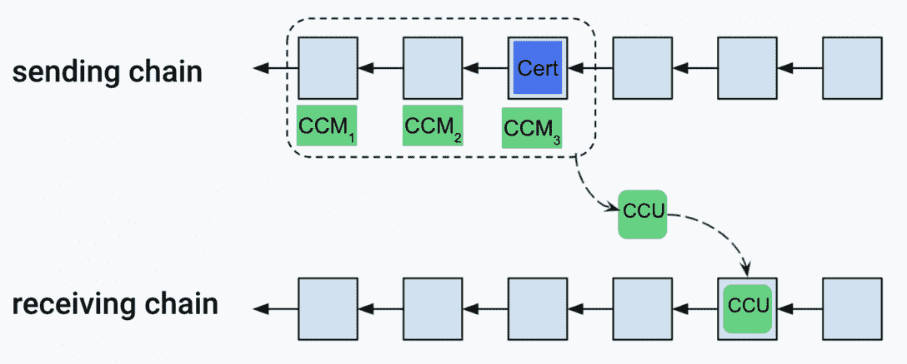
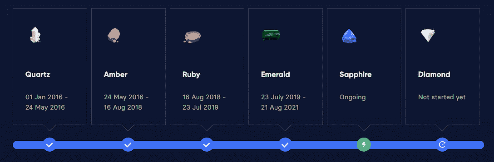

# 为什么区块链互操作性很重要，Lisk 如何解决这个问题

> 原文：<https://web.archive.org/web/https://dappradar.com/blog/why-blockchain-interoperability-matters-and-how-lisk-addresses-it>

## 仔细看看 Lisk 的可扩展和分散的互操作性解决方案

对区块链互操作性的倡导日益高涨。今天的区块链不仅仅是一个价值储存库或简单的分散通信基础设施。每个区块链网络都有自己的社区和文化，并针对用户需求提供有针对性的解决方案。值得注意的是，Lisk 正在努力推动区块链世界的互操作性。

**内容:**

*   [为什么区块链互操作性很重要？](https://web.archive.org/web/20221004003758/https://dappradar.com/blog/why-blockchain-interoperability-matters-and-how-lisk-addresses-it/#interoperability)
*   [什么是跨链技术？](https://web.archive.org/web/20221004003758/https://dappradar.com/blog/why-blockchain-interoperability-matters-and-how-lisk-addresses-it/#lisk-solution)
*   【Lisk 的互操作性解决方案有什么特别之处？
*   下一步是什么？

## 为什么区块链互操作性很重要？

随着区块链用户和项目数量的不断增加，人们越来越认识到，一条链解决所有问题的办法无法满足所有需求。因此，新区块链继续进入该领域，以缓解以太坊的压力，解决用户未满足的需求。

很明显，多区块链生态系统正以前所未有的速度发展。然而，如果大多数区块链在自给自足、孤立的生态系统中运行，这将严重限制区块链生态系统作为一个有机整体的全部潜力。

因此，允许不同链之间的互操作性变得非常迫切。作为回应，跨链技术已被开发出来，以促进区块链之间的互动和优化现有的生态系统。

## 什么是跨链技术？

跨链技术支持独立区块链之间的互操作性。它支持不同网络之间的资产和信息交换。

显然，跨链技术没有单一的解决方案。各种网络采用不同的方法来实现这一概念。例如，Cosmos 推出了区块链间通信(IBC)协议，以促进链之间的通信。Polkadot 开发了链间消息协议作为解决方案。此外，我们不得不提的另一个关键的互操作性解决方案提供商是 Lisk。

## Lisk 的互操作性解决方案有什么特别之处

Web3 是互联网的未来，它将拥有互连互补的独特区块链。互操作性是这个多链世界为用户提供无缝 Web3 体验的关键。

### Lisk 的研究驱动的互操作性方法

随着多链生态系统的发展，互操作性解决方案将会有所不同，每个服务提供商都有更具针对性的区块链互操作性解决方案。

值得注意的是， [Lisk'](/web/20221004003758/https://dappradar.com/blog/lisk-a-modular-blockchain-platform-for-javascript-developers/) s 区块链互操作性解决方案是基于严格和全面的研究。这为 Lisk 推出具体的互操作性方法提供了坚实的基础和科学前提。

为了便于用户理解整个互操作性解决方案，团队围绕八个路线图目标对其进行了组织。每个路线图目标都定义了解决方案的一个重要方面:

*   定义跨链消息传递协议
*   定义侧链注册和生命周期
*   定义状态模型和状态根
*   为 Lisk 生态系统引入令牌标准
*   为互操作性更新 Lisk-BFT
*   更新块标题格式
*   为侧链引入替代验证器选择机制
*   增强签名方案

[点击此链接](https://web.archive.org/web/20221004003758/https://lisk.com/blog/research/lisk-interoperability-solution-published)深入了解 Lisk 互操作性解决方案的方方面面。

### Lisk 的无缝跨链通信

最终，区块链技术将促进广泛的行业特定用户场景，为他们提供去中心化和数据透明性。这意味着个人、社区和机构可以在各种平台和网络上互动和交换信息。

Lisk 互操作性解决方案就是为了满足不同平台之间信息交换的需求而设计的。为此，跨链更新事务(CCU)开始发挥作用。

跨链更新事务充当链之间传输信息的工具。它们携带来自发送和接收链的关于状态变化的信息。特别是，它们包含来自发送链的证书。CCU 还可以包含跨链消息，因此其工作方式类似于从一个链到另一个链的消息的信封。

### 使用 Lisk 侧链简化区块链应用程序开发

Lisk 侧链网络的建设正在全面展开。最终，它将允许开发者在 Lisk 上快速构建区块链应用程序。然而，我们可以先看看完成后它将如何工作。

首先，Lisk 支持开发人员使用 JavaScript 在其网络上创建应用程序；这是通过一个简单易用的工具 [Lisk SDK](https://web.archive.org/web/20221004003758/https://lisk.com/documentation/lisk-sdk/index.html) 完成的。

而且在开发方面，侧链上的区块链应用和 dapp 是不一样的；前者更类似于构建常规的 web 应用程序。但是，最重要的是，这些应用程序可以被设计为具有针对特定用例的最佳特征，同时要求较低的交易费用。

为了让这些区块链应用程序在 Lisk 的生态系统中运行，侧链将通过注册过程并连接到 Lisk 主链。结果，它成为了 Lisk 生态系统的一部分，实现了互操作性。

## 下一步是什么？

Lisk 的网络和生态系统的发展正沿着它的路线图有序地展开。

在正在进行的 Sapphire 阶段，Lisk 已经完成了其网络内互操作性的许多里程碑。在下一阶段，Diamond，Lisk 可能会将其互操作性扩展到其他协议，如以太坊、Polkadot、Cardano 和 Cosmos(协议列表待定)。

下面的文章将帮助开发人员深入了解 Lisk 的互操作性解决方案。

*   [Lisk 互操作性解决方案发布](https://web.archive.org/web/20221004003758/https://lisk.com/blog/research/lisk-interoperability-solution-published)
*   [区块链互操作性解决方案–示例](https://web.archive.org/web/20221004003758/https://lisk.com/blog/learning/blockchain-interoperability-solutions-examples)
*   [Lisk 生态系统中侧链的生命周期](https://web.archive.org/web/20221004003758/https://lisk.com/blog/research/lifecycle-sidechain-lisk-ecosystem)

要了解关于 Lisk 的更多信息，您还可以查看以下频道:

[网站](https://web.archive.org/web/20221004003758/https://lisk.com/)

[推特](https://web.archive.org/web/20221004003758/https://twitter.com/LiskHQ)

[不和](https://web.archive.org/web/20221004003758/https://discord.com/invite/7EKWJ7b)

[Github](https://web.archive.org/web/20221004003758/https://github.com/LiskHQ)

**免责声明** —这是一篇赞助文章。DappRadar 不认可本页面上的任何内容或产品。DappRadar 旨在提供准确的信息，但读者应该在采取行动之前总是自己做研究。DappRadar 的文章不能被认为是投资建议。