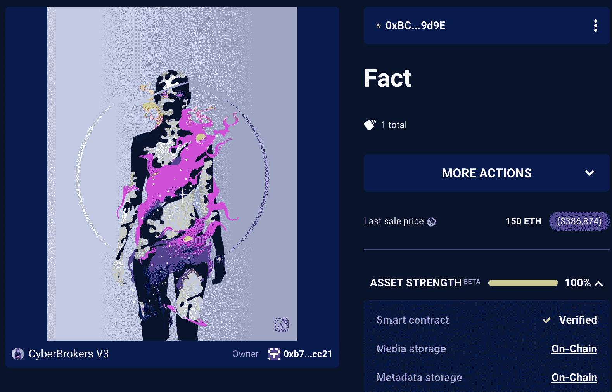

# 为什么网络经纪人支付 250，000 美元，使非功能性网络交易完全在链上

> 原文：<https://web.archive.org/web/https://dappradar.com/blog/why-cyberbrokers-paid-250000-to-make-nfts-completely-on-chain>

## 来自财政部的 91.04 ETH 用于将所有元数据和 SVG 文件上传到区块链以太坊

乔西·贝里尼的最新 NFT 项目“网络经纪人”已经成为 NFT 空间的热门话题，现在这个系列已经完全转移到了网上。将所有元数据和 SVG 资产转移到区块链以太坊需要 91.04 ETH 的投资，价值约 25 万美元。

最初，[网络经纪人](https://web.archive.org/web/20221129133236/https://dappradar.com/ethereum/collectibles/cyberbrokers)的艺术品和元数据只存储在星际文件系统(IPFS)上。虽然这在加密领域是一个流行的选择，但它有一定的局限性。尤其是在安全性和互操作性方面。

最重要的是，链上存储确保收集不依赖于第三方系统，因此中断图像获取几乎是不可能的。藏品消失的唯一方式是整个以太坊区块链突然崩溃。

根据 [cybourgeoisie.eth](https://web.archive.org/web/20221129133236/https://dappradar.com/hub/wallet/eth/0x9ee5e3ff06425cf972e77c195f70ecb18ac23d7f) 的官方[公告](https://web.archive.org/web/20221129133236/https://twitter.com/cybourgeoisie/status/1503130085993459722)，该收藏的 SVG 艺术品仍将在 IPFS 有备份。这将允许像[DappRadar Portfolio Tracker](https://web.archive.org/web/20221129133236/https://dappradar.com/hub/wallet/)这样的服务快速提取信息并向用户呈现视觉效果，而无需与区块链进行交互。实质上，CyberBrokers 集合了链外和链内功能的优点。

## 网络经纪人占据中心舞台

CyberBrokers 是过去几天人们谈论最多的收藏品之一。除了从链外存储到链内存储的巨大转变，该项目还在过去一周内极大地推动了活动和底价。

根据 DappRadar 的数据，在过去的七天里，该系列吸引了超过 1300 名独特的交易者。此外，网络经纪人 NFT 的底价现在接近 3 ETH，约合 7700 美元。考虑到 3 月 1 日 0.35 ETH 的铸币价格，该系列已经获得了相当大的升值。

更重要的是，网络经纪人已经进入了过去一周 NFT 十大销售榜，在销售时 [Fact](https://web.archive.org/web/20221129133236/https://dappradar.com/hub/assets/eth/0x892848074ddea461a15f337250da3ce55580ca85/987) 以 150 ETH 或约 37.7 万美元的价格转手。

这里要指出的一个奇怪的注意是，最近存储的变化已经将网络经纪人的资产实力评估推至 100%。资产强度是一种衡量指标，用于显示某项数字资产的不可改变性。在集中式服务器上存储元数据或图像的 NFT 得分较低。另一方面，像 CyberBrokers 这样的收藏因为完全在链上而获得 100%的分数。您可以使用 [DappRadar 投资组合跟踪器](https://web.archive.org/web/20221129133236/https://dappradar.com/hub/wallet/)工具来检查您的集合中的 NFT 的资产实力。

DappRadar 将继续监测网络经纪人的收集，因为它接受新的挑战，并进一步推动 NFT 空间的边界。你可以在官方 DappRadar 页面上关注网络经纪人的销售和交易活动。你也可以在[推特](https://web.archive.org/web/20221129133236/https://twitter.com/dappradar)上关注 DappRadar，首先了解最新的 NFT 新闻。

 NewsletterUnsubscribe at any time. [T&Cs](https://web.archive.org/web/20221129133236/https://dappradar.com/terms) and [Privacy Policy](https://web.archive.org/web/20221129133236/https://dappradar.com/privacy-policy)