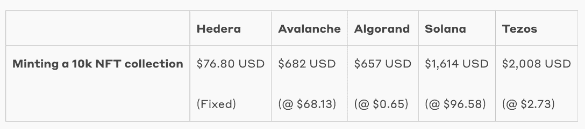
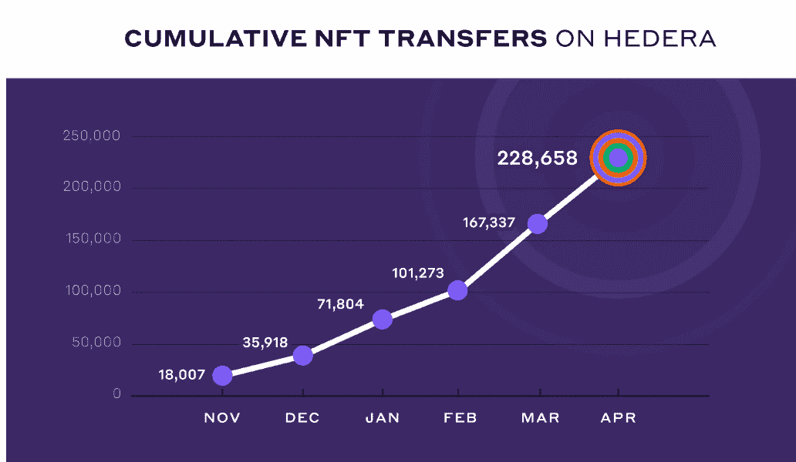
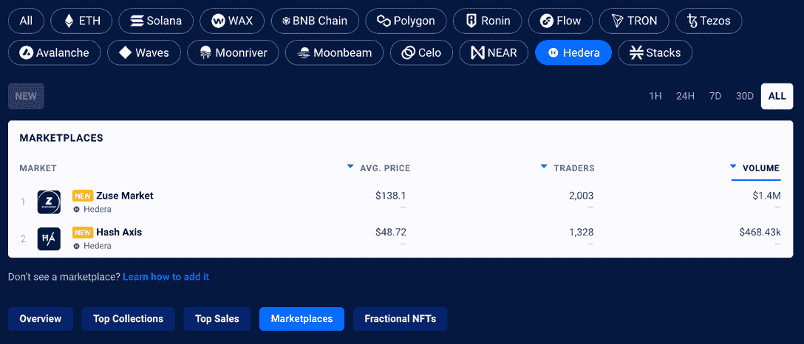
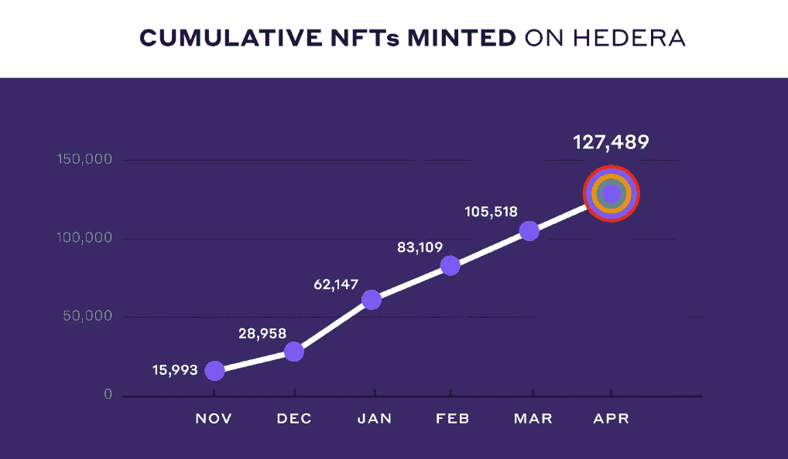

# 为什么在 Hedera 上启动 NFTs 有意义

> 原文：<https://web.archive.org/web/https://dappradar.com/blog/why-launching-nfts-on-hedera-makes-sense>

## 随着 NFT 公用事业超越宣传，创新的想法和用例能够可持续地扩展成本效益至关重要。

*在 Hedera 上以不到 100 美元的价格铸造 10k NFT 系列*

**自 2021 年末数字收藏品起飞以来，Hedera 上数字收藏品的有机增长和采用令人印象深刻。**

**Hedera 开始看到一个由收藏家、创作者和生态系统开发者组成的充满活力的社区，这将导致 2022 年 Hedera 上 NFT 用例的使用急剧增加，创作者可以以不到 100 美元的价格铸造 10，000 版 NFT 收藏。**

不断增长的项目、应用和生态系统工具社区为选择 Hedera 推出 NFT 系列提供了令人信服的理由。此外，在很短的时间内，NFT 的倡导者和建设者有机地结合在一起，启动了海德拉的 NFT 生态系统。

## 为什么是海德拉？

HTS 是一项基于 Hedera 的本地令牌化服务——它提供每秒 10，000 笔交易，易于配置的[自定义令牌使用费](https://web.archive.org/web/20220814091416/https://docs.hedera.com/guides/docs/sdks/tokens/custom-token-fees)，任何公共分类账中[碳足迹最低的](https://web.archive.org/web/20220814091416/https://hedera.com/ucl-blockchain-energy)，以及低且可预测的[费用](https://web.archive.org/web/20220814091416/https://docs.hedera.com/guides/mainnet/fees#token-service)。2022 年 4 月下旬，HTS 直接集成到 Hedera 基于 Solidity 的智能合约中，以利用 Hedera dapps 中的完全可编程性。**开源的 Hedera 公共网络**非常适合开始使用 NFTs。

## 开发者选择 Hedera

Hedera 的团队表示，他们通过采访、聚会、Discord 频道等方式与 dapp 项目进行了交谈，发现有四个一致的主题可以解释为什么开发人员选择在 Hedera 上推出 NFTs:低费用、碳负交易、可伸缩性和易于开发。

## 海德拉的费用

Hedera 的费用是固定的，以美元计价，并使用该网络的本币 HBAR 支付。用户需要知道的四项最高成本如下。

| 创建不可替换的令牌集合 | $1.00 |
| 在集合中铸造一个不可替换的令牌 | $0.05 |
| 将帐户与令牌相关联 | $0.05 |
| 转移任何数量的代币 | $0.001 |

将 Hedera 上制造 NFT 的成本与其他第 1 层网络进行比较是最容易的。正如所见，成本差异很大，Avalanche 目前最接近 Hedera 的价值主张。尽管如此，铸造一万个 NFT 集合还是有将近 600 美元的差别。

## 碳补偿

web3 上的 NFT 社区强烈反对区块链公共网络的碳足迹。

这并不令人惊讶，因为所有这些关于全球变暖达到极限的言论，以及 NFT 收藏馆每天都要为杀死小猫负责(顺便说一句，这是个笑话)。

碳中和不仅仅是一个道德立场，而且越来越成为一个营销角度，Hedera 凭借其实质性的价值主张保持强势。

根据伦敦大学学院最近进行的一项研究，由于 Hedera 和 hashgraph 共识的架构，Hedera 网络是基于每笔交易平均能耗(0.00017 kWh)的最可持续的公共分布式分类帐之一。

虽然这是一个很好的起点，但对 Hedera 管理委员会来说还不够——此外，Hedera 还承诺通过购买季度碳信用来抵消所有面向公众的基础设施的排放，从而成为一个碳负公共网络。

碳补偿项目的证书和细节可以在[这里](https://web.archive.org/web/20220814091416/https://hedera.com/carbon-offsets)找到。

## 可扩展的性能

Hedera 令牌服务是基于 Hedera 构建的本地服务，可以扩展到每秒 10，000 个事务，这些事务的终结发生在几秒钟内。Hedera 服务代码每个版本的性能测量可以在[发行说明文档](https://web.archive.org/web/20220814091416/https://docs.hedera.com/guides/docs/release-notes/services)中找到。

## 易于开发

Hedera Token Service 让专注于 NFT 的生态系统工具、应用和项目的开发人员非常容易上手，而无需配置复杂的智能合约——这一切都是 Hedera API 的原生功能。

此外，[令牌映射到 ERC-20、721 和 1155 标准](https://web.archive.org/web/20220814091416/https://hedera.com/blog/mapping-hedera-token-service-standards-to-erc20-erc721-erc1155)，确保与其他基于 Solidity 的智能合约网络的互操作性。建造者可以从这个简单的例子开始:T2 在海德拉建造了一个 NFT，收取定制的版税。

## 海德拉·NFT 成长

闪电般的速度和良好的价格只能让你在 web3 的世界里走得更远，在这个世界里，需要一个火花来提升整个生态系统。在大约六个月的时间里，NFT 的收藏家、项目创建者和生态系统开发人员已经联合起来，为海德拉的 NFT 生态系统注入了活力。

## NFT 转会海德拉

首先看看海德拉的月平均 NFT 转会，我们看到了稳定的增长，累计数字几乎每月翻一番。该指标作为 Hedera 上 NFT 二级市场销售的健康指标，可以表明零售情绪。

进一步说明，这一指标计算了最初在 Hedera 上创建的二级市场上的 NFT 销售额。当卖家将 NFT 发送给新买家时，它被计为单次令牌转移，并被添加到总数中。

使用达普拉达 NFT 跟踪系统，通过查看 Hedera 上领先的 NFT 市场，这一点变得非常清楚，两家公司已经产生了近 200 万美元的交易量。Zuse 以超过 140 万美元领先，Hash Axis 创造了近 50 万美元的收入。

## 在 Hedera 铸造的 NFT

看看铸造的 NFT 的数量就可以看出在 Hedera 网络上推出数字收藏品的采用水平，以及现有项目的继续和进一步的 NFT 下降。该指标着眼于在 Hedera 上铸造的 NFT 系列，即由新所有者成功铸造的 10，000 件 NFT 系列。每个薄荷糖都算在总数中。

重要的是，Hedera 上 NFTs 的用例远远超出了 PFP 头像项目、艺术和简单的数字表示，他们希望很快看到更多的用例推出。此外，Hedera 预计控制下的资产(AUC)将成为广泛使用的衡量标准，以代表网络在 NFTs 方面的成功。

## 海德拉·NFT 系列已经开始腾飞了

进一步放大，我们可以看到几个系列目前表现不错。Hbar Punks 用它的帽子尖领导以太坊上的 OG CryptoPunks 集合。该系列已售出 1000 多件，交易额超过 4 万美元。虽然与以太坊上的一些收藏相比，这些数字微不足道，但在一个充满一夜成功和失败的行业中，一致性非常重要。

## Hedera 上的 NFTs 摘要

熊市可以为新技术和趋势的出现提供完美的场景。虽然以太坊上的 NFT 收藏似乎有一定的质量和 OG 网络印记，但对于亲民党头像狂潮后出现的许多现实世界用例来说，网络远非高效。

例如，在这个时候，使用以太坊来运营 NFT 票务平台的想法是非常简单和荒谬的。想象一下，一个用户每次想铸造一张票时都必须支付以太币汽油费。这会使服务无法运行。而在 Hedera 上运行类似的服务可能会在区块链上提供类似 Web2 的用户体验。

随着 NFT 公用事业超越宣传，创新的想法和用例能够可持续地扩展成本效益将是至关重要的。你可以在 DappRadar 上追踪 Hedera NFTs 以及 DappRadar 上其他 16 个区块链的数字收藏品。

发现新推出的和即将推出的 NFT 系列，并使用超级先进的 [NFT 浏览器](https://web.archive.org/web/20220814091416/https://dappradar.com/hub/nft-explorer)根据机器学习算法、历史销售和元数据获得估计的 NFT 价值！

[<picture></picture>](https://web.archive.org/web/20220814091416/https://dappradar.com/hub/nft-explorer)