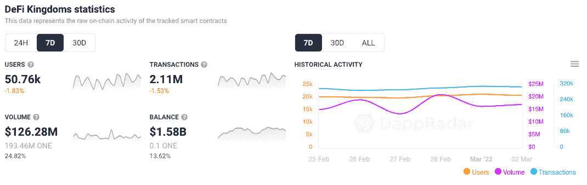

# 为什么绿洲网络非常适合区块链游戏

> 原文：<https://web.archive.org/web/https://dappradar.com/blog/why-oasis-network-is-perfect-for-blockchain-games>

## 第 1 层网络具有超快的交易速度、低廉的燃气费和 50，000 美元的支持

**区块链上的游戏在很大程度上依赖于快速、低成本的交易来为玩家提供流畅的体验，谢天谢地，Oasis Network 可以做到这一点。与 DeFi 和其他 dapps 不同，它们可能只需要很少的交易来完成一个动作，游戏需要更多的交易来让玩家前进。低成本是在该领域取得成功的关键，绿洲网络可以说是完美的定位。**

价值 500，000 美元的 DappRadar x Oasis Accelerator 计划的任务是从 DappRadar 开发人员社区中寻找有抱负的团队，并支持他们在 Oasis 网络上进行建设。

Oasis Network 可扩展，是游戏 dapps 的理想选择，因为它具有即时终结性、比以太坊低 99%的燃气费、高吞吐量、隐私保护和 MEV 防御。 [Emerald，Oasis EVM 兼容 ParaTime](https://web.archive.org/web/20221226054349/https://medium.com/oasis-protocol-project/oasis-emerald-evm-paratime-is-live-on-mainnet-13afe953a4c9) ，允许完全 EVM 兼容性，易于与 EVM 的 dapps 集成，并具有跨链桥以实现跨链互操作性。

## 选择选择

虽然传统上开发人员将以太坊视为 dapps 的发射台，但 2022 年开发团队的一个关键考虑因素是用户的成本和速度。简单地说，以太坊上的游戏由于汽油费而不可持续。玩家不会在每次需要完成一个小的、可能没有价值的交易时放弃 50 美元。

像 Axie Infinity 这样的项目产生了他们与浪人区块链的内部解决方案。然而，并不是所有的开发商都有如此雄厚的财力。Oasis Network 提供现成的解决方案，并通过[50 万美元的 DappRadar x Oasis Dapp 加速器基金](https://web.archive.org/web/20221226054349/https://airtable.com/shreZAEcjcrTFpwT0)提供资金支持。

## 绿洲的先发优势

在撰写本文时，Oasis Network 上还没有[play-to-earn 或 GameFi dapps。重要的是，这不是在嘲笑绿洲；这是一个积极的因素，意味着这个类别对开发者来说是大有可为的。这也是绿洲的 mainnet 只存在了几个月，其 dapp 生态系统仍在发展的结果。同样，这不是一个消极点，因为这意味着绿洲网络的创新空间是巨大的。](https://web.archive.org/web/20221226054349/https://dappradar.com/rankings/protocol/oasis)

我们已经看到，在过去的 12 个月里，区块链游戏在区块链占据了主导地位。DeFi 王国是 dapp 在以太坊之外的网络上找到真正牵引力的主要例子。通过利用其先发优势， [DeFi 王国](https://web.archive.org/web/20221226054349/https://dappradar.com/harmony/games/defi-kingdoms)持有[超过 60%的锁定和声](https://web.archive.org/web/20221226054349/https://defillama.com/chain/Harmony)总价值，这一壮举可能在绿洲网络上复制。

## 快速交易和低成本

Oasis 上的交易在几秒钟内完成，而汽油费约为 0.15 美元，这一数字远远符合当前的金融支付系统费用，如 Visa 和万事达卡。此外，这与以太坊相去甚远，以太坊的学费在 2022 年高达 100 美元。此外，即使 ETH 2.0 的到来，汽油费也不会大规模降低，所以开发商仍然需要寻找其他地方。

为了进一步强调快速和便宜的交易对区块链游戏的重要性，Harmony 的主要 GameFi dapp DeFi 王国的用户完成的交易数量如下。在过去的七天里，它处理了 210 万笔交易，而网络领先的 DEXvipers WAP 在此期间仅处理了 8000 笔交易。

## 未来安全

如果有一天数字空间能够反映现实世界，用户将需要他们在现实世界中所依赖的所有安全功能。Oasis 是第一个支持机密智能合同的网络。Oasis Eth/WASI 运行时是一个保密并行的开源例子，它使用安全的飞地在处理数据时保持数据的私密性。Oasis 相信这一功能将成为游戏和元宇宙 dapps 未来成功的关键。

如果用户要生活在虚拟世界中，他们需要在自己和他们的数字产品周围建立安全网。此外，他们需要隐藏或保密其资产的某些方面，以避免被坏人盯上。

Oasis 在网络上有几个令人兴奋的项目，包括与币安的 CryptoSafe 联盟、Nebula Genomics、Genetica、BMW 等。除了其快速增长的合作伙伴生态系统，Oasis 还代表了寻求构建带隐私解决方案的即玩即赚游戏和 GameFi dapps 的 dapp 开发者的可靠选择。

## 五万多个理由

价值 50 万美元的 DappRadar x Oasis 加速器项目现已启动并接受申请。将选出 10 个成功的项目，并提供 50，000 美元的 ROSE 和营销及业务发展支持，以确保项目按计划进行。我们邀请已经在进行项目并有可靠想法的开发者[通过加速器计划申请资金和支持](https://web.archive.org/web/20221226054349/https://airtable.com/shreZAEcjcrTFpwT0)。

## 关键日期:

*   开放申请时间:2022 年 2 月 9 日至 4 月 3 日
*   加速器启动:2022 年 4 月 11 日
*   研讨会、指导和 Dapp 开发:2022 年 4 月 11 日至 7 月 10 日
*   对团队的筹款和网络支持:2022 年 7 月 11 日至 9 月 30 日
*   演示日:2022 年 9 月 2 日

## 如何申请

[在 2022 年 4 月 3 日欧洲中部时间午夜前提交您的申请](https://web.archive.org/web/20221226054349/https://airtable.com/shreZAEcjcrTFpwT0)。如果您是 DappRadar 社区的成员，并且正在从事 DeFi、P2E 游戏或数据隐私解决方案等项目，我们希望为您提供支持。

 NewsletterUnsubscribe at any time. [T&Cs](https://web.archive.org/web/20221226054349/https://dappradar.com/terms) and [Privacy Policy](https://web.archive.org/web/20221226054349/https://dappradar.com/privacy-policy)