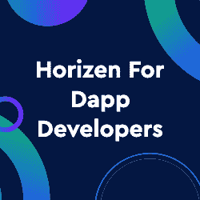
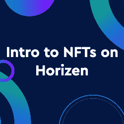

# 为什么先玩后赚空间需要隐私和可扩展性

> 原文：<https://web.archive.org/web/https://dappradar.com/blog/why-the-play-to-earn-space-needs-privacy-and-scalability>

## Horizen 正在构建区块链生态系统，使“即玩即赚”能够实现大规模采用

游戏赚钱空间正在蓬勃发展。截至发稿时，即玩即赚代币的市值约为[280 亿美元](https://web.archive.org/web/20221007195453/https://coinmarketcap.com/view/play-to-earn/)，而该领域仅在 2021 年开始起步。是什么推动了这种增长？在某种程度上，这种满足感来自于通过游戏获得真实世界的奖励。

有了区块链，就有可能创建无信任的系统，用户可以通过玩游戏、贡献社交网络或执行其他任务来获得可替代或不可替代的代币形式的奖励。消除了对控制这些活动的集中式平台的需求。因此，用户的贡献可以直接获得奖励，而无需通过第三方。此外，玩家可以将这些代币兑换成真钱。

这就是为什么像 Horizen 这样的区块链生态系统正在建设下一代区块链生态系统，这将使游戏赚取空间实现大规模采用。通过为[开发者提供一流的工具，在区块链推出](https://web.archive.org/web/20221007195453/https://www.horizen.io/zendoo/)高度可定制、可扩展和隐私保护的游戏和游戏经济。

## 玩即赚不仅仅是游戏

像委内瑞拉和菲律宾这样的发展中国家的人们意识到“玩赚”不仅仅是游戏:它是财务自由的机会。毕竟，许多玩家每月挣[几千美元](https://web.archive.org/web/20221007195453/https://www.theverge.com/2021/10/13/22725083/axie-infinity-sky-mavis-blockchain-economy-game-pokemon)，而这些玩家中有四分之一没有银行账户或者没有得到传统金融系统的充分服务。

集中式平台让这些用户失望了，因为他们经常拿走很大一部分利润，很难兑现奖励。基于区块链的平台可以解决这个问题，让玩家无需通过第三方即可赚取和交换代币。这使得用户可以赚取更多，并让他们获得更广泛的游戏和任务。

但是随着空间的增长，它面临着新的挑战。隐私和可伸缩性是需要解决的两个关键问题。让我们来看看这些关键挑战和潜在的解决方案。

## 隐私挑战

隐私是许多玩家关心的问题，他们担心自己的个人数据被不当处理或窃取。此外，一些玩家对成为营销目标感到不安。几乎在世界各地，大多数人都关心他们的在线隐私，人们意识到数据收集和跟踪已经走得太远了。

由于游戏赚钱游戏不想过度侵犯玩家的隐私，他们需要小心收集和使用数据的方式。这就导致了[通过多个玩家账号欺骗](https://web.archive.org/web/20221007195453/https://www.playtoearn.online/2021/09/11/0-5-of-axie-infinity-population-banned-over-energy-abuse/)等后果。

正如我们已经确定的，许多用户依靠游戏赚钱谋生，特别是在委内瑞拉这样的国家，那里的月最低工资不到 4 美元(不，这不是一个错别字)。因此，像制作多个账户这样的问题类似于金融欺诈，会产生现实世界的后果:更少的钱和失去公平，这与区块链的精神背道而驰。

如果“玩赚”游戏能够在保护玩家隐私的同时验证玩家的身份，他们就能更容易地打击作弊。Horizen network 的一个标志性特征是使用零知识证明来验证交易，而不会损害他们的隐私。

目前，Horizen 使用一种称为 zk-SNARKS 的零知识证明形式，允许在其许多侧链上发生的交易在主链上得到验证，而主链节点不知道交易的细节(即传输的地址或值)。

该相同的应用可以被应用于使得在区块链游戏中发生的活动，即，关于谁拥有某些皮肤或者在涉及游戏内 NFT 的交易中涉及了什么个人或实体的细节是保密的。同时仍然能够公开验证游戏内的交易是诚实有效的。

最终，由于游戏赚钱已经成为许多人的收入来源，保护人们的隐私是当务之急。随着元宇宙变成我们现实生活中的数字双胞胎，隐私保护变得更加重要。

## 可扩展性挑战

可伸缩性是游戏赚取空间面临的另一个挑战。许多游戏都在努力跟上游戏内奖励的需求，导致等待时间长和玩家沮丧。

随着“玩即赚”游戏变得成功，它们导致了[网络拥堵](https://web.archive.org/web/20221007195453/https://qz.com/1145833/cryptokitties-is-causing-ethereum-network-congestion/)和交易费用飙升，削弱了区块链的实用性。

由于链上交易的高成本，许多用例在规模上变得不可行。例如，数字内容和服务的微支付在区块链很受欢迎。但是它们在规模上变得不经济。这就是可扩展解决方案至关重要的原因。有了 [Horizen](https://web.archive.org/web/20221007195453/https://www.horizen.io/) ，开发者可以创建自己的侧链应用，这样他们就不需要在同一条链上与他人竞争带宽，并且可以根据需要进行扩展。

[<picture></picture>](https://web.archive.org/web/20221007195453/https://dappradar.com/blog/tag/horizen)[<picture></picture>](https://web.archive.org/web/20221007195453/https://dappradar.com/blog/horizen-an-ecosystem-designed-for-dapp-developers)[<picture></picture>](https://web.archive.org/web/20221007195453/https://dappradar.com/blog/introduction-into-nfts-with-horizen)

## 游戏赚钱的未来

区块链游戏仍处于早期阶段，因为整个游戏市场预计到 2028 年将超过 5000 亿美元。像《侠盗猎车手》、《堡垒之夜》和《《我的世界》》这样的传统流行视频游戏比今天大多数以玩挣钱为主的复古式 2D 游戏更具互动性和先进性。

然而，随着人们对区块链游戏的兴趣越来越大，我们预计很快会看到更复杂、更高级的“玩即赚”游戏。这些游戏将需要克服可扩展性的挑战，以便为数亿尚未进入“玩即赚”领域的游戏玩家提供满意的体验。

换句话说，目前的“玩即赚”游戏主要针对那些主要寻找金钱的人，而不是普通玩家。一旦赚取游戏对普通玩家变得有吸引力，网络拥塞将成为一个越来越大的问题。

克服这一挑战的一种方法是通过使用侧链。侧链是连接到主区块链的独立区块链，用于卸载否则会阻塞主链的特定任务或数据。

目前，对于一个玩家来说，要想从玩到赚游戏中赚钱，他们需要与游戏开发商或平台分享他们的个人信息。这使得玩家容易受到数据窃取和其他恶意攻击。这是由于以太坊区块链固有的公共性质。

克服这一挑战的一种方法是使用零知识证明。这些都是证明，让玩家在不透露自己任何信息的情况下，证明自己做过一些事情。

Horizen 将零知识证明与侧链相结合，实现可扩展且安全的游戏平台。这将允许开发更复杂和互动的游戏，普通玩家可以享受，这也是区块链游戏开发商开始将 Horizen 视为他们选择的区块链的众多原因之一。

**免责声明** —这是一篇赞助文章。DappRadar 不认可本页面上的任何内容或产品。DappRadar 旨在提供准确的信息，但读者应该在采取行动之前总是自己做研究。DappRadar 的文章不能被认为是投资建议。

 NewsletterUnsubscribe at any time. [T&Cs](https://web.archive.org/web/20221007195453/https://dappradar.com/terms) and [Privacy Policy](https://web.archive.org/web/20221007195453/https://dappradar.com/privacy-policy)