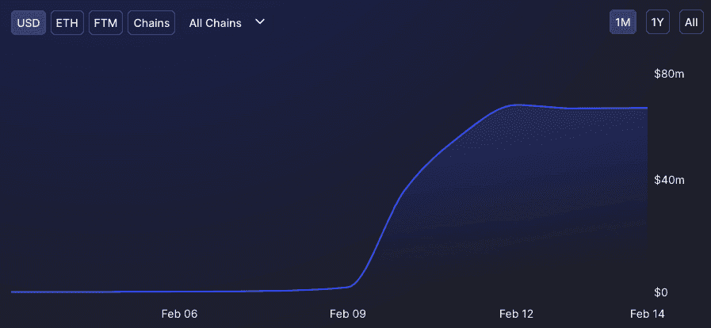
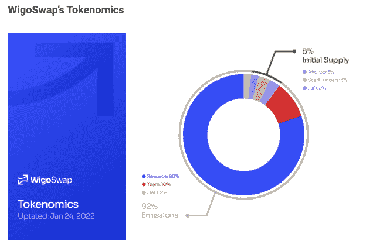
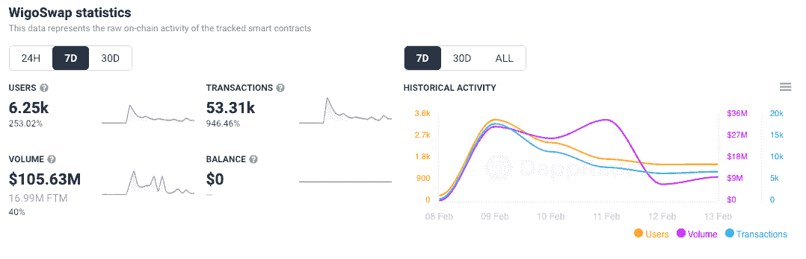
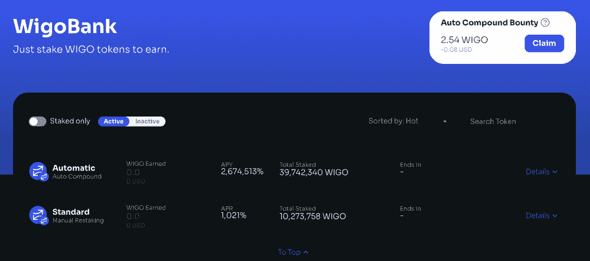
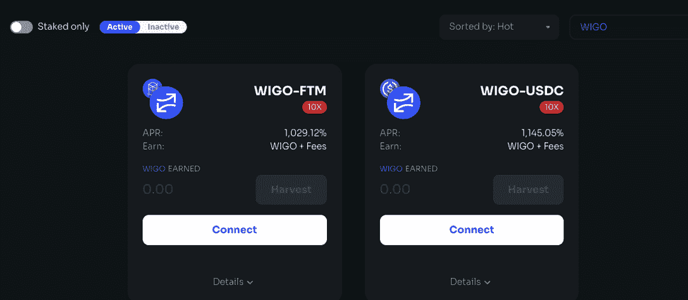
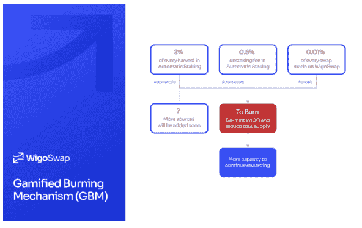
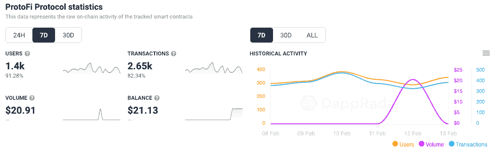
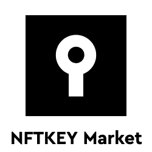

# WigoSwap IDO &游戏化代币燃烧推动 TVL 超过 6300 万美元

> 原文：<https://web.archive.org/web/https://dappradar.com/blog/wigoswap-ido-gamified-token-burning-push-tvl-over-63-million>

## Fantom 上的 WigoSwap 用户增加了 250%

2 月 9 日，交易平台 WigoSwap 为其本地 WigoSwap DEX 和 WIGO token 推出了首次公开募股(IDO ),用户和交易量都在不断增加。资本的涌入使 WigoSwap 将其合同总价值从发布日的 180 万美元增加到今天的 6500 万美元，这要感谢支持者们抢在 WIGO 之前入场。

总价值锁定(TVL)6500 万美元， [WigoSwap 突然成为 Fantom 区块链上的一个突出平台](https://web.archive.org/web/20220930104230/https://dappradar.com/fantom/defi/wigoswap)。它的游戏化燃烧机制引起了人们的注意，因为它开辟了永久铸造新代币的可能性，并激励了提供流动性的用户。

根据公告，IDO 于 2 月 9 日在 wigoswap.io 上启动。此外，Wigo Bank 和 Farms 也于同一天推出，允许用户在该平台上下注和耕作。此外，WigoSwap 的社交媒体[上发起了一项活动，在农场启动前通过空投奖励流动性提供者。](https://web.archive.org/web/20220930104230/https://twitter.com/WigoSwap/status/1489506096339460098)

## WigoSwap 向月球进发

随着连接到 [WigoSwap 的钱包周周增长超过 253%](https://web.archive.org/web/20220930104230/https://dappradar.com/fantom/defi/wigoswap) ,达到 6250 个，发布和奖励达到了预期的效果。这些钱包完成了 53，310 笔交易，通过财务应用程序推动了超过 1.056 亿美元的交易量。有趣的是，过去七天 WigoSwap 上的平均交易价值约为 2000 美元。与其他新平台相比，这是相当高的，因为其他新平台的平均交易额通常只有几百美元。

今天的 WigoSwap [价格为 0.486226 美元，在过去 24 小时内上涨了 483%](https://web.archive.org/web/20220930104230/https://nomics.com/assets/wigo-wigoswap) ，在三个交易所进行交易，其中最大的交易所是 [SpookySwap、SpiritSwap 和 SushiSwap on Fantom](https://web.archive.org/web/20220930104230/https://dappradar.com/rankings/protocol/fantom) 。

如上所述，Wigo 农场和银行在 IDO 发布的同一天开业，为持有者提供了即时的效用和收入潜力。该银行允许 WIGO 持有者持有 WIGO，以赚取更多利润。在撰写本文时，有两种选择:自动复利和手动复利，每种选择的百分比回报率都有很大不同。

两个农场可供持有者赚取更多的 WIGO，年利率超过 1000%，乘数均为 10 倍。目前为 Fantom 的本地令牌 FTM 和 USDC stablecoin 提供流动性是可用的选项。为了促进简单、低成本的交易，该平台希望巩固其稳定的本地令牌储备。

## 什么是 WigoSwap？

[WigoSwap 是 Fantom 区块链](https://web.archive.org/web/20220930104230/https://dappradar.com/fantom/defi/wigoswap)上的一种新 DeFi 协议，它通过提出一种称为游戏化燃烧机制的新概念而广受欢迎。该机制旨在解决激励流动性提供者的问题，这是 DeFi 面临的最大问题之一。利用游戏化，WigoSwap 旨在防止流动性提供商(LP)奖励耗尽，尽管有 20 亿代币的硬上限。通过这种新机制， [WigoSwap](https://web.archive.org/web/20220930104230/https://dappradar.com/fantom/defi/wigoswap) 开启了永久铸造新代币和激励用户的可能性。

## 游戏化燃烧机制

DeFi 在很大程度上依赖于流动性提供商将加密资产锁定在智能合约中。这导致流动性池的产生，交换、借贷等服务可以利用代币。只要流动性提供者始终受到激励，所需的流动性就可以获得。然而，激励流动性提供者并不容易。DeFi 协议的交易费用在一定程度上形成了流动性提供者获得的收益。然而，在 Fantom 等交易费用较低的网络上，需要更有力的激励措施。

主要的问题是，DeFi 协议可以铸造新的代币，并且仅在代币的最大供应量没有达到时奖励其流动性提供者。换句话说，由于硬性规定的存在，这是每个区块链项目中的一个重要组成部分，奖励用户的选择将最终结束。在大多数区块链项目中，焚烧过程仅限于向废弃地址发送令牌，实际上，令牌不会从总供应量中扣除。

[WigoSwap 利用一种特殊类型的智能合约](https://web.archive.org/web/20220930104230/https://dappradar.com/fantom/defi/wigoswap),这种合约可以烧毁代币，并通过逆转被称为“去币”的铸造过程将代币从流通中移除。然而，WigoSwap 的去伪存真方法可以被认为是燃烧过程的真实例子。这允许在将来铸造新代币，同时受益于通过硬上限的存在而获得的优势。

路线图指出，要完全实现游戏化的燃烧机制，需要几个阶段。在初始阶段，烧钱机制包括 DEX 的[个基本功能，如解套费、互换费等。WigoSwap 已经宣布，它将很快为 Fantom 网络上的游戏开发者提供使用奖励计划和 IDOs 的可能性，以使用 GBM 机制开发他们的游戏。可以说，WigoSwap 方法可以作为未来几年该行业长期稳定的方法。](/web/20220930104230/https://dappradar.com/blog/what-is-a-decentralized-exchange-or-dex/)

## Fantom DeFi 正在上升

Fantom DeFi dapps 目前持有 DeFi 锁定的 2000 亿美元总价值的约 [5%，在 2021 年取得了长足的进步。随着我们走向 2022 年，该网络继续给人留下深刻印象，尽管目前加密市场的趋势有些悲观，但几个 dapps 在过去七天中显示了出色的增长指标。](https://web.archive.org/web/20220930104230/https://defillama.com/)

Fantom 上的另一个[金融平台是](/web/20220930104230/https://dappradar.com/blog/a-look-at-defi-dapps-on-fantom/) [ProtoFi](https://web.archive.org/web/20220930104230/https://dappradar.com/fantom/exchanges/protofi-protocol) 。一家分散的银行，提供通过支付利息不断增加存款的储蓄账户。同时，允许用户通过双令牌系统从协议产生的所有收入中获得一部分，从而获得其他回报。

在过去的七天里，与 ProtoFi 连接的钱包增长了 90%以上，交易量超过了 2650 笔。虽然与 Fantom 上更成熟的平台相比数量很少，但 ProtoFi 仅在一个月前推出，表明 Fantom 用户对新 dapp 产品的渴望以及以太坊继续在不利的天然气费用中挣扎的第一层网络的更广泛吸引力。

[<picture></picture>](https://web.archive.org/web/20220930104230/https://dappradar.com/fantom/exchanges/spookyswap)[<picture></picture>](https://web.archive.org/web/20220930104230/https://dappradar.com/rankings/protocol/fantom)[<picture></picture>](https://web.archive.org/web/20220930104230/https://dappradar.com/fantom/marketplaces/nftkey-marketplace)

***以上不构成投资建议。此处给出的信息仅供参考。请行使尽职调查，做你的研究。作者持有 ETH、BTC、AGIX、HEX、LINK、GRT、CRO、OMI、不可变 X、GALA、AVASTR、GMEE、CUBE、RADAR、FLOW、FTM、BNB、SPS、WRLD、ATOM 和 ADA。***