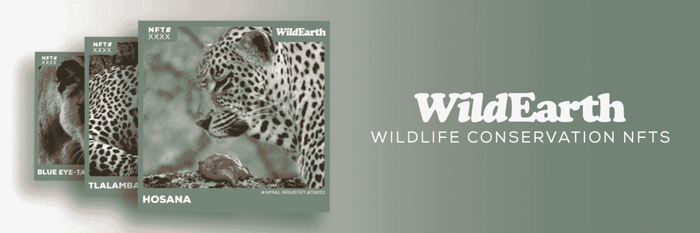
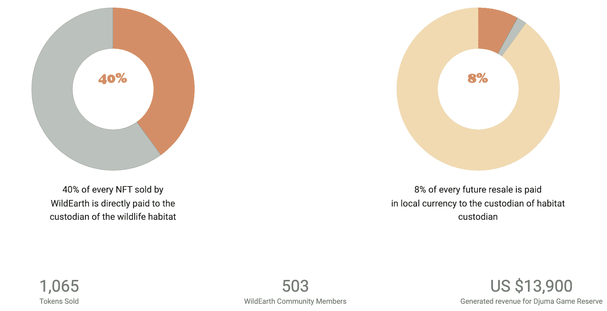

# 威尔德斯推出野生动物保护 NFT 系列

> 原文：<https://web.archive.org/web/https://dappradar.com/blog/wildearth-launches-wildlife-conservation-nft-collection>

## 野生 NFT 的铸造和二次销售收入将用于保护工作

WildEarth 已经启动了一个大规模的 NFT 造币厂，旨在帮助全球濒危物种和野生动物救助中心。野生动物保护收藏有一个崇高的使命。造币和转售价格的很大一部分将直接流向野生动物栖息地的管理人。

野生动物保护系列将展出 25 种动物:11 只豹子、9 只狮子和 5 只鬣狗。他们目前都生活在朱马禁猎区。每个动物收藏的 NFT 显示动物的肖像，它们的名字，和它们的动物注册 ID。他们还将展示他们独特的 NFT 序列号。

Genesis WildEarth NFTs 将以 200 美元的价格出售，即 120 英镑。重要的是，团队已经决定使用[多边形](https://web.archive.org/web/20221206173252/https://dappradar.com/rankings/protocol/polygon)。这为支持者提供了一个以环保方式拥有 NFTs 的机会。根据该组织的网站，Polygon 每笔交易仅需要约 0.0003 千瓦时。这相当于看几分钟电视。这也比给手机电池充电要少得多。重要的是，这比区块链的[以太坊](https://web.archive.org/web/20221206173252/https://dappradar.com/rankings/protocol/ethereum)和比特币的能源成本低得多。

此次 [NFT 收集活动](https://web.archive.org/web/20221206173252/https://dappradar.com/nft)的主要目标是支持自然野生动物栖息地的保护和养护。此外，WildEarth 计划继续扩大其在全球的动物注册。该项目希望通过为栖息地管理人提供新的收入来源，为野生动物保护做出永久贡献。

## 威尔德斯会捐多少？

根据官方网站，所有初始薄荷收入的 40%将直接进入野生动物栖息地托管人。以每个 200 美元的价格，这意味着每个 NFT 将产生 80 美元。重要的是，他的销售份额将用于保护这些动物的自然栖息地。

此外，WildEarth 已经将一种版税计划整合到 NFT 代码中，将所有二次销售的 8%直接发送给托管人。

自推出以来，WildEarth 已经为朱马野生动物保护区筹集了超过 13，000 美元。更重要的是，该项目有一个雄心勃勃的路线图，将为储备提供持续的收入和资金。

根据官方网站，每有一个 NFT 被收藏家铸造，WildEarth 就会铸造第二个，增加未来的赚钱机会。更重要的是，随着项目的发展，WildEarth 的目标是为 NFT 持有者带来更多的效用。其中包括 Search&ID 的领土扩张以显示更多的储备，以及人像提取和动物识别人工智能软件的部署。

DappRadar 将继续监视 WildEarth，因为它的崇高使命达到了它的路线图目标。此外，这是一个重要的项目，展示了 NFTs 如何既可以成为一个可怕的收藏品，又可以成为改变和福祉的驱动力。要首先了解最新的 NFT 新闻，请在 Twitter 上关注 DappRadar，并加入 T2 DappRadar PRO 的社区。

 NewsletterUnsubscribe at any time. [T&Cs](https://web.archive.org/web/20221206173252/https://dappradar.com/terms) and [Privacy Policy](https://web.archive.org/web/20221206173252/https://dappradar.com/privacy-policy)