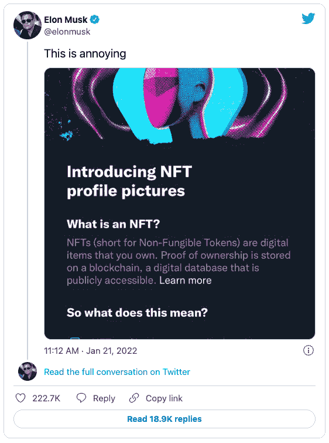
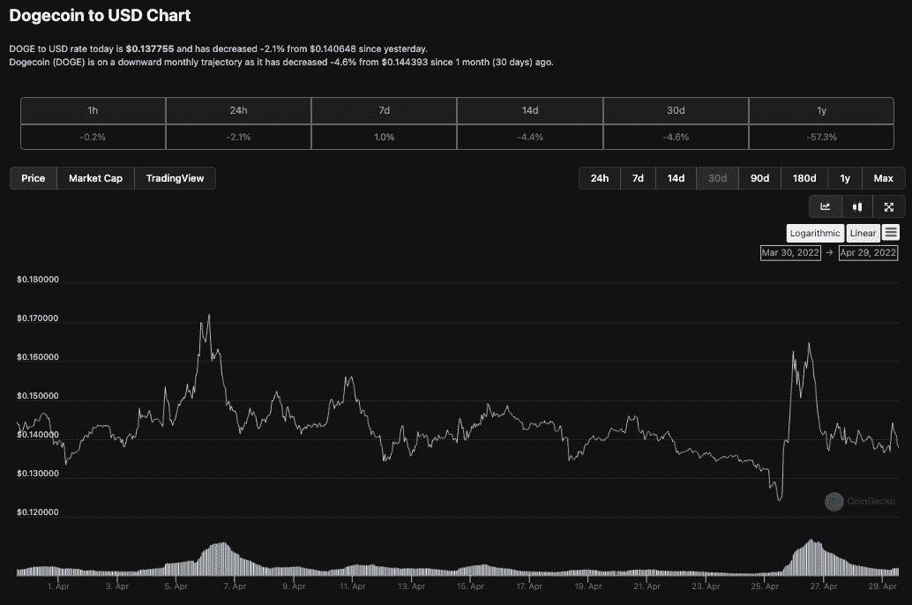

# 埃隆·马斯克会让 Twitter 成为 Web3 中心吗？

> 原文：<https://web.archive.org/web/https://dappradar.com/blog/will-elon-musk-make-twitter-a-web3-hub>

## 这位企业家的最新收购对 crypto 意味着什么

Elon Musks 以 440 亿美元收购 Twitter 的交易在 Web3 领域引起了人们的议论，因为支持者们在思考这次收购对于一个对加密社区来说如此土生土长的平台意味着什么。上周，在最初拒绝了特斯拉创始人的提议后，董事会一致同意将 Twitter 出售给 Elon Musk，后者计划将公司私有化。

在这篇文章中，我们将看看埃隆收购 Twitter 前后的一些事件，看看这些事件能告诉我们他对一个拥有 2.29 亿日活跃用户的平台的意图。

此外，在 2018 年初最初禁止加密广告和聊天后，Twitter 做了一个完全的 180 度大转弯，成为第一个将 NFT 头像作为个人资料图片的中心平台，并且可以说已经成为加密原住民的家园。与此同时，马斯克的一些非加密计划包括将其算法开源，添加编辑按钮，并允许用户发布更长的推文。向 Web3 中心的转变会继续吗？还是伊隆另有打算？让我们开始吧。

## NFT 个人资料图像验证

如上所述，Twitter 最近的加密集成包括 NFT 个人资料图像验证和 BTC 创作者提示。这一举措承认 crypto 中的许多著名声音每天都在使用 Twitter。NFT 验证于 2021 年 1 月推出，使 Twitter 成为第一个纳入 NFTs 的主要社交平台。具有讽刺意味的是，当该功能首次推出时，埃隆在 Twitter 上称其为[烦人的](https://web.archive.org/web/20221127143748/https://links.coinbase.com/u/click?_t=3aca56371967418192255878e9689713&_m=de2305c9c7d7489a81bc46d63b3cd4a9&_e=GcWNGCO_N8OhbaBN98CnhF5S-B4xJVgpdTGYy9ohwoTwYIHYxIwJ99Qezg8RHlZZq9Wcy_eYJNyVX1pNiJC_TgMz6gvm-VyeJSQLXFlLcA59ohqjzCmM0Nbf6HHSQQOAkYdA_QB56e5ZynoRPc8Z2S5_abN9WJQCfHvK-gWwb5fpbhoC3TMqdTInc86iuGjDn-z9MjXowBSQ-AKvCM_oiWJB2DdhwfV8WuxWPdblt2n2pGBqIbgntaqFTbAmXB070zzdPXUDL7IsasQYRDrPxz0nfIZ4afh0T345Vh26gDFjAckeDRKH0Yn7Pijxy7T-mwmjkEHwFJ_gUQsoVYI-JsmVn1jmajRxWJRAf8S-4Hc7tk64R4kCpoAyQSZnRKDkkYtDQHjdlnjZTUFSPSIumSKebeGx9kW0nGl8Zz4PO5vphs4CDMePWW2GwQcAigru1qjtJ2geRpeESKH7XY2DQw%3D%3D)。而由比特币的低费用闪电网络提供支持的 BTC 小费功能目前仅适用于美国和萨尔瓦多的用户。

虽然这条推文很隐晦，但它确实表明，埃隆是利用 Twitter 获利的专家。说某事令人讨厌可能意味着你漠不关心、嫉妒，或者只是在全世界都在谈论的时候，用这句话来吸引注意力。Elon 进一步说，“Twitter 正在这个 bs 上花费工程资源，而加密骗子正在每个线程中举办垃圾邮件拦截派对！?"

对于 Elon 来说，更积极的公关，因为他概述了他将如何处理进一步的加密集成和优先级设置。虽然他的评论并非不正确，但他们也不会对目前最重要的加密问题提供任何快速解决方案。然而，通过在关键时刻扮演好撒玛利亚人，埃隆的 Twitter 影响力开始朝着正确的方向发展。

此外，Twitter 允许验证 NFT 个人资料图片的举动在 NFT 和密码世界受到了广泛欢迎。它允许收藏家、名人和有影响力的人向世界展示他们珍贵的 NFT，并获得一些实际的效用。这进一步证明了成功的 NFT 收藏会围绕自己建立强大的派系，给持有者带来独特的利益。

## Twitter 上的 USDC 支付

就在 Twitter 被出售给马斯克的几天前，这家社交媒体巨头宣布 [USDC stablecoin 支付](/web/20221127143748/https://dappradar.com/blog/stablecoins-show-worth-as-uniswap-tvl-hits-ath-4-5b/)将与支付处理器 Stripe 合作，接受平台内容创作者的支付。此举将允许 Twitter 用户在 USDC 获得超级关注和购票空间，这是一种与美元挂钩的加密货币。

更有趣的是，支付将通过多边形网络发生，用户可以使用钱包服务连接到该网络，包括 [MetaMask](/web/20221127143748/https://dappradar.com/blog/metamask-mobile-gets-an-overhaul-and-applepay-fiat-on-ramp/) 。使用 USDC，Twitter 可以有效地降低全球商务的众多壁垒之一。使用一种美元支持的货币，Twitter 可以向 70 多个国家的贡献者支付，这种货币不会大幅波动，并且可以很容易地兑换成法定货币。

这一消息可能是最明确的迹象，表明 Twitter 计划建立一个 Web3 中心，奖励加密货币的贡献者——扩大 stablecoins 作为全球贸易和结算手段的应用。如果阴谋论者认为这一举措来得正是时候，那也情有可原。当全世界都在等待 Elon 的收购结果时，Twitter 内部人士一直都知道，并在悄悄地奠定更多的 Web3 包容性基础。

## Twitter 上的 DOGE 支付

4 月初，马斯克表示，他希望该公司的订阅服务 Twitter Blue 能够提供用户以 DOGE 支付的选项。然后，在马斯克和 Twitter 达成协议的消息传出后，DOGE 膨胀了 20%以上。

## 杰克·多西是怎么想的？

Twitter 的联合创始人兼前首席执行官杰克·多西似乎完全支持马斯克的收购，并在一系列推文中称赞马斯克“将 Twitter 从华尔街带回来”，并进一步称他为“我信任的唯一解决方案”

结论相当确凿，尽管这位作者有点不确定埃隆·马斯克是如何“从华尔街夺回 Twitter”的，当时马斯克筹集了 465 亿美元来资助他对 Twitter 的收购，他的资产支持了这个数字的三分之二。他的部分包括以他在特斯拉公司的股权为担保的 125 亿美元的巨额保证金贷款，与此同时，其余部分来自以 Twitter 资产为担保的银行融资，这是一种传统的杠杆收购安排。

## 为什么 Twitter 和 Web3 粉丝应该关注

正如马斯克所说，Twitter 是互联网的城市广场，他已经有了一个相当大的扩音器来解决人口问题。马斯克在该平台上拥有超过 8300 万粉丝，并且仍然是一个多产的推特用户。他在推特上表达了他对 Dogecoin 的热情，冒犯了他的敌人，分享了搞笑的模因，无意中注入了加密令牌，并在融合新闻和商业风险更新的同时参与了文化战争。

马斯克公开表示，他希望通过增加新功能、开源算法、抵御垃圾邮件大军以及认证平台上的所有人来让 Twitter 变得更好。所有这些举措表明 Twitter 张开双臂拥抱 Web3 精神。这笔交易感觉就像埃隆对 Twitter 说，“我喜欢你在这里做的事情。这很酷，但现在让我让它变得更好。”

总体而言，可以肯定地说，特斯拉老板对 Twitter 的收购让许多秘密世界的人感到乐观。他致力于将 Twitter 算法开源，这与 [Web3](https://web.archive.org/web/20221127143748/https://links.coinbase.com/u/click?_t=3aca56371967418192255878e9689713&_m=de2305c9c7d7489a81bc46d63b3cd4a9&_e=GcWNGCO_N8OhbaBN98CnhGZ8CnRdYLlwROH7EnK581YKG7MejcVnZW1qhKb-BLyqridOZ0lhv_EVksa7GQBcrxbSOaZidbfAfVuhBtMA-a1wo6tQiGYIG4zbhdjsdz47hSck5PZmByBUKveth3zt-oOjUMrlY_fuwbUgbjKIHxxS-1GbIYjd0BigVl_azvmMTemMC6ukltTIvnk3a8UFvrBh7uJYN6KRGTl9uUicHmg5_9JIhbnr-8Xl6t3Li3xbRht4k516iibZPNj7UYG8nWdFx2iYjS1DatZsC03TqUX6kIpgyzA5q-5qeWJwiqdrzZgZ1RG_4PaTbNGHD0qpfDn6NKBKYprwmn-pkKaXJQ2ICouItyfjtZDGLUcuWKYClXIAR-n2N6sJXM86CkYVai1m6EUw1kjd9TUv3Sd2zWxQFfDGjsdrKzyi7c-YuMvb) 将数据控制权交还给用户的去中心化互联网愿景是一致的。此外，因为他是一个加密崇拜者和 Twitter 的大用户，马斯克非常清楚加密 Twitter 最令人讨厌的问题——机器人。

马斯克并不是第一个试图将财富转化为媒体影响力的亿万富翁企业家。马克·安德森创立了 Clubhouse(还记得 Clubhouse 吗？)，杰夫·贝索斯买下了《华盛顿邮报》，彼得·泰尔关闭了 Gawker.com。虽然可以说是该团伙中最引人注目的，但马斯克似乎在遵循已经走过的道路。

有一点很清楚，埃隆·马斯克对 Twitter 的痴迷有利于商业。4 月 29 日，Twitter 发布了 5.13 亿美元的季度收益，并进一步补充说，在截至 2022 年 3 月的三个月中，收入增长了 16%，达到 12 亿美元，用户比去年增长了 16%，日活跃用户达到 2.29 亿。

 NewsletterUnsubscribe at any time. [T&Cs](https://web.archive.org/web/20221127143748/https://dappradar.com/terms) and [Privacy Policy](https://web.archive.org/web/20221127143748/https://dappradar.com/privacy-policy)

***以上不构成投资建议。此处给出的信息仅供参考。请行使尽职调查，做你的研究。作者持有多种加密货币的头寸，包括 BTC、瑞士法郎和雷达。***