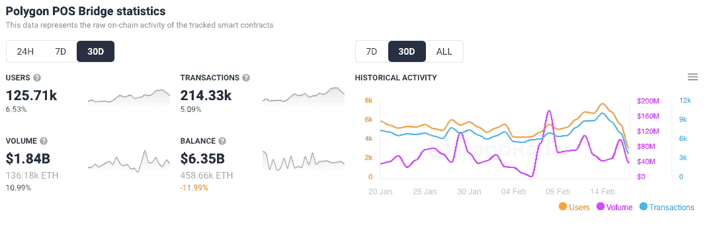
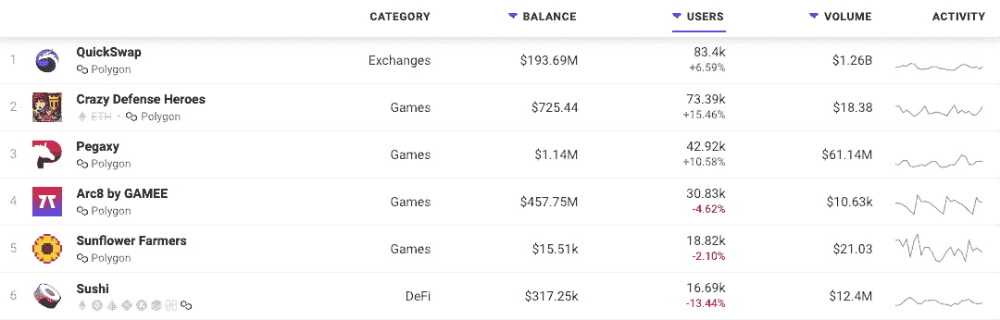
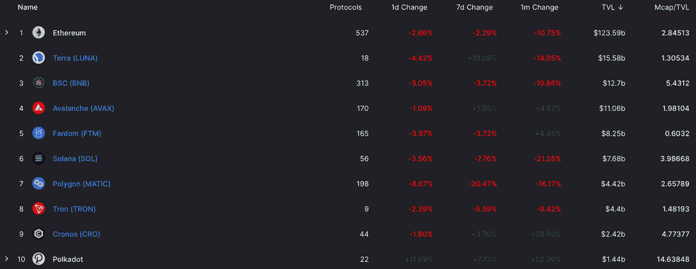
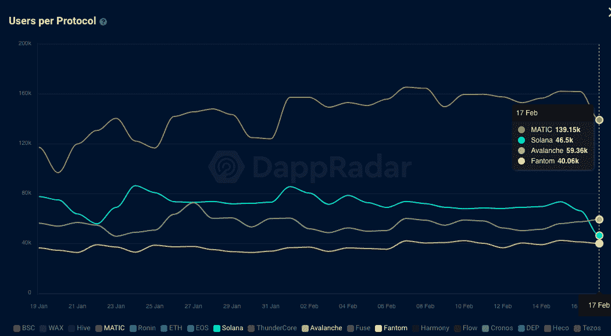
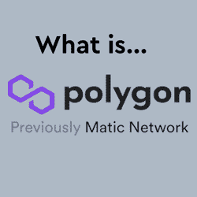

# 多边形会成为以太坊真正的替代品吗？

> 原文：<https://web.archive.org/web/https://dappradar.com/blog/will-polygon-become-the-real-alternative-to-ethereum>

## 随着资金涌入 Polygon，PoS 桥的使用量激增

随着交易者将资产转移到以太坊侧链，以从更便宜的天然气和交易费用中获益，多边形网络令牌桥的使用持续增长。Polygon 并不是新来者，EVM 兼容网络如 Fantom、Solana 和 Avalanche 一直在制造噪音并增加各自的 TVL。Polygon 一直在冷静地处理事情，将其 dapp 生态系统多元化为 GameFi，并在 TVL 达到 44 亿美元。

令牌桥是一组帮助将资产从一个链转移到另一个链的合同。以太坊和多边形之间主要有两个桥梁来移动资产。第一个是等离子体桥，第二个被称为 PoS 桥或桩证明桥。血浆桥提供了更高的安全性，但有 7 天的停药期，因此没有限制的 PoS 桥很受欢迎。

在过去的 30 天里，超过 125，000 个钱包连接到了 [Polygon PoS Bridge](https://web.archive.org/web/20221007155404/https://dappradar.com/ethereum/defi/polygon-pos-bridge) ，发送了 214，330 笔交易，产生了 18.4 亿美元的交易量。有趣的是，我们可以看到，过去 30 天通过该桥的平均交易价值约为 8500 美元。

[比之前观察到的数字高得多](/web/20221007155404/https://dappradar.com/blog/quickswap-dex-on-polygon-volume-grows-180-in-the-last-7-days/)因为交易者将更多的资金转移到网络中，以继续在更便宜的 sidechain 网络上进行交易。作为参考，以太坊的汽油费现在可能高达 100 美元。在 Polygon 上，交易者将支付不到 0.50 美元。

使用率的上升也可以在几个领先的多边形 dapp 中看到。而[以太坊有 Uniswap](/web/20221007155404/https://dappradar.com/blog/uniswap-v3-to-launch-on-polygon-after-community-vote/) , [多边形有 QuickSwap](/web/20221007155404/https://dappradar.com/blog/quickswap-and-its-quick-token/) 和完整的 dapp 生态系统。最有趣的是，本周 Polygon 上表现最好的两个 dapps 都在游戏类别中。当然，这些游戏严重依赖 DeFi 机制，看起来[疯狂防御英雄](https://web.archive.org/web/20221007155404/https://dappradar.com/multichain/games/crazy-defense-heroes)，一个玩家可以赚取代币的塔防游戏，可能会超过 QuickSwap。这进一步显示了 2022 年游戏 dapps 的影响。

## 多边形中锁定的值

TVL 是目前评判区块链的主要标准。这个数字显示了区块链智能合约现在锁定了多少价值。这可以表明区块链的使用情况，因为它表明价值从交易者、投资者和现在的玩家那里流入。以太坊遥遥领先，但在过去的一年里，它的市场份额一点一点地流失。

Source: [https://defillama.com/chain/Polygon](https://web.archive.org/web/20221007155404/https://defillama.com/chain/Polygon)

可以说，在以太坊之后，由 TVL 排名的其他 9 强[之间的差距是很大的。例如，如果多边形的 TVL 翻倍，它将跳到前 5 位，开始向 Terra 前进。考虑到上个月有超过 145，000 个](https://web.archive.org/web/20221007155404/https://defillama.com/chain/Polygon)[钱包连接到 Polygon dapps](https://web.archive.org/web/20221007155404/https://dappradar.com/rankings/protocol/polygon) ，这个目标非常容易实现。这个数字几乎超过了索拉纳、雪崩和凡托姆的总和。

## 多边形会成为以太坊真正的替代品吗？

[Polygon Network](/web/20221007155404/https://dappradar.com/blog/what-is-polygon-a-simple-explanation/) 的一些关键优势在于，它通过提供一个私有和个人 dapp 项目可以互操作的平台，为开发人员提供了多种方式来在其 dapp 中提供高速、低成本的事务处理。同时，开发者在不完全抛弃以太坊的情况下，选择最适合自己需求的一个或多个缩放工具。

Polygon 上 GameFi 和 Play-to-Earn dapps 的崛起也表明其用户群将继续扩大。多边形游戏生态系统看起来已经与 Pegaxy，Aavegotchi，Fear，Phantom Galaxies，REVV Racing，Zed Run，Doctor Who:Worlds apartment，以及即将到来的 Galaxy Fight Club，Riot Racers 等堆叠在一起。

该网络通过战略投资和合作伙伴关系不断改进其游戏前景。更重要的是，Polygon 团队[在一系列合作伙伴的帮助下推出了 Polygon Studios](/web/20221007155404/https://dappradar.com/blog/polygon-puts-focus-on-for-play-to-earn-blockchain-gaming/) ，这些合作伙伴包括 Animoca Brands、Sandbox、Decentraland 和其他领先的 dapps。

Polygon 当然有机会成为区块链主要的多 dapp 类别，但目前面临来自最近更名的 BNB 连锁店的激烈竞争。另一个网络拓宽了视野，在 DeFi 之外拥抱 dapps，以帮助增加其观众。

[<picture></picture>](https://web.archive.org/web/20221007155404/https://dappradar.com/blog/what-is-polygon-a-simple-explanation)[<picture></picture>](https://web.archive.org/web/20221007155404/https://dappradar.com/polygon/exchanges/quickswap)[<picture></picture>](https://web.archive.org/web/20221007155404/https://dappradar.com/blog/what-is-a-dapp-on-the-blockchain)[<picture></picture>](https://web.archive.org/web/20221007155404/https://dappradar.com/polygon/defi/sushi)[<picture></picture>](https://web.archive.org/web/20221007155404/https://dappradar.com/blog/set-up-metamask-on-layer-2-and-avoid-ethereum-gas-fees)[<picture></picture>](https://web.archive.org/web/20221007155404/https://dappradar.com/polygon/defi/1inch-network-on-polygon)

***以上不构成投资建议。此处给出的信息仅供参考。请行使尽职调查，做你的研究。作者持有 ETH、BTC、AGIX、HEX、LINK、GRT、CRO、OMI、不可变 X、GALA、AVASTR、GMEE、CUBE、RADAR、FLOW、FTM、BNB、SPS、WRLD、ATOM 和 ADA。***