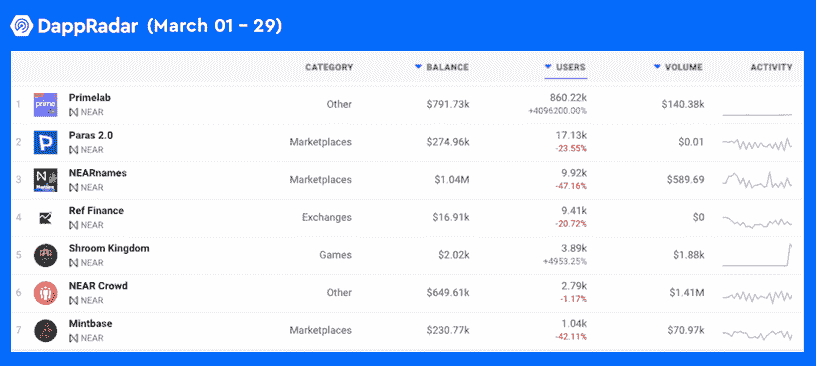

# Primelab on NEAR 会重新定义 Web3 吗？

> 原文：<https://web.archive.org/web/https://dappradar.com/blog/will-primelab-on-near-redefine-web3>

## PrimeLab 又名 NEAR Apps 正在为日常用户建立一个体验生态系统

Primelab 是区块链附近的一个新的 dapp 平台，在三月中旬用户数量和交易量都激增。它是一个为个人和企业加入 NEAR 生态系统提供简单易用工具的平台。

区块链附近发生的一些有趣的事情让我们看到了今天的文章。

在三月中旬，近区块链显示了链上数据的巨大增长。令人惊讶的是，流量基本上来自一个 dapp，Primelab。[根据 DappRadar dapp 跟踪](https://web.archive.org/web/20221007095313/https://dappradar.com/near/other/near-apps)，Near 的交易增长曲线与 Primelab 的增长曲线高度一致。

dapp 记录了 860，220 个独特的活动钱包与其智能合约的交互，在过去 30 天内增长了 10，000%以上。此外，同期 dapp 的交易量也出现了令人瞠目结舌的增长。用户在 dapp 的智能合约上进行了 497 万次交易，激增 10，548%。随着这种类型的活动增长，Primelab 在 DappRadar 上排名第一也就不足为奇了。

## **链条上的一切**

Primelab 告诉 DappRadar，它的使命是通过为个人和企业提供最易于使用的工具来体验 Web3，从而推动区块链附近的大规模采用。Primelab 的创始团队坚信，链上数据应该反映用户与区块链的每一次互动，而不仅仅是跟踪用户的资金活动，即交易。

抱着这样的想法，Primelab 将其想法付诸实践。Primelab 惊人的数据记录了用户的各种上链行为，而不仅仅是交易。这为我们应该如何全面地看待区块链的数据打开了大门。因此，用户参与是显而易见的。那么问题来了。Primelab 做了什么，发了这么多流量，几乎占到了所有近日交易和活跃用户的 90%？

## 用一个包罗万象的生态系统重新定义 Web3

Primelab 为用户提供了一个以可访问性和可用性为中心的包罗万象的区块链生态系统。所有的 Primelab dapp 都允许用户通过电子邮件或电话注册一个账户。该账户作为访问平台上不同 dapps 的唯一通行证和身份。最终，聚合的 dapp 将成为用户体验生态系统中数百个其他 dapp 的门户。目前，Primelab 几乎没有 dapps，但它已经吸引了近百万用户。

[https://web.archive.org/web/20221007095313if_/https://www.youtube.com/embed/20L8bunrhxI?start=168&feature=oembed](https://web.archive.org/web/20221007095313if_/https://www.youtube.com/embed/20L8bunrhxI?start=168&feature=oembed)

## 帮助 dapps 的角色目标网络

从同一个演练 [Youtube 视频](https://web.archive.org/web/20221007095313/https://www.youtube.com/watch?v=20L8bunrhxI)中，我们还了解到 Primelab 将在不久的将来利用用户的链上活动来生成人物角色。具体来说，一个旨在与谷歌广告竞争的营销活动平台将使用这些用户角色来准确定位潜在受众。为了实现这个目标，Primelab 计划今年建造 180 个 dapps。他们认为，如果 20%的 dapps 成功，广告网络将有足够的数据来描述每个用户的角色。如何实现这一点？基本上，人物角色生成过程依赖于用户最近的活动。Primelab 将使用用户在区块链上最近的五个动作来生成这样一个角色。例如，一个动作可以是铸造一个 NFT，销售一张交易卡，或者通过一个 KYC 过程。

### 带有病毒式营销工具的 NFT 创客应用

NFT 创客应用是更广泛的 Primelab 生态系统中的第一个 dapp。它以一种工具的身份出现，可以在区块链附近轻松创建 NFT。在 [Youtube 视频](https://web.archive.org/web/20221007095313/https://www.youtube.com/watch?v=20L8bunrhxI)中，Primelab 分享了它通过其病毒式营销工具在几天内成功收购了超过 70 万个钱包。根据视频介绍，病毒式共享机制不仅会引发内容的传染性共享，还可以与生态系统中的任何其他 dapp 集成为一个切片，即一个模块功能小部件。

### [Web 3 云](https://web.archive.org/web/20221007095313/http://myweb3cloud.io/)，隐私第一

Primelab 采取了与 IPFS 相反的方法，建立了一个真正的分散存储解决方案，隐私第一。获取是真正的所有权。所有 Primelab 产品都建立在一个默认的私有文件系统上，在这个系统中，文件用它们所有者的区块链钱包加密，用户甚至可以选择在哪里存储这些数据。在线或他们自己的存储系统。Web 3 cloud 包括一个免费的实时协作套件，因此每个用户都可以呆在 Web 3 中。人们第一次真正控制了数据。他们可以随时共享、隐藏或删除数据。

## 今后

广告网络使企业和个人能够在 Web3 上有效地组织营销活动。Primelab 开发工具，让用户和开发者更容易访问区块链生态系统。两者听起来都雄心勃勃却令人兴奋。值得一提的是，Primelab 的用户群由广泛的普通用户组成，而不仅仅是密码高手。可以说，Primelab 惊人的数据表现表明，该团队通过建立一个能够大规模采用的生态系统，走在了正确的道路上。DappRadar 将继续监控 Primelab 和区块链生态系统 T3 附近的 T2 的发展。

**免责声明** —这是一篇赞助文章。DappRadar 不认可本页面上的任何内容或产品。DappRadar 旨在提供准确的信息，但读者应该在采取行动之前总是自己做研究。DappRadar 的文章不能被认为是投资建议。