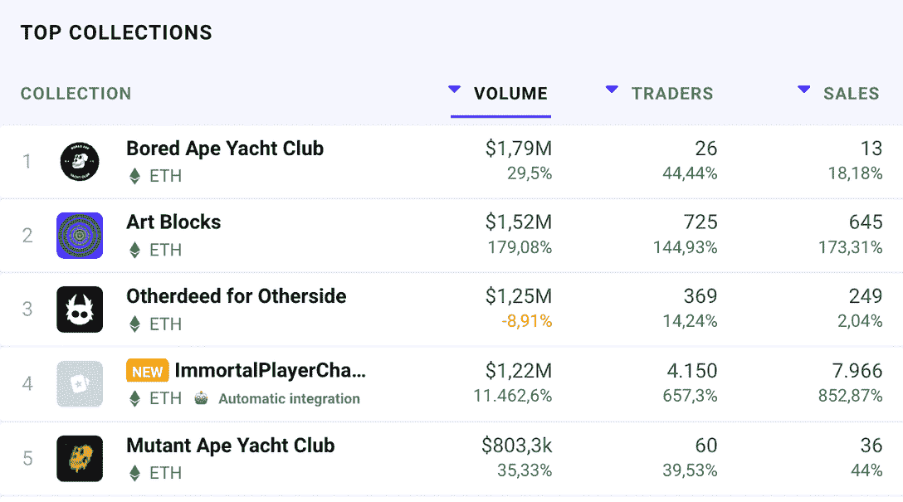
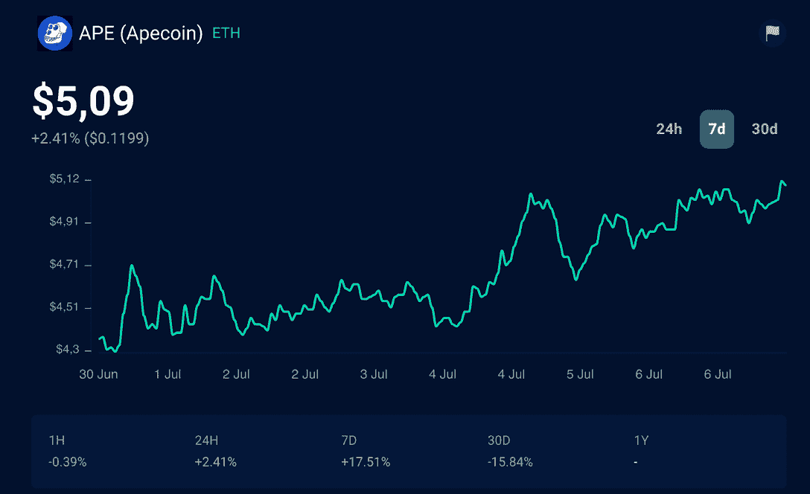

# 另一边演示会给元宇宙一个新的推动吗？

> 原文：<https://web.archive.org/web/https://dappradar.com/blog/will-the-otherside-demo-give-the-metaverse-a-new-push>

## 宇迦实验室的元宇宙计划在 7 月 16 日进行首次旅行演示，这可能会是另一个巨大的成功

作为今年最受期待的 web3 游戏发布之一，the Otherside 在上周的负载测试中再次转移了它的粉丝群。随着第一次试玩的临近，Otherdeed 的所有者已经拿到了进入元宇宙的门票。在 5 月份 NFT 土地销售占据排行榜之后，人们预计，在未来几天里，类人猿和 ApeCoin 将再次成为人们关注的焦点。

是时候开始探索[另一边](https://web.archive.org/web/20221128041345/https://otherside.xyz/)了。仍处于开发阶段，玩家将能够通过测试和最终演示，与*《龙与地下城之魂》*世界的建设合作。

[https://web.archive.org/web/20221128041345if_/https://www.youtube.com/embed/qt1equGhkQE?feature=oembed](https://web.archive.org/web/20221128041345if_/https://www.youtube.com/embed/qt1equGhkQE?feature=oembed)

两个负载测试中的第一个测试发生在 6 月 6 日，同时依赖 2500 名玩家的协作。

早期采用者可以直接测试元宇宙，帮助开发者为演示版本做好一切准备。

## 其他方面的交易数字随着预期而上升

DappRadar 的 NFT 概览数据显示，自 Otherside 首次负载测试以来，BAYC 和游戏内 Otherdeeds 这两个系列的交易量都位居榜首。

这表明，当游戏试玩版最终推出时，5 月份 55，000 土地销售的成功可能会重演。

五月，Otherside 的官方推特账户首次宣布，第一次旅行定于 7 月 16 日。

此外，在元宇宙用于任何交易的 APE (Apecoin)货币也出现了升值。ApeCoin 目前为 5.09 美元，在本周的首次负载测试中上涨了 17%。然而，在 16 号之前还有很多要爬的。

承诺将无聊猿游艇俱乐部(BAYC) NFT 集合带入生活的元宇宙将是一个大型多人在线角色扮演游戏(MMORPG)。

此外，多元宇宙将突出不同蓝筹 NFT 项目之间的互操作性。例如，谁拥有来自 BAYC、[crypto punk、](https://web.archive.org/web/20221128041345/https://dappradar.com/hub/nft-explorer/collection/cryptopunks)[Women](https://web.archive.org/web/20221128041345/https://dappradar.com/hub/nft-explorer/collection/world-of-women-nft)和 [Cool Cats](https://web.archive.org/web/20221128041345/https://dappradar.com/hub/nft-explorer/collection/cool-cats-nft) 的 NFT，谁就可以在另一边使用它们。

为了玩另一边的游戏，玩家必须拥有自己的土地，即另一份契约。在元宇宙，玩家可以一边用 [ApeCoin token](https://web.archive.org/web/20221128041345/https://dappradar.com/hub/token/eth/APE?from=0x4d224452801aced8b2f0aebe155379bb5d594381) 进行交易，一边建造、探索和收集资源。

点击此处了解更多关于 Otherside 项目的信息。

DappRadar 将继续关注 Otherside、BAYC 和 ApeCoin 的最新进展。在 [Twitter](https://web.archive.org/web/20221128041345/https://twitter.com/dappradar) 、 [Discord](https://web.archive.org/web/20221128041345/https://discord.gg/4ybbssrHkm) 和 [Youtube](https://web.archive.org/web/20221128041345/https://www.youtube.com/c/DappRadar) 上关注我们，跟上区块链世界的动态。

 NewsletterUnsubscribe at any time. [T&Cs](https://web.archive.org/web/20221128041345/https://dappradar.com/terms) and [Privacy Policy](https://web.archive.org/web/20221128041345/https://dappradar.com/privacy-policy)