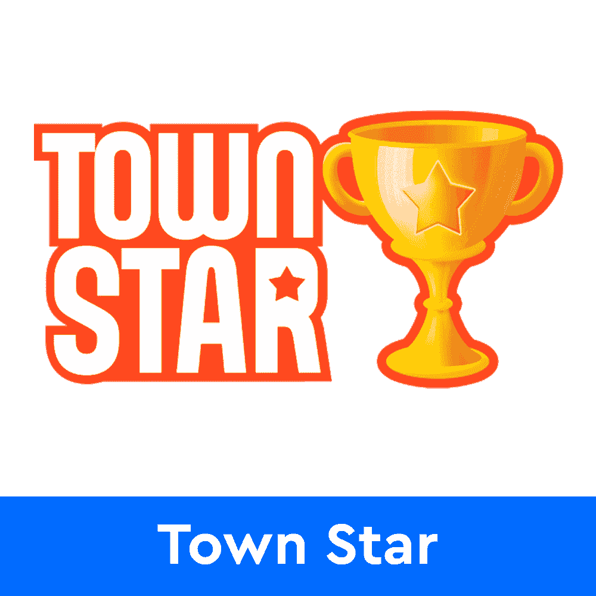
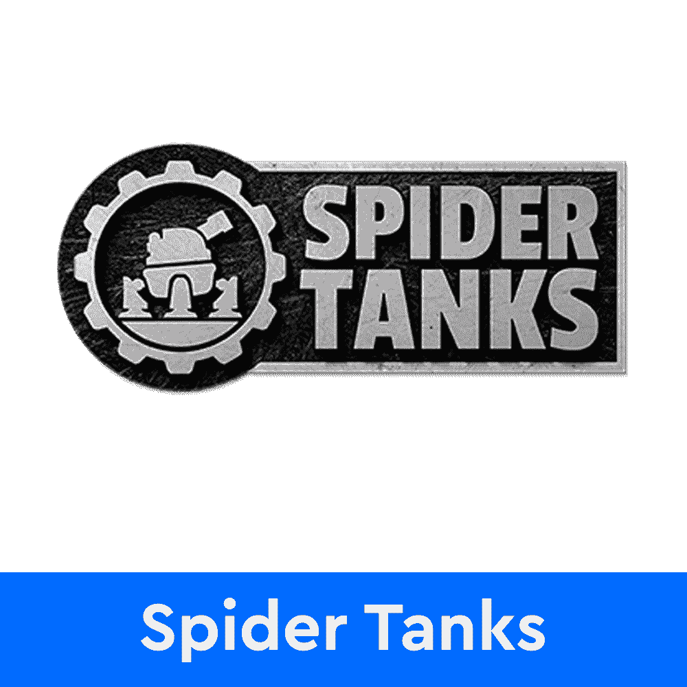

# 在五月混乱期间赢得城镇之星大奖

> 原文：<https://web.archive.org/web/https://dappradar.com/blog/win-gala-prizes-in-town-star-during-may-mayhem>

## 在城镇之星大混乱事件中赢取奖励所需了解的一切

农业游戏《城镇之星》是 Gala Games 的标志性游戏，它宣布了一年一度的 5 月 Mayhem 活动以及为此分配的奖金。根据官方宣布，超过 200 万美元的节日奖励将在下个月在城镇明星球员中分发。

## 总结:

*   Town Star 将举办四场[周奖](https://web.archive.org/web/20221129070549/https://dappradar.com/blog/win-gala-prizes-in-town-star-during-may-mayhem/#Town-Star-Mayhem)活动，每场的最高奖金为 15，000 美元
*   额外的奖池将每两周奖励来自全镇之星[即玩即赚服务器](https://web.archive.org/web/20221129070549/https://dappradar.com/blog/win-gala-prizes-in-town-star-during-may-mayhem/#servers)的随机玩家
*   May Mayhem 凭借 400 万美元的节日奖励池接管了[节日游戏生态系统](https://web.archive.org/web/20221129070549/https://dappradar.com/blog/win-gala-prizes-in-town-star-during-may-mayhem/#Gala Games)

## 城镇之星伤害排行榜奖励

五月大混乱是盛大游戏生态系统中最令人期待的事件之一。它给玩家带来了巨大的回报。当谈到城镇之星时，今年的奖励池达到了高达 200 万美元的庆祝代币。

根据[官方公告](https://web.archive.org/web/20221129070549/https://blog.gala.games/mayhem-comes-to-town-157039c03281)，奖励池分配将分为四个不同的时段。每周 Town Star 的前 2000 名玩家将获得一部分奖励。

当然，排名靠前的玩家会获得更大的奖励。以下是每个职位的完整薪酬明细:

*   第一名—15，000 美元
*   第二名—10，000 美元
*   第三名——7500 美元
*   第 4 名到第 10 名——3000 美元
*   第 11-100 名——1000 美元
*   第 101-200 名——715 美元
*   第 201-300 名——450 美元
*   第 301-1000 名——150 美元
*   第 1001-2000 次——50 美元

记住，这些是每周奖励。这意味着，如果一名玩家在五月混乱事件的所有四次每周运行中排名第一，他们可以获得高达 60，000 美元的庆祝代币。更重要的是，Gala Games 团队已经宣布，无论玩家在排行榜上的排名如何，都将向他们发放随机奖金。

在城镇之星排行榜上名列前茅需要大量的销售。因此，建立你的农场，搅动供应线。出售物品会给你带来星星，星星越多，你的每周排名就越高。

## 即玩即赚服务器也有一个奖励池

除了在城镇之星排行榜上排名上升之外，社区成员还将有机会通过在游戏的“玩即赚”服务器上玩游戏来赢得奖励。为了让五月大混乱的快乐和刺激尽可能容易获得，Gala Games 已经分配了超过 20 万美元给镇星 P2E 服务器上的玩家。

重要的是，奖品将从排行榜中随机分配。这意味着即使你排名在排行榜的底部，你也有机会获胜。五月混乱的第二周和第四周过后，将会有两次抽奖。在每两周的会议后，将会有一个直播流，在此期间，将会选出一些号码来赢得节日奖品。

## May Mayhem 接管所有游戏项目

《城市之星》并不是节日游戏组合中唯一受益于五月混乱奖热潮的游戏。区块链游戏工作室已经预留了总计 400 万美元的庆祝代币，在所有游戏项目的玩家中分发。

虽然城镇之星获得了全球奖励池的最大份额，但其他游戏如蜘蛛坦克也将获得奖励。蜘蛛坦克将运行一个玩家推荐竞赛，每周奖励获胜者。此外，游戏将在每周举办四场不同的游戏赚取比赛[。](https://web.archive.org/web/20221129070549/https://dappradar.com/blog/gamers-can-win-1-5-million-in-prizes-playing-spider-tanks-this-may)

说到推荐比赛，Gala Games 还举办了一个全平台的比赛，奖励推荐成功十次的玩家。这场比赛的获胜者将获得一个免费的饲料机器人 NFT。这个 Feed Bot 是一个限量版的收藏品，不通过 Gala Games marketplace 出售，只能在 OpenSea 等二级市场上赢得或购买。

随着 May mayhem 的接管，DappRadar 将继续监控 Gala Games 生态系统。如果你想了解更多关于城镇之星，庆典令牌和其他庆典游戏产品的信息，请点击下面的链接。此外，你可以在 Twitter 上关注 DappRadar，抢先获得最新的区块链博彩新闻。

[<picture></picture>](https://web.archive.org/web/20221129070549/https://dappradar.com/blog/town-star-updates-economy-again)[<picture></picture>](https://web.archive.org/web/20221129070549/https://dappradar.com/hub/token/eth/GALA?from=0x15d4c048f83bd7e37d49ea4c83a07267ec4203da)[<picture></picture>](https://web.archive.org/web/20221129070549/https://dappradar.com/blog/gamers-can-win-1-5-million-in-prizes-playing-spider-tanks-this-may) NewsletterUnsubscribe at any time. [T&Cs](https://web.archive.org/web/20221129070549/https://dappradar.com/terms) and [Privacy Policy](https://web.archive.org/web/20221129070549/https://dappradar.com/privacy-policy)