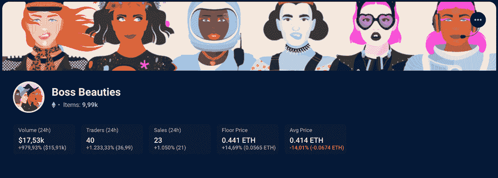
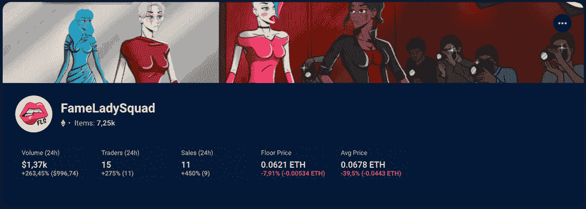

# 妇女领导的 NFT 项目缩小了 Web3 的性别差距

> 原文：<https://web.archive.org/web/https://dappradar.com/blog/women-led-nft-projects-to-narrow-web3-gender-gap>

## 潮流的改变即将到来，NFT 的妇女站在了最前沿

一直以来都有很多关于多样性和将无代表群体纳入加密空间的讨论。但是尽管有 web3 革命的理想，包括权力的分散，看起来高层的群体还是和以前一样。性别差距如此之大，我们如何实现全球收养？这时，由女性领导的 NFT 项目开始崭露头角。

## 网络中的性别差距越来越小

就像在任何领域一样，女性经常努力争取在 dapp 项目的领导层中获得一个席位。

如果我们看看更广泛的受众，男性仍然是交易加密和非加密技术的绝大多数，这也使得区块链的营销活动几乎完全针对他们。

根据双子座的 2021 年美国密码报告，只有 T2 26%的密码持有者是女性。2021 年 11 月，[艺术策略](https://web.archive.org/web/20220930202336/https://arttactic.com/product/nft-art-market-report-november-2021/)发布的另一份报告指出，在 Nifty Gateway 上，不到 **16%** 的 NFT 艺术家认为自己是女性。

然而，更乐观的数据引起了人们对该行业未来的关注。双子座的报告还显示，在所谓的加密好奇者中，女性占 53%，这是第一次投资 web3 项目。在同一方向，澳大利亚交易所 [BTC 市场](https://web.archive.org/web/20220930202336/https://assets.btcmarkets.net/reports/BTC%20Markets%20Investor%20Study%20Report%20FY20-21.pdf)的女性用户比去年增加了 **175%。**

这代表着下一波密码购买者的重大潜在转变。那么，女性领导的 NFT 项目是如何促成这种变化的呢？

[<picture></picture>](https://web.archive.org/web/20220930202336/https://dappradar.com/blog/what-are-non-fungible-tokens-nfts)[<picture></picture>](https://web.archive.org/web/20220930202336/https://dappradar.com/nft/marketplaces)[<picture></picture>](https://web.archive.org/web/20220930202336/https://dappradar.com/nft/sales)

## 由妇女领导的促进赋权的 NFT 项目

web3 中的突破性创新太耀眼了，不能让女性远离，而 NFT 是主要的入口。

2021 年，以女性为中心的 [NFT 系列抢尽风头](https://web.archive.org/web/20220930202336/https://dappradar.com/blog/world-of-women-boss-beauties-and-cryptochicks-walk-in-the-spotlight)，它们加入了[达普拉达排名](https://web.archive.org/web/20220930202336/https://dappradar.com/nft)的前 100 名 NFT 系列。

这些项目远远超出了私营部门筹资和伙伴关系司的国家粮食贸易项目，促进了对更多元化社区的开放，并支持妇女在私营部门筹资和伙伴关系司行业学习和工作。

请继续阅读，了解由女性领导的最佳 NFT 项目。

### 1.女人的世界

作为世界上最成功的 NFT 项目之一,《妇女的世界》是第一批吸引主流媒体关注的女性主导的作品集之一。

#### 什么是女人的世界？

“一群独特、酷、多样的女性，准备在 NFT 留下印记！10.000 个随机生成的各种稀有的数字收藏品，作为 ERC-721 代币存在于区块链以太坊，并在 IPFS 托管。”

*   [访问天下女人官网](https://web.archive.org/web/20220930202336/https://worldofwomen.art/)

#### 代表所有女性的蓝筹 NFT

2021 年 7 月公开发售的[女性世界(WoW) NFT 系列](https://web.archive.org/web/20220930202336/https://dappradar.com/ethereum/collectibles/world-of-women)仅在 10 小时内就销售一空。项目背后的艺术家 Yam Karkai 手工绘制了 200 个视觉资产，组成了 10，000 个令牌。

许多女性名人通过购买 WoW NFT 宣布进入加密领域，合作关系也从那里开始发展。

自推出以来，WoW[与元宇宙沙盒](https://web.archive.org/web/20220930202336/https://dappradar.com/blog/the-sandbox-x-world-of-women-partner-up-to-empower-women)整合，并与 Billboard 一起发布了一个特殊的[系列，以庆祝音乐中的女性。](https://web.archive.org/web/20220930202336/https://dappradar.com/blog/billboard-x-world-of-women-collab-celebrates-women-in-music)

继第一个系列获得成功之后，该团队在 2022 年 3 月推出了另一个系列，名为[女性银河世界](https://web.archive.org/web/20220930202336/https://dappradar.com/hub/nft-explorer/collection/world-of-women-galaxy) (WoWG)，很快[也成为热门](https://web.archive.org/web/20220930202336/https://dappradar.com/blog/world-of-women-second-collection-boasts-record-sales)。

### 2.老板美人

通过与漫威、 [Meta](https://web.archive.org/web/20220930202336/https://dappradar.com/blog/nfts-on-instagram-how-it-works-why-its-special) 、芭比和联合国妇女署的合作，Boss Beauties NFTs 正在将女性赋权带给大众——以及纽约证券交易所艺术大厅。

#### 关于老板美女

“一个女人可以成为她想要的一切。10 年来，教育下一代妇女和女孩并增强其权能一直是我们的使命。Boss Beauties 系列延续了我们过去十年来一直倡导的激情和目标。这是一个由 10，000 名独特、独立和坚强的女性组成的集合，她们还可以参加独家虚拟活动等。”

*   [访问老板美女官网](https://web.archive.org/web/20220930202336/https://bossbeauties.com/)

#### 提升女性超过 10 年

老板美人的故事始于创始人丽莎·梅尔和她的非营利组织[我的社交画布](https://web.archive.org/web/20220930202336/https://mysocialcanvas.com/)。在为年轻女孩提供指导和职业机会超过十年后，她决定将她们的社区扩展到 NFT 空间。

凭借强大的创业团队，该项目利用 NFTs 推广女性可以成为她们想要的一切的理念。

老板美女 NFT 系列于 2021 年 9 月推出，取得了巨大的成功，一小时内就销售一空。几个月后，Boss Beauties 已经筹集了 300 多万美元，用于资助妇女和女孩的辅导和奖学金项目。

2022 年 3 月，该组织还推出了第二个系列，名为 [Boss Beauties Role Models](https://web.archive.org/web/20220930202336/https://dappradar.com/hub/nft-explorer/collection/rolemodels) ，灵感来自历史上最具标志性的女性。

### 3.FameLadySquad

以太坊区块链上的第一个全女性生殖化身项目 FameLadySquad 走出了一个耻辱的时代，被 NFT 空间中一群有影响力的女性所拯救。

#### FameLadySquad 是什么？

“名媛队”是由生活在区块链联邦理工学院的 8888 名独特的名媛组成的。每位女士都与众不同。为此创造了数百万种组合。”

*   [访问 FameLadySquad 官网](https://web.archive.org/web/20220930202336/https://fameladysquad.com/)

#### 为女性争取发言权

尽管 FameLadySquad NFT 系列有着令人困惑的历史，但它仍然是最强大、最具影响力的女性区块链项目之一。

当发现所谓的由女性领导的非传统疗法的收集实际上是一个粗略的男性项目时，社区决定接管。阿什丽·史密斯([无聊的贝基](https://web.archive.org/web/20220930202336/https://twitter.com/iamboredbecky?s=20&t=mbwgSYUhRB6p7BM5I-Ed0A))和丹妮尔·戴维斯([无知](https://web.archive.org/web/20220930202336/https://twitter.com/NFTignition?s=20&t=mbwgSYUhRB6p7BM5I-Ed0A))决定领导一场蓬勃发展的社区革命。

2021 年 8 月，前团队成员将项目的智能合同、艺术层和域交给了他们，于是他们开始重建藏品及其声誉。新老板唯一没有收到的是销售所得的 150 万美元。

自从他们接管以来，FameLadySquad 社区已经与领先的元宇宙[非集中化](https://web.archive.org/web/20220930202336/https://dappradar.com/blog/what-is-decentraland-an-open-world-economy-in-the-metaverse)合作庆祝了它的自由纪念日。

## 支持非正规教育中妇女的名人

你可能已经知道，NFTs 的巨大成功部分归功于名人的采用。就妇女领导的 NFT 项目而言，这种参与支持人道主义事业。

瑞茜·威瑟斯彭和伊娃·朗格利亚是参与《魔兽世界》和《老板美人》的一些最著名的名人。

更进一步，帕丽斯·希尔顿于 2021 年推出了自己的 NFT 系列，销售额超过 111 万美元。这位女继承人是区块链技术的早期采用者和倡导者，最近的合作伙伴[本周宣布与沙盒元宇宙](https://web.archive.org/web/20220930202336/https://dappradar.com/blog/paris-hilton-enters-the-sandbox)。

在这一浪潮中，最近由米拉·库妮丝、格温妮丝·帕特洛、凯特·哈德森和提拉·班克斯领导的 [NFT 区块链永远的朋友(BFF)](https://web.archive.org/web/20220930202336/https://www.mybff.com/) 项目也有望成为该领域的领导者。

## 你如何支持女性主导的 NFT 系列？

虽然购买 NFT 似乎是这个问题的显而易见的答案，但你不必投资你的钱来支持这项事业。通过支持网络 3 中所有女性的工作，你已经为一个更公平的社区做出了贡献。最基本的姐妹会形式有所帮助。

如果我们属于没有代表的群体，就更容易感到需要增加多样性。但这并不能阻止整个社区从这种多样性中受益。

毕竟，我们想要建立一个所有人都受欢迎并有代表的社区。

*   **阅读还:** [15 位女性开创区块链空间](https://web.archive.org/web/20220930202336/https://dappradar.com/blog/15-women-pioneering-the-blockchain-space)

## 使用 DappRadar 跟踪和管理您的 NFT

由于我们一直在寻求改善我们的社区体验， [DappRadar](https://web.archive.org/web/20220930202336/https://dappradar.com/) 开发了一些工具，让您的 NFT 狩猎更上一层楼。

使用我们的 [NFT 收藏浏览器](https://web.archive.org/web/20220930202336/https://dappradar.com/hub/nft-explorer)，您不仅可以找到最热门的收藏，还可以深入了解它们独特的代币和统计数据。此外，它还允许您买卖 NFT。查看下面的视频了解更多信息。

[https://web.archive.org/web/20220930202336if_/https://www.youtube.com/embed/fkEaXYLOW-s?start=1&feature=oembed](https://web.archive.org/web/20220930202336if_/https://www.youtube.com/embed/fkEaXYLOW-s?start=1&feature=oembed)

现在，如果你的钱包里已经有了安然无恙的 NFTs，并且只想管理你的投资组合，你一定会喜欢 DappRadar NFT 投资组合跟踪系统。

你也会喜欢看看名人密码& NFT 钱包富豪榜来收集一些灵感。

## 加入我们为多元化社区而战

随着越来越多以社区为中心的收藏出现，DappRadar 将继续关注 NFT 空间。如果你想密切关注这些女性优先的系列，一定要关注我们的[博客](https://web.archive.org/web/20220930202336/https://dappradar.com/blog/)、[推特](https://web.archive.org/web/20220930202336/https://twitter.com/dappradar)账号和 [Youtube](https://web.archive.org/web/20220930202336/https://www.youtube.com/c/DappRadar) 频道。

***以上不构成投资建议。此处给出的信息仅供参考。请尽职调查并自行研究。***

 NewsletterUnsubscribe at any time. [T&Cs](https://web.archive.org/web/20220930202336/https://dappradar.com/terms) and [Privacy Policy](https://web.archive.org/web/20220930202336/https://dappradar.com/privacy-policy)