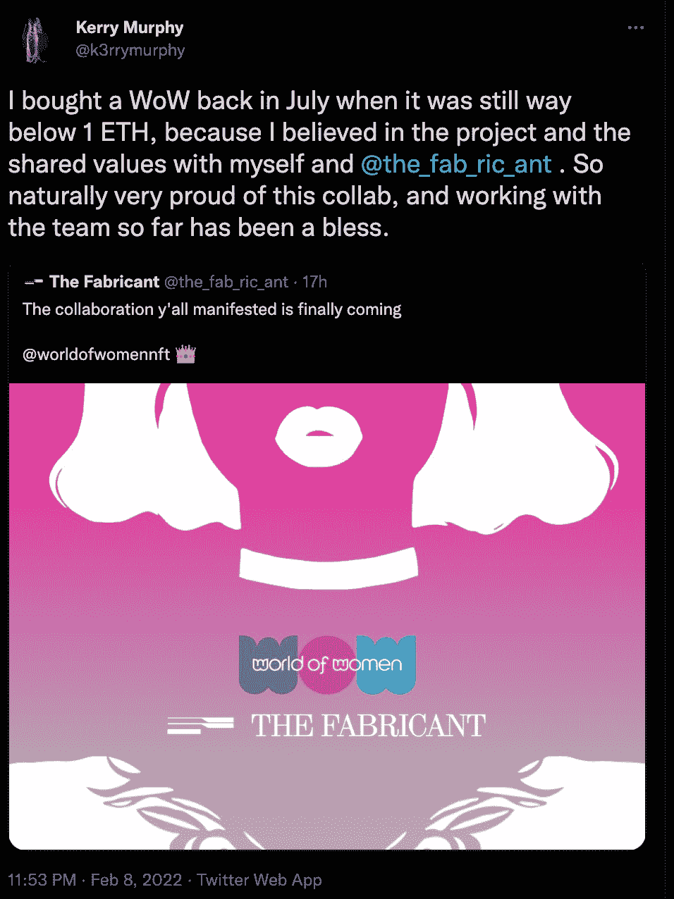

# 女性世界和制作者宣布合作

> 原文：<https://web.archive.org/web/https://dappradar.com/blog/world-of-women-and-the-fabricant-announce-collaboration>

## 这家数码时尚公司与以女性为中心的授权系列合作

《女性世界》将与流量驱动的数字时尚平台 The Fabricant 合作一个独家的 NFT 项目。目前，两个团队还没有透露任何合作的细节。然而，两个社区都接受了即将到来的项目。

《女性世界》和《制作者》都有强大的以女性为中心的社区，这种合作迎合了 NFT 空间的这一面。值得注意的是，这两个项目在过去的几个月里也受到了广泛关注。

制作者刚刚宣布其第一季工作室现在向符合条件的钱包开放。工作室将允许收藏家和设计师从三个基本模型中创造出他们自己的 NFT 设计。粉丝们将有机会选择他们时尚 NFT 的材料、图案、颜色和整体设计。

在合作的另一方,《女性世界》( WOW)也在大步前进，并宣布了重要的更新。来自 WOW 收藏的最新消息是，它将在著名拍卖行佳士得即将举行的拍卖中展出。对于任何 NFT 系列来说，这都是一个重要的里程碑，这也是为什么女性群体兴奋不已的原因。

## Fabricant 创造者是一个女性早期采用者的世界

虽然关于 WOW 和 Fabricant 合作的信息仍然很少，但 Kerry Murphy 透露了一个重要的信息。Kerry Murphy 是 Fabricant 项目的基础，他最近在推特上写道，WOW 是他们早期采用 NFT 项目的一部分。

根据推特上的[消息，墨菲购买了一件 WOW NFT，当时该系列的底价仅为 1 ETH。目前,《女人的世界》正在上涨，底价已经涨到 10 多 ETH，约合 34.130 美元。](https://web.archive.org/web/20221127152438/https://twitter.com/k3rrymurphy/status/1491168349086044161)

Kerry Murphy 认识到 WOW 项目的价值，并指出他自己的项目与以女性为中心的系列之间的相似之处。从这个意义上说，即将到来的合作项目是两个项目发展的自然步骤。

DappRadar 将继续监测这一合作，因为有更多的细节。你可以用 [DappRadar PRO](https://web.archive.org/web/20221127152438/https://dappradar.com/token/pro) 追踪最新的[世界女性 NFT 销售数据](https://web.archive.org/web/20221127152438/https://dappradar.com/ethereum/collectibles/world-of-women)。此外，你可以在[推特](https://web.archive.org/web/20221127152438/https://twitter.com/dappradar)上关注 DappRadar，抢先获得最新的 NFT 新闻。

 NewsletterUnsubscribe at any time. [T&Cs](https://web.archive.org/web/20221127152438/https://dappradar.com/terms) and [Privacy Policy](https://web.archive.org/web/20221127152438/https://dappradar.com/privacy-policy)