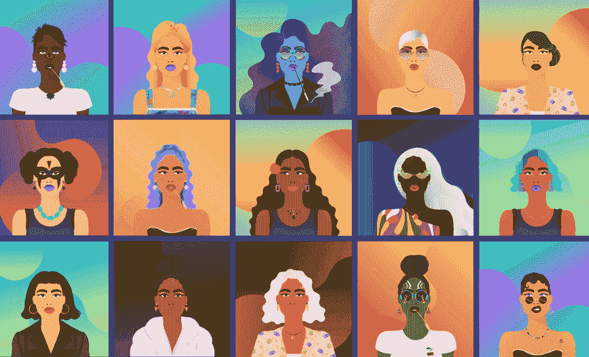
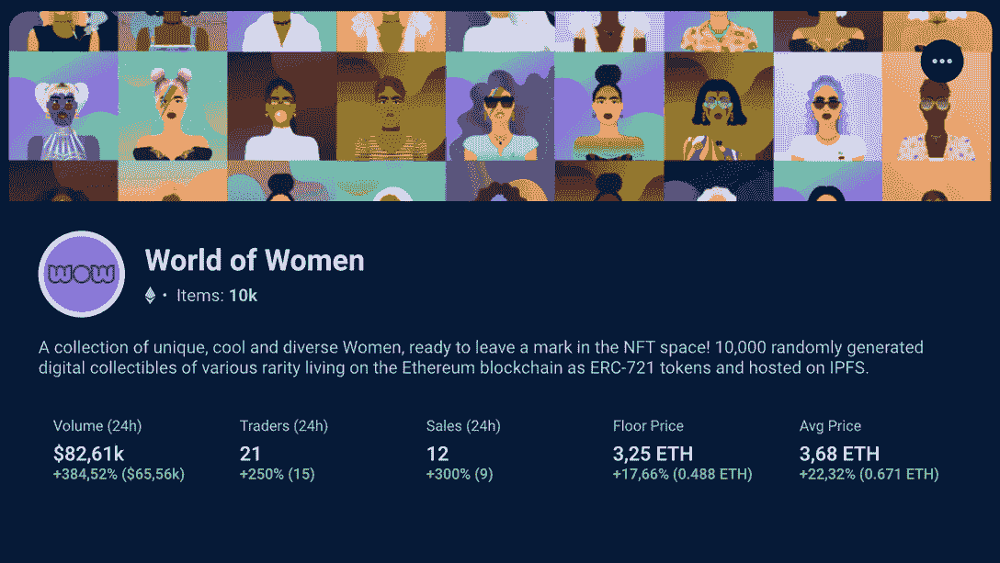
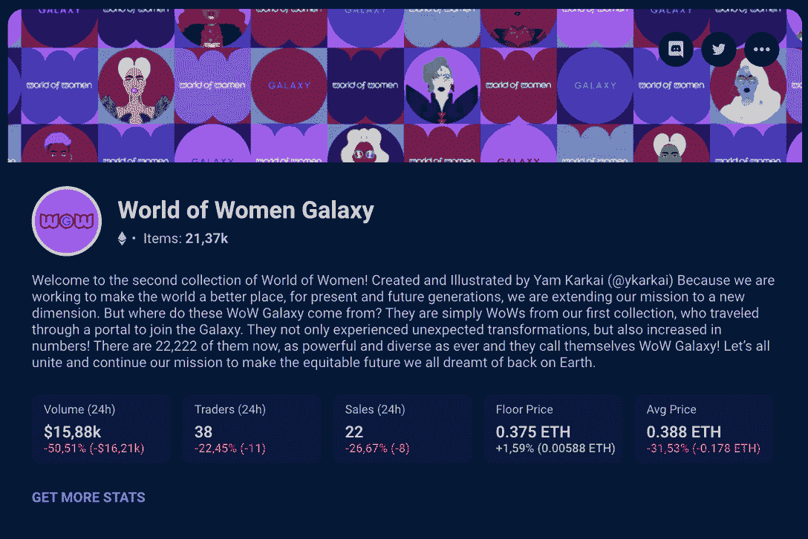
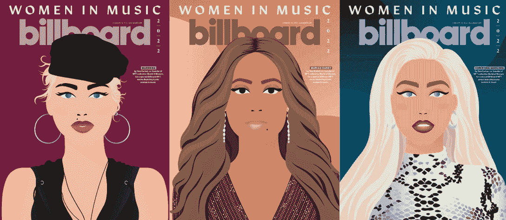
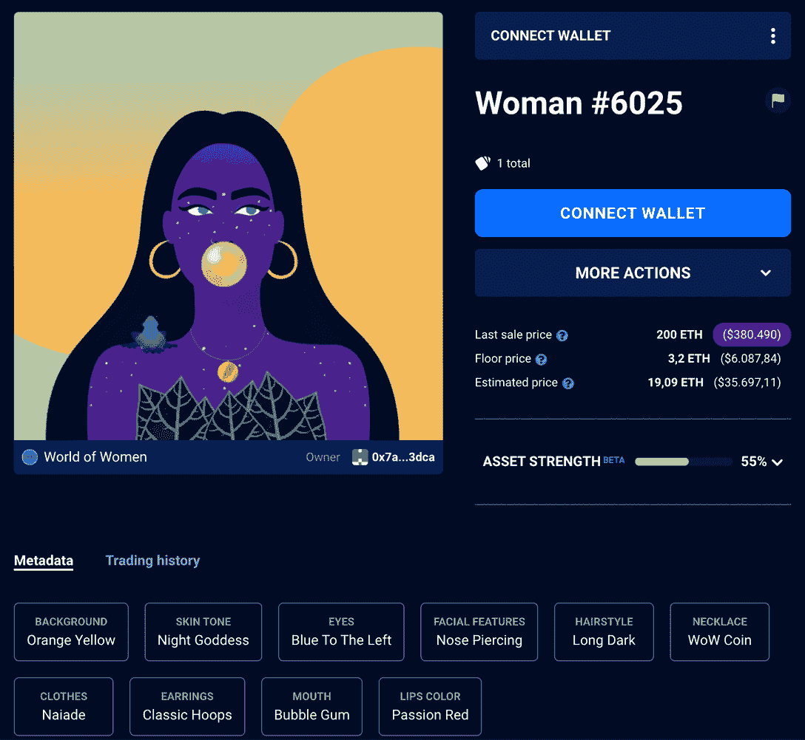

# 女性非技术人员的世界:促进多样性的蓝筹 NFT 项目

> 原文：<https://web.archive.org/web/https://dappradar.com/blog/world-of-women-nfts>

## 你所需要知道的关于女性领导的 NFT 的一切，彻底改变了这个行业

如果你已经关注 NFT 空间有一段时间了，你肯定听说过女性非功能性测试的世界。在一个女性从未有太多代表性的行业中首次亮相，这些标志使代表性不足的人在最大的 NFT 项目中拥有发言权和空间。

与此同时，在 DappRadar 收藏排行榜上获得了自 2021 年以来最高的收藏量。好奇？在这个完整的指南中了解所有关于 NFT 妇女项目世界的知识。

## 什么是女人的世界(WoW)？

该项目于 2021 年 7 月通过 NFT 女性世界系列首次向世界推出，如今已成为整个 web3 行业的主要多元化领导者之一。

Source: World of Women

除了引领[趋势的 PFP NFT](https://web.archive.org/web/20221004011617/https://dappradar.com/blog/top-10-most-popular-avatar-pfp-nft-collections)和女性在该领域的活动，它还上升到了蓝筹股 NFT 的位置。这意味着它被认为是行业内的一项稳定投资，得到了成功工作和合作伙伴的认可。

该项目已经创造了数百万美元的销售额，并致力于帮助资助平等事业和造福世界各地的非营利组织。

### 什么是 NFT？

如果你感到有点困惑，不知道什么是 NFT，你应该读一读我们的完整指南[什么是不可替换的令牌，或 NFT？](https://web.archive.org/web/20221004011617/https://dappradar.com/blog/what-are-non-fungible-tokens-nfts)

但接下来，要知道首字母缩略词 NFT 代表不可替代令牌，这基本上意味着它们是由区块链技术支持的独特数字资产。无论是图片、视频、音乐、合同、游戏道具、活动门票等等。

如果这还不够，那么知道 NFTs 行业在 2021 年爆发并出现第一轮牛市可能会很有趣。

名人和品牌如史努比·道格、帕丽斯·希尔顿、贾斯汀比伯、麦克拉伦、古驰和普拉达都投资了这些代币。

[<picture></picture>](https://web.archive.org/web/20221004011617/https://dappradar.com/blog/what-are-non-fungible-tokens-nfts)[<picture></picture>](https://web.archive.org/web/20221004011617/https://dappradar.com/nft/marketplaces)[<picture></picture>](https://web.archive.org/web/20221004011617/https://dappradar.com/nft/sales)

## 谁创建了 WoW 项目？

人们在谈论女性世界时，不能不称赞这些 NFT 背后的天才艺术家 Yam Karkai。在 2021 年初首次加入 NFT 世界后，Yam 很快注意到有必要在这个快速增长的领域增加女性的代表性。

> 哇，多好的一年！(双关语非常 intended)⁰⁰🥳
> 一年前的今天 WoW 向全世界发布了。
> 我们最初是一群朋友，他们偶然走到一起，试图影响 NFTs & Web3 的进程，使它成为一个更具包容性、多元化的&赋权所有人的空间。⁰ 1/18
> 
> — Yam (@YKarkai) [July 27, 2022](https://web.archive.org/web/20221004011617/https://twitter.com/YKarkai/status/1552276246414884864?ref_src=twsrc%5Etfw)

她现在被认为是最有影响力的 NFT 艺术家之一，并一直对新人的工作表现出极大的支持。

*   **进一步阅读** : [妇女领导的 NFT 项目缩小网络 3 性别差距](https://web.archive.org/web/20221004011617/https://dappradar.com/blog/women-led-nft-projects-to-narrow-web3-gender-gap)

## 哇 NFT 系列

通过他们的 NFT 系列，让自己沉浸在女性社区的世界中。

### NFT 女性世界系列

该项目的第一个系列也是革命性的，当它涉及到一般的 NFTs 时。在那之前，不仅在 NFTs 中，而且在整个 web3 社区中，女性代表都很少。

这一系列对于将女性带到新兴技术领域的最高职位至关重要，这是进入区块链工业的主要途径之一。

正如你在 dappar Dar NFT 系列浏览器中看到的,[世界女性系列](https://web.archive.org/web/20221004011617/https://dappradar.com/hub/nft-explorer/collection/world-of-women-nft)有 10，000 种不同类型女性的独特展示。

它是以太坊网络上排名前 20 的 NFT 藏品之一，总销售额超过 2.22 亿美元。

已经宣布购买这些收藏品的名人包括[伊娃·朗格利亚](https://web.archive.org/web/20221004011617/https://dappradar.com/hub/wallet/eth/0xaa1b056286a66a9e6752c26776ac034c662a51d5)、[瑞茜·威瑟斯彭](https://web.archive.org/web/20221004011617/https://dappradar.com/hub/wallet/eth/0x7948aa99e095dbfc1971bc8d2d1173893146630e)和[史蒂夫·青木](https://web.archive.org/web/20221004011617/https://dappradar.com/hub/wallet/eth/0xe4bbcbff51e61d0d95fcc5016609ac8354b177c4)。

*   [***点击这里查看收藏官网***](https://web.archive.org/web/20221004011617/https://worldofwomen.art/wow.html)

### 女性世界银河 NFT 系列

该团队创造的第二个系列是 2022 年 3 月推出的[女性银河世界](https://web.archive.org/web/20221004011617/https://dappradar.com/hub/nft-explorer/collection/world-of-women-galaxy)。有 22，222 个 NFT 代表星系间环境中原始集合的突变。

创纪录销售 WoWG NFTs 让更多人有机会加入 WoW 社区，并为品牌带来全新的概念。除了生成性 NFT 之外，还有 16 个在叙事中具有特殊作用的特殊手绘记号。

*   [***点击这里查看收藏官网***](https://web.archive.org/web/20221004011617/https://worldofwomen.art/wow-galaxy.html)

## 妇女伙伴关系世界

在其夸夸其谈的第一年里,《女性世界》已经与一些网络内外的大品牌建立了合作关系。下面就来认识其中的一些吧。

### 女人的世界&广告牌

2022 年 2 月，世界女性和美国音乐杂志 Billboard 宣布了一项合作，以庆祝音乐领域的女性。Yam 为流行乐坛最伟大的歌手麦当娜、玛利亚·凯莉和克里斯蒂娜·阿奎莱拉的三张杂志封面设计了插图。

Source: Billboard

这个[声明](https://web.archive.org/web/20221004011617/https://dappradar.com/blog/billboard-x-world-of-women-collab-celebrates-women-in-music)再次导致 WoW NFTs 的需求增加，并使 NFT 炒作在普通社会中更具争议性，这对于 web3 的采用是必不可少的。

### 元宇宙的妇女世界

至于与其他大型 web3 项目的合作，World of Women 也是不遗余力。2022 年，它宣布与元宇宙游戏[沙盒](https://web.archive.org/web/20221004011617/https://dappradar.com/blog/what-is-the-sandbox-how-to-join-the-metaverse)合作。在那里，你可以使用你的魔兽世界头像，参观魔兽世界塔，等等。

此外，你还可以在宇迦实验室期待已久的[元宇宙另一边](https://web.archive.org/web/20221004011617/https://dappradar.com/blog/will-the-otherside-demo-give-the-metaverse-a-new-push)使用你的 WoW。在这个虚拟世界中，Women NFTs 将能够在其他著名的蓝筹 NFT 中导航，例如那些在 [Bored Ape 游艇俱乐部收藏的](https://web.archive.org/web/20221004011617/https://dappradar.com/hub/nft-explorer/collection/bored-ape-yacht-club)。

*   **感觉失落？阅读我们的文章** [什么是元宇宙:下一代虚拟世界](https://web.archive.org/web/20221004011617/https://dappradar.com/blog/what-is-the-metaverse)

## 我能为我的 NFT 女性世界做些什么？

WoW NFT 的效用不仅仅是拥有一个独特的鼓舞人心的艺术形象。通过拥有一个 WoW，你可以参加社区活动、私人不和谐聊天室、进入元宇宙虚拟世界，并从该品牌未来加入的任何合作伙伴关系中受益。更不用说，这意味着你是管理 WoW 基金会的道的一部分。

此外，你还获得了你的 NFT 的商业权利，能够在你自己的任何盈利项目中使用它。

你将支持该项目的目标，即*“领导和支持元宇宙的女性；通过教育、指导、慈善倡议&更多！”*

## 加入社区:如何购买世界女性非功能性测试

你已经决定要加入妇女社区的世界并购买你的 NFT 了吗？在购买之前，有一些事情需要了解和做。看下面的一步一步购买你的第一个哇 NFT。

### 1.设置您的 web3 钱包并获取一些密码

如果您刚刚开始进入 NFTs 的世界，欢迎您！首先，你需要一个[虚拟钱包](https://web.archive.org/web/20221004011617/https://dappradar.com/blog/best-cryptocurrency-wallets-for-2022)来存储你的 NFT。当然，要购买 NFT，你将需要加密货币，它们也将留在你的钱包里。

观看我们的视频什么是加密钱包？快速了解如何连接和准备您的钱包，以购买《NFT 女人的世界》。

### 2.决定你想使用哪个市场

一旦你的钱包创建好了，你的种子短语安全了，你的密码准备好了，是时候去购物了！但是在哪里？

在女性 NFT 的世界中，该公司广告的唯一官方渠道是 marketplaces [OpenSea](https://web.archive.org/web/20221004011617/https://dappradar.com/blog/what-is-opensea-and-how-to-use-it-the-beginners-guide) 、LooksRare、Nifty、Rarible、Foundation 和 X.xyz。

他们在 NFT 都很受尊敬，所以他们之间的选择完全是个人的事。只是要小心核实你购买 NFT 的网站是合法的，而不是骗局。

### 3.找到与你对话的魔兽世界头像

下一步可能是最有趣的。是时候选择你的女人世界了，NFT。正如这些系列所表明的，它们代表了所有女性不同的美丽。你可以选择一个长得像你的，一个你欣赏的，或者只是一个你觉得很酷的。

所以这是一个知道你想用你的 NFT 做什么的问题。会保值吗？以后再高价卖出？还是仅仅作为推特上新的个人资料图片？无论你的目标是什么，在选择你的 NFT 时记住这一点是有好处的。

Explore WoW NFTs’ features on DappRadar

由于女性收藏领域的所有非功能性珠宝都已经铸造完成，因此价格会因供求关系和销售类型的不同而有很大差异。虽然第一批 WoW NFTs 是以 0.07 ETH 的固定成本铸造的，但在撰写本文时的底价是 3.25 ETH。

而且不同的 NFT 有不同的稀有特征，这也是对最终价值的打压。

### 4.再次检查真实性

购买时一个很重要也很容易被忽略的步骤就是对其合法性的验证。有成百上千的骗局恶意使用女性世界的名字来销售假的 NFT 或窃取你的种子短语。始终确保您使用的是官方项目门户或平台。

### 5.完成交易，保护你女人的安全

如果到目前为止一切正常，请继续确认您的购买。你的女性新世界 NFT 将在你的 web3 钱包里安然无恙。然后是享受 WoW 社区的时候了。

## 我该如何推销我的《女人的世界》？

如果你想交易或出售你的女性资产，过程甚至比购买更简单。因为你已经有了 NFT，只需选择你想在哪个平台上出售它们，然后按照相应的步骤操作。

例如，您可以通过定时拍卖或以固定价格列出 NFT 进行销售。此外，你还可以[在 DappRadar](https://web.archive.org/web/20221004011617/https://dappradar.com/blog/how-to-buy-and-sell-nfts-on-dappradar) 上出售你的 NFT。

## 女性世界项目的下一步是什么？

正如 2022 年初宣布的那样，世界妇女基金会有着远大的计划。从 WoW 博物馆开始，在那里其他艺术家可以展示他们的作品，以及 WoW 大学，以激励其他妇女更多地了解 NFT 世界。

与瑞茜·威瑟斯彭(Reese Witherspoon)的组织“你好阳光”(Hello Sunshine)合作制作赞美女性的内容，也将很快被改编为电影和电视剧。

WoW 也在适应完全以社区为中心，由自己的 DAO 管理。会员已经可以对项目的决策进行投票，并塑造女性品牌世界的未来。

简而言之，你可以从这个鼓舞人心的项目中期待伟大的事情。

## 使用 DappRadar 跟踪您的女性 NFT 世界

拥有非功能性思维最重要的事情之一就是记录你的价值观。幸运的是，DappRadar 有一个很好的工具。

通过 [NFT 投资组合跟踪系统](https://web.archive.org/web/20221004011617/https://dappradar.com/hub/wallet/)，你可以在以太坊、多边形和 BNB 链上看到你的 NFT 的实时估计值。只需连接您的 web3 钱包，并通过 DappRadar 移动应用程序轻松访问投资组合。

但是，如果你还没有你的女性 NFT 世界，但正在寻找，它值得检查一下 [NFT 价值评估](https://web.archive.org/web/20221004011617/https://dappradar.com/hub/nft-value-estimator)和收集在我们的排名中的位置。

最重要的是， [DappRadar NFT 收藏浏览器](https://web.archive.org/web/20221004011617/https://dappradar.com/hub/nft-explorer/)可以让你对整个市场有一个总体的了解，并且可以在最好的以太坊项目中比较单个的收藏和非艺术珍品。

[https://web.archive.org/web/20221004011617if_/https://www.youtube.com/embed/fkEaXYLOW-s?feature=oembed](https://web.archive.org/web/20221004011617if_/https://www.youtube.com/embed/fkEaXYLOW-s?feature=oembed)

如你所知，达普拉达是了解领先的 NFT 系列(如“女性世界”系列)的理想场所。

请确保关注我们的 [Twitter](https://web.archive.org/web/20221004011617/https://twitter.com/DappRadar) 和 [Youtube](https://web.archive.org/web/20221004011617/https://www.youtube.com/c/DappRadar) ，并关注我们的[博客](https://web.archive.org/web/20221004011617/https://dappradar.com/blog/)内容以获取更多信息。

***以上不构成投资建议。此处给出的信息仅供参考。请尽职调查并自行研究。***

 NewsletterUnsubscribe at any time. [T&Cs](https://web.archive.org/web/20221004011617/https://dappradar.com/terms) and [Privacy Policy](https://web.archive.org/web/20221004011617/https://dappradar.com/privacy-policy)