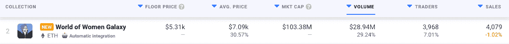
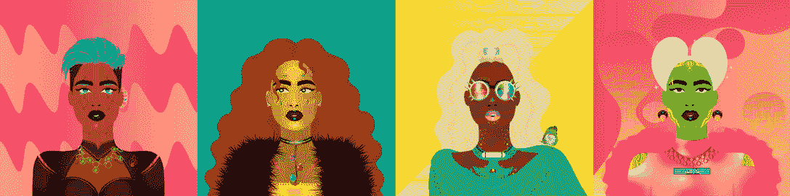
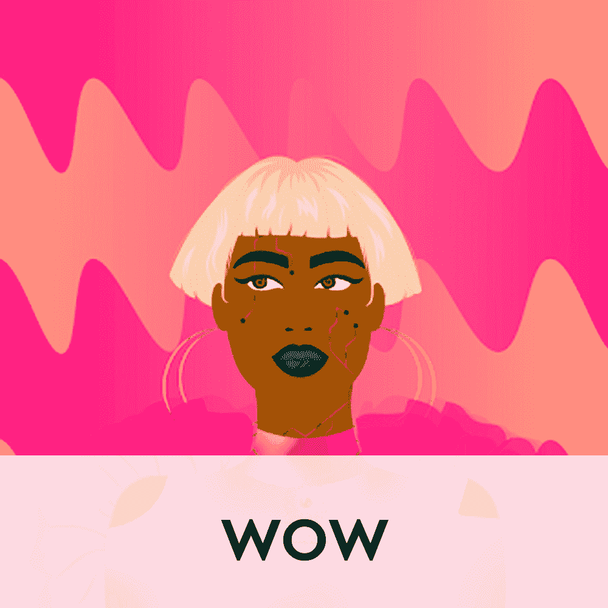
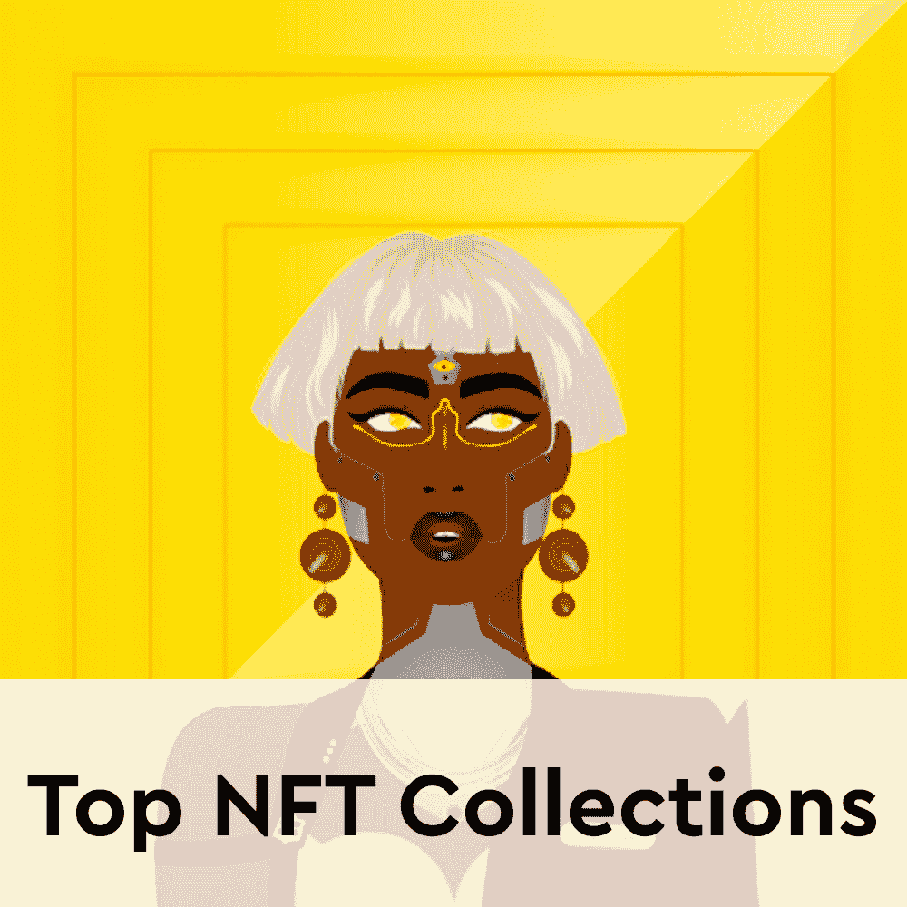

# 《女人的世界》第二季创下销售记录

> 原文：<https://web.archive.org/web/https://dappradar.com/blog/world-of-women-second-collection-boasts-record-sales>

## 世界女性银河在几个小时内售罄，沙盒欢迎哇化身

****女性银河世界是数码艺术家 Yam Karkai 的下一个系列，它已经在 NFT 空间引起轰动。该系列向世界妇女组织免费空投了 10，000 份 NFT，另有 10，000 份可供公共造币厂使用。此外，另外 2，222 个 WOWG NFT 是为 WOW 社区的预选 allowlist 部分保留的。****

 **令人印象深刻的是,《世界女性》后续系列引起了轰动，几个小时内就销售一空。可供公共铸币厂使用的 10，000 个 NFT 通过荷兰拍卖出售，而允许现货持有者以 0.3 ETH 的固定价格铸造。

仅在过去的 24 小时内，[Women Galaxy NFTs](https://web.archive.org/web/20221127161824/https://dappradar.com/ethereum/collectibles/world-of-women-galaxy)的交易额就超过了 2800 万美元。这些收藏品的平均价格持续上涨，从昨天开始已经超过 7000 美元。

WOWG 系列追随其前身[女性世界](https://web.archive.org/web/20221127161824/https://dappradar.com/ethereum/collectibles/world-of-women)的脚步，基本上有着相同的目标。这个后续项目旨在支持来自世界各地的新兴创作者，并向促进妇女教育和经济机会的组织和注重可持续发展的组织捐款。

为了做到这一点，WoW Galaxy 的所有主要销售额的 10%将捐给 WoW 基金会。该基金会的任务是组织和创建一个支持新兴人才的网络，并随后向该网络的成员发放赠款和资金。

## 沙盒欢迎女性化身的世界

除了为女性收藏者带来全新的收藏品，该系列背后的团队还积极提升其他平台的可用性。最近，这些收藏已经成为沙盒生态系统的一部分。WOW 所有者现在可以在虚拟世界中使用他们的 NFT 作为 3D 化身。

根据[官方公告](https://web.archive.org/web/20221127161824/https://twitter.com/TheSandboxGame/status/1507805184860250120)，WOWG NFTs 也将在适当的时候获得沙盒集成。在一个最受欢迎的虚拟世界中使用你的 NFT 作为一个 3D 像素化的化身是一个不小的福利。女性收藏家的世界现在有机会完成沙盒阿尔法游戏任务，作为他们最喜爱的 NFT 收藏品。

这种整合只是《女性世界》带给所有者的一系列好处中的一部分。WOW 和 WOWG NFT 持有人的另一个重要好处是可以访问 DAWOW 治理平台。这种类似 DAO 的组织将允许社区为项目做出贡献。

## 哇银河迎来数千名新成员

随后的收藏已经成为 NFT 空间中大牌的主要收藏。像[无聊猿游艇俱乐部](https://web.archive.org/web/20221127161824/https://dappradar.com/ethereum/collectibles/bored-ape-yacht-club)和[数码港](https://web.archive.org/web/20221127161824/https://dappradar.com/ethereum/collectibles/cyberkongz)这样的项目都捆绑在一个故事中，以推出一系列后续的 NFT。令人印象深刻的是,《妇女世界》将这一理念提升到了一个新的高度，有效地实现了受众翻倍的目标。

我们看到的大多数成功的收藏都与原始 NFT 的所有权紧密相关。这限制了对这些项目的访问，只允许新成员通过二级市场购买加入。WOW 颠覆了这种做法，创造了迎合所有人的后续系列。现有的社区成员获得了一个免费的 WOWG NFT。然而，同样数量的非功能性食品已发放给公共造币厂。

一个强大的社区是 NFT 系列成功的最重要的先决条件之一。数量上的优势永远是个好策略。考虑到这一点,《女性世界》有望成为 NFT 空间的一大亮点。该系列也是第一个以女性为主题的 NFT 项目。我们在本月早些时候发布了一篇文章，在那里你可以查看其他有大量女性参与的[加密项目](https://web.archive.org/web/20221127161824/https://dappradar.com/blog/15-women-pioneering-the-blockchain-space/)。

DappRadar 将继续监测女性生态系统的世界，因为它正在推向新的高度。如果你想了解更多关于魔兽世界和 WOWG 的信息，请点击下面的链接。此外，你还可以在 Twitter 上关注 DappRadar，抢先获得最新的 NFT 新闻。

[<picture></picture>](https://web.archive.org/web/20221127161824/https://dappradar.com/ethereum/collectibles/world-of-women)[<picture></picture>](https://web.archive.org/web/20221127161824/https://dappradar.com/ethereum/collectibles/world-of-women-galaxy)[<picture></picture>](https://web.archive.org/web/20221127161824/https://dappradar.com/nft/collections) NewsletterUnsubscribe at any time. [T&Cs](https://web.archive.org/web/20221127161824/https://dappradar.com/terms) and [Privacy Policy](https://web.archive.org/web/20221127161824/https://dappradar.com/privacy-policy)**