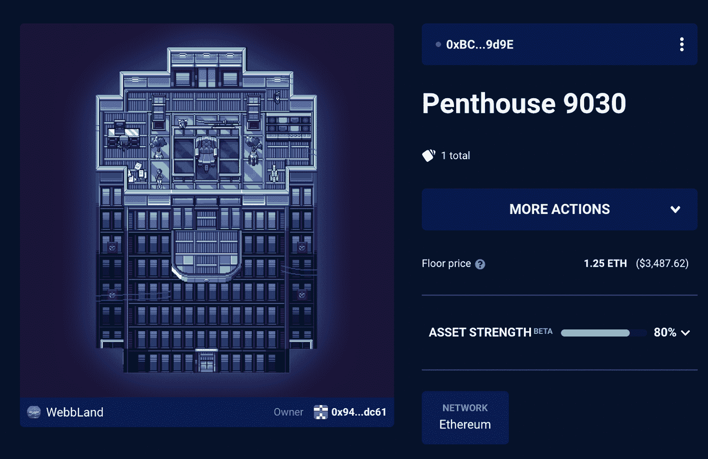

# WorldWideWeb3 顶层公寓售价 18 万美元

> 原文：<https://web.archive.org/web/https://dappradar.com/blog/worldwideweb3-penthouse-sold-for-180-000>

## 该地块由德费拉斯 plot 社区购买

WorldWideWeb3 刚刚创下了迄今为止最大的一笔销售记录，NFT 的一套顶层公寓以 63.63 ETH 的价格转手，约合 18 万美元。Deadfellaz NFT 收藏背后的社区在像素化的虚拟世界里买下了 9030 号阁楼。

去年底，环球网举办了一场土地拍卖。顶层公寓是最大也是最稀有的虚拟房地产。根据[官方不和谐公告](https://web.archive.org/web/20220929052622/https://discord.com/channels/870177385968959508/873972867233120266/933951392199110687) , [Deadfellaz](https://web.archive.org/web/20220929052622/https://dappradar.com/ethereum/collectibles/deadfellaz) 决定进入 WWW3，因为团队相信 WWW3 土地所有者即将到来的功能将为整个社区带来好处。

顶层公寓是第二个环球网 3 NFT 进入 Deadfellaz 金库。金库里还有一套 NFT 的大公寓，大约两个月前以 1.63 ETH 的价格购买。

在过去的几个月里，WorldWideWeb3 的地块收集一直在稳步增长。在过去的七天里，该收藏品产生了近 200 万美元的交易量，并吸引了 567 名交易者。在撰写本文时，WWW3 上最小地块的楼面价为 1.29 ETH。令人印象深刻的是，最初的造币价格是 0.069 ETH。

## WorldWideWeb3 并不是 Deadfellaz 雷达上唯一的虚拟世界

使用[DappRadar Portfolio Tracker](https://web.archive.org/web/20220929052622/https://dappradar.com/hub/wallet/eth/0x943c452f19dc971db2fb944d98efb907fd6edc61)工具对 Deadfellaz 金库进行更深入的研究后发现，该系列背后的团队和社区在虚拟世界上下了很大的赌注。除了两个万维网 NFTs，金库还拥有一个 [NFT 世界的地块](https://web.archive.org/web/20220929052622/https://dappradar.com/hub/assets/eth/0xbd4455da5929d5639ee098abfaa3241e9ae111af/167)。此外，保险库包含许多分散的可穿戴设备

这种与虚拟世界相关的各种各样的 NFT 表明 Deadfellaz 社区和团队对加密世界的这一领域有着浓厚的兴趣。考虑到元宇宙在过去几个月里人气的大幅上升，这并不完全令人惊讶。重要的是，虚拟空间对 NFT 收藏很重要，因为它允许这些项目在他们自己的土地上举行定制和专属活动。

DappRadar 将继续监视 Deadfellaz 和 T2。随着元宇宙的升温，虚拟土地将变得更加受欢迎和受欢迎。要跟踪最新的土地销售和虚拟世界新闻，请在[推特](https://web.archive.org/web/20220929052622/https://twitter.com/dappradar)上关注 DappRadar，并加入我们的 [Discord](https://web.archive.org/web/20220929052622/https://discord.gg/4ybbssrHkm) 社区。此外，您还可以查看 DappRadar PRO ，它可以让您访问先进的 NFT 销售数据！

 NewsletterUnsubscribe at any time. [T&Cs](https://web.archive.org/web/20220929052622/https://dappradar.com/terms) and [Privacy Policy](https://web.archive.org/web/20220929052622/https://dappradar.com/privacy-policy)