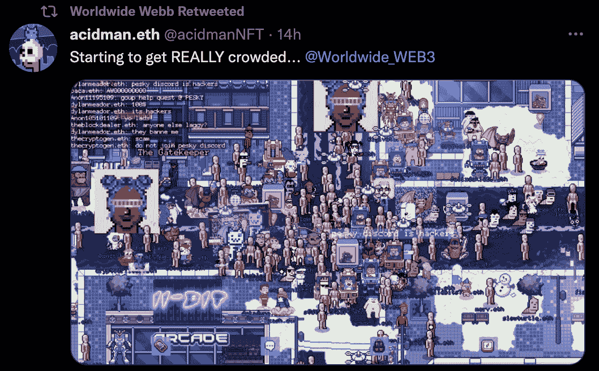
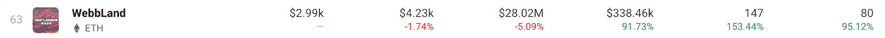

# WorldWideWeb3 Quest 推动 NFT 交易量增长 153%

> 原文：<https://web.archive.org/web/https://dappradar.com/blog/worldwideweb3-quest-boosts-nft-trading-volume-153>

## 韦伯地产在过去 24 小时内创造了 95%的销售额

WorldWideWeb3 是目前最热门的虚拟世界之一，吸引着游戏玩家和 NFT 收藏家。昨晚，该平台推出了一个新的任务，这大大促进了游戏的土地情节 NFT 收集活动。仅在过去 24 小时内，Webb Land 就吸引了 153%以上的交易者，交易量超过 338，000 美元。

“岔路口”任务给玩家带来了有趣的决定。首要问题是在 ETH、BTC 和 USD 之间做出选择。这也是现实世界中一个典型的两难问题。重要的是，每个成功完成任务的人都有机会参加抽奖，赢取珍贵的 NFT 收藏品。不管最初的选择是什么，玩家都有机会用剩下的两种货币完成任务。三者各自展开不同的使命。

WorldWideWeb3 一直以其有趣的任务吸引着玩家，这款最新的游戏也不例外。此外，根据开发团队的说法，这是迄今为止最广泛的探索。在过去的 24 小时里，玩家们蜂拥至平台，试图满足 Doc 的要求，并成功完成任务。

## 环球网 3 大地从探索炒作中获益

看看聚集在一起完成“岔路口”任务的大量玩家，韦伯·兰德·NFT 收藏馆的活动也有所增加就不足为奇了。在过去的 24 小时里，与该集合互动的交易者数量增加了 153%。此外，韦伯土地智能合同的销售记录跃升了令人印象深刻的 95%。

活动激增的主要原因之一是完成任务的土地所有者获得了额外的奖励。除了参加罕见的 NFT 抽奖，这些韦伯土地持有者还将参加抽奖，以获得即将到来的 Coolpets NFTs mint 的白名单。Coolpets 是备受期待的 NFT 系列，由《酷猫 T1》的创作者创作。

在万维网 3 中成为土地所有者的额外好处仍有待充分开发和释放。然而，该团队已经在寻找方法，将效用带给拥有 Webb Land NFTs 的收藏者。

如果你好奇想在“岔路口”的任务中试试你的技能，去官方的 [WorldWideWeb3 网站](https://web.archive.org/web/20220929120911/https://dappradar.com/ethereum/collectibles/worldwide-webb-land)。任务仍然有效，成功完成任务后你有机会赢得稀有的 NFT。

要了解最新的游戏和元宇宙新闻，请在 [Twitter](https://web.archive.org/web/20220929120911/https://twitter.com/dappradar) 上关注 DappRadar，并加入我们的 [Discord](https://web.archive.org/web/20220929120911/https://discord.gg/4ybbssrHkm) 社区。此外，你还可以看看[的 DappRadar PRO](https://web.archive.org/web/20220929120911/https://dappradar.com/token/pro) 。PRO 为 DappRadar 用户提供了独家的 Discord 讨论和最新的 NFT 销售链数据。

 NewsletterUnsubscribe at any time. [T&Cs](https://web.archive.org/web/20220929120911/https://dappradar.com/terms) and [Privacy Policy](https://web.archive.org/web/20220929120911/https://dappradar.com/privacy-policy)