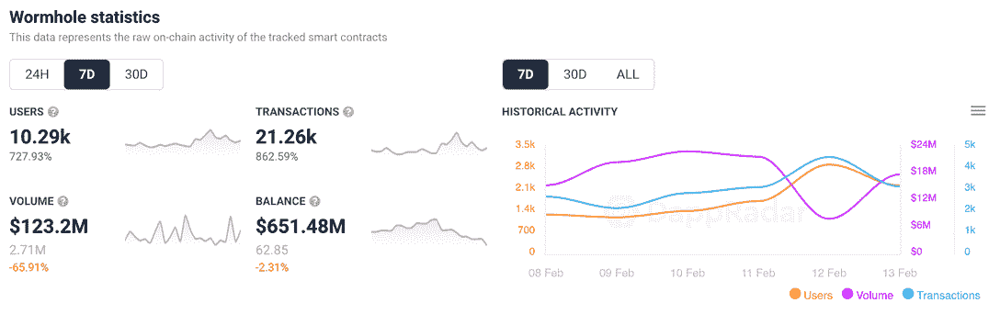
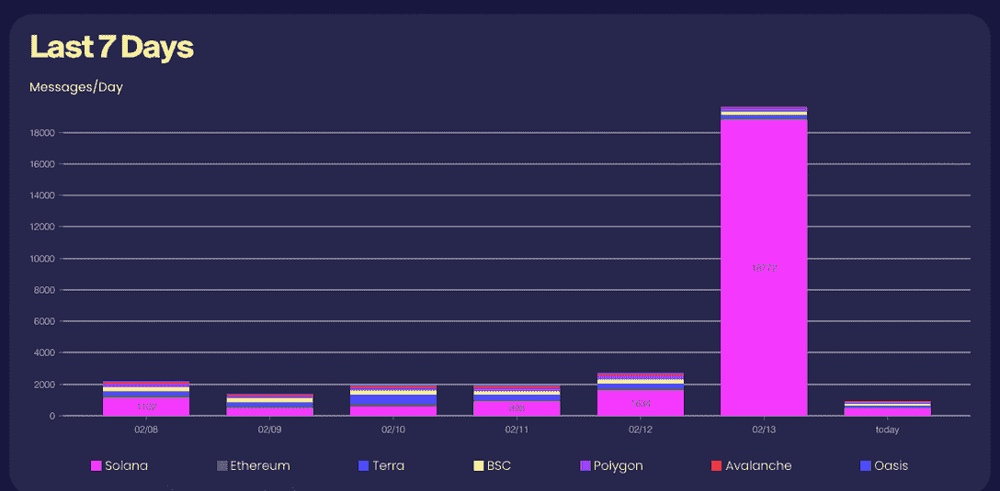
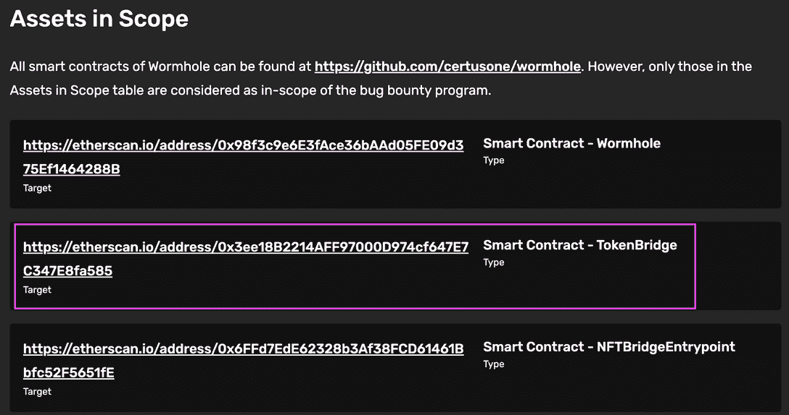
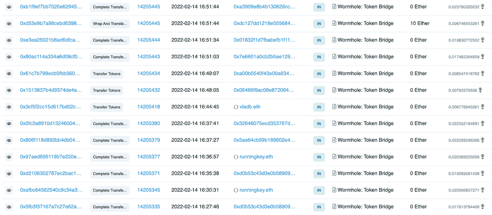

# 虫洞虫赏金帮助索拉纳 DeFi 回到正轨

> 原文：<https://web.archive.org/web/https://dappradar.com/blog/wormhole-bug-bounty-helps-solana-defi-get-back-on-track>

## 关键漏洞利用后，1000 万美元的漏洞奖金可供争夺

虫洞区块链令牌桥宣布了一项 1000 万美元的臭虫奖励计划，让 DeFi 在 Solana 身上恢复健康。本月早些时候，一名黑客利用了这座桥梁，导致 3.21 亿美元的资金被盗。

如前所述，[虫洞是一个跨链平台](https://web.archive.org/web/20230127234700/https://dappradar.com/multichain/defi/wormhole)，在过去的七天里吸引了超过 10290 个钱包。与前一周相比，这是一个超过 700%的惊人提升。这些钱包完成了超过 21，000 笔交易，增长超过 860%。从漏洞利用到数据显示虫洞重回正轨的两周内。然而，这些数字有一个基本的细微差别。

使用虫洞财务浏览器可以更清楚地看到这种影响。在 11 日，我们看到不到 900 条信息被发送。到 12 日，这个数字几乎翻了一番，达到 1634 人。然后在 12 号，也就是 bug bounty 上线的那一天，我们看到索拉纳上的交易量出现了巨大的峰值。一天之内超过 18，000 笔，这个数字代表了自 Wormhole 推出以来 Solana 上发送的所有交易的几乎一半。

这可能是通过 Immunify 提供的 bug 赏金的结果。一家专门为区块链项目提供 bug 奖金的公司，它提供一个平台将项目和黑客聚集在一起，这样黑客可以负责任地报告 bug，项目可以安全地修复漏洞。或者，dapp 可以吸引垃圾邮件或机器人流量，以提高其在 DappRadar 上的地位。然而，更有可能的是，空事务流代表了 bug 测试。

[DappRadar 正在跟踪七份虫洞智能合同](https://web.archive.org/web/20230127234700/https://dappradar.com/multichain/defi/wormhole)，包括下面突出显示的一份，即[虫洞令牌桥合同](https://web.archive.org/web/20230127234700/https://etherscan.io/address/0x3ee18B2214AFF97000D974cf647E7C347E8fa585)。如前所述，这座桥是资金被剥削的地方，所以这是在严格审查之下。这也解释了为什么我们看到平台上关于钱包连接和完成交易的活动膨胀。鉴于大多数交易都是空的，交易量下降的数字也是有道理的。

看看 Etherscan，我们看到[数以千计的交易发生](https://web.archive.org/web/20230127234700/https://etherscan.io/address/0x3ee18B2214AFF97000D974cf647E7C347E8fa585)而没有附加价值，因为那些寻找漏洞的人尝试各种方法和途径来揭示问题。

尽管指标达到峰值，但理解峰值的背景是非常重要的。随着越来越多的赏金猎人到来寻找奖励，我们应该在一段时间内期待这些结果。此外，这是虫洞启动 bug 赏金和在桥上重新安装信仰的绝佳时机。其次，社区似乎在努力工作，所以结果应该是一个更加稳定和安全的协议。

[<picture></picture>](https://web.archive.org/web/20230127234700/https://dappradar.com/blog/tag/play-to-earn)[<picture></picture>](https://web.archive.org/web/20230127234700/https://dappradar.com/blog/10-play-to-earn-games-to-watch-in-february-2022)[<picture></picture>](https://web.archive.org/web/20230127234700/https://dappradar.com/rankings/category/games)

***以上不构成投资建议。此处给出的信息仅供参考。请行使尽职调查，做你的研究。作者持有 ETH、BTC、AGIX、HEX、LINK、GRT、CRO、OMI、不可变 X、GALA、AVASTR、GMEE、CUBE、RADAR、FLOW、FTM、BNB、SPS、WRLD、ATOM 和 ADA。***