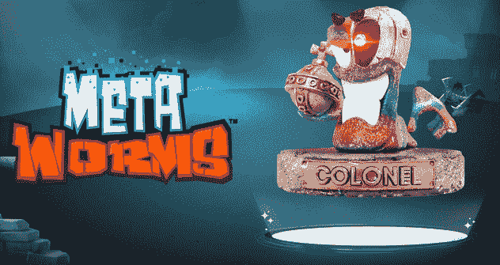
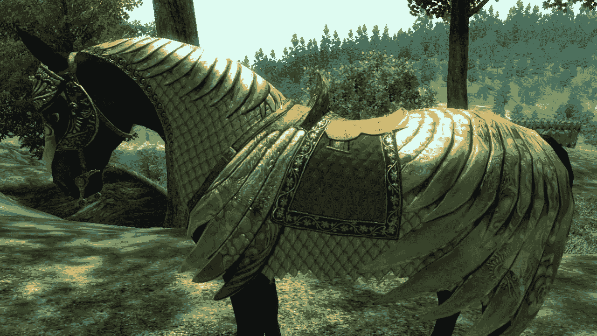

# 游戏系列蠕虫忍者绳成 NFT 收藏品

> 原文：<https://web.archive.org/web/https://dappradar.com/blog/worms-nft-collectibles-team17-announcement>

## Team17 宣布与现实游戏集团合作

英国游戏工作室 Team17 与 Reality Gaming Group 合作，根据蠕虫游戏系列制作 NFT 收藏品。这些限量版的元蠕虫将成为基于蠕虫特许经营 26 年历史的艺术作品。

变形虫是可再生的艺术品，这意味着区块链会在购买时随机分配视觉元素。这意味着后生动物可以有闪光的彩虹皮肤和激光眼。

Metaworms, NFT collectibles by Team17 and Reality Gaming Group (2022)

现实游戏集团希望确保他们的蠕虫 NFT 收藏品是环保的。这就是为什么超蠕虫会存在于现实游戏集团自己的以太坊侧链上。元虫生活在以太坊的侧链上，能量消耗非常低。据 Reality Gaming Group 称，在其网络上铸造 10 万个 NFT 的成本相当于“11 个家庭平均每年的水壶使用量”。

在写这篇文章的时候，Metaworms 项目仍然有很多神秘之处。销售什么时候进行？会有多少 NFT，价格是多少？现实游戏集团承诺 [on Discord](https://web.archive.org/web/20220929042927/https://discord.gg/9w9GCddH) 发布该项目的路线图，但至今仍未实现。持续的社区反弹可能是原因。

## 游戏公司涉足 NFT

Team17 和 Worms 是游戏行业的知名品牌。Reality Gaming Group 和 Team17 之间的合作突显了一种新趋势，即游戏公司涉足区块链技术、即玩即赚游戏和 NFTs。在 Team17 和 Reality Gaming Group 的情况下，我们纯粹是在谈论数字收藏品，但 Team17 很可能会允许这些 NFT 收藏品作为现有或即将推出的 Worms 游戏中的可玩角色存在。

去年，Konami、Sega、Namco Bandai 和 Square Enix 等公司进行了试水。育碧[做了一个大动作](https://web.archive.org/web/20220929042927/https://dappradar.com/blog/ubisoft-bringing-ghost-recon-game-nfts-to-tezos)，在他们最不受欢迎的游戏之一《幽灵侦察断点》中实施 NFT 奖励。与此同时，电子艺界也宣布了他们的兴趣。然而，如果没有游戏玩家和记者的参与，这些公司不会涉足 NFTs 和游戏赚钱。

## 不支持 NFTs 的游戏玩家和游戏记者

一些游戏公司投资了区块链项目，而另一些公司则宣布了 NFT 系列。通常这样的声明会导致社区的反弹，有时游戏公司会放弃他们的 NFTs 计划。这种情况发生在 GSC 游戏世界和世嘉(T2)公司身上，如果粉丝反对的话，他们会改变出售 NFT 的决定。

与此同时，NFT 社区认为游戏玩家还没有完全理解 NFTs。甚至育碧内部的人都说。貌似“记者”似乎也很难理解非功能性翻译。在因反对非功能性技术而臭名昭著的 Kotaku.com，[抨击团队使用非功能性技术，称这种技术是“骗局”和“环境灾难”。棒球卡和 Funko Pops 都可以，但数码收藏品不行？Kotaku 到底有没有看新闻稿，了解关于能耗的部分？](https://web.archive.org/web/20220929042927/https://kotaku.com/worms-team17-nfts-metaworms-scam-blockchain-1848452059)

虽然 NFT 的空间在继续增长，元宇宙也在成形，但也有很多阻力。这让我想起了围绕 Xbox 360 发布的一个臭名昭著的事件。2006 年 4 月，当育碧为《上古卷轴湮没》发布《战马盔甲》时，每个人都为 250 美元的价格叫屈。

$2.50 golden horse armor was an outrage in 2006

差不多 16 年后，人们一直在数字游戏项目上花钱。通过 NFTs，玩家可以转售他们的资产，例如一件马盔甲的等价物。记住，不是每个 NFT 都需要 10 万美元。根据可用性和需求，NFT 的价格从几美分到几美元不等。

传统游戏仍将存在，就像除了数字游戏外，实体游戏仍在销售一样。互联网给游戏领域带来了许多创新，手机游戏也是如此。也许游戏行业应该给 NFTs 一个机会。