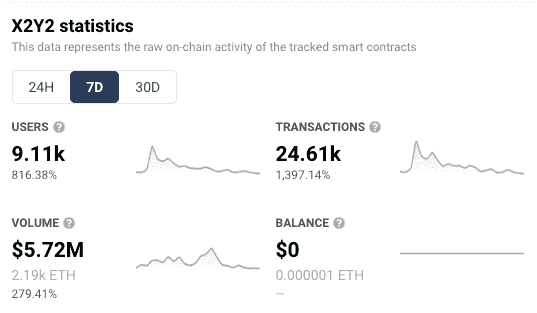
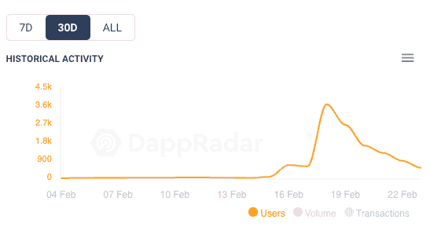
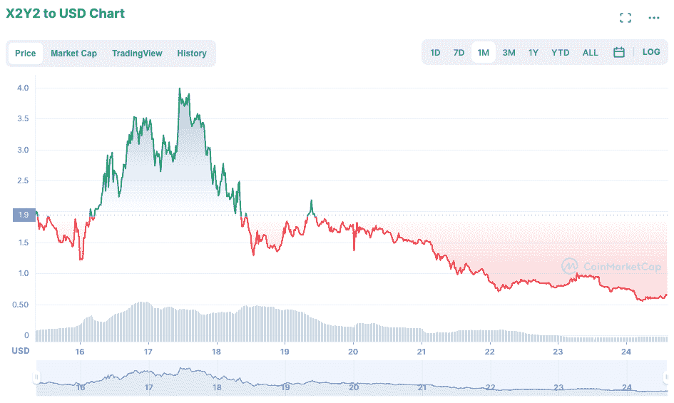
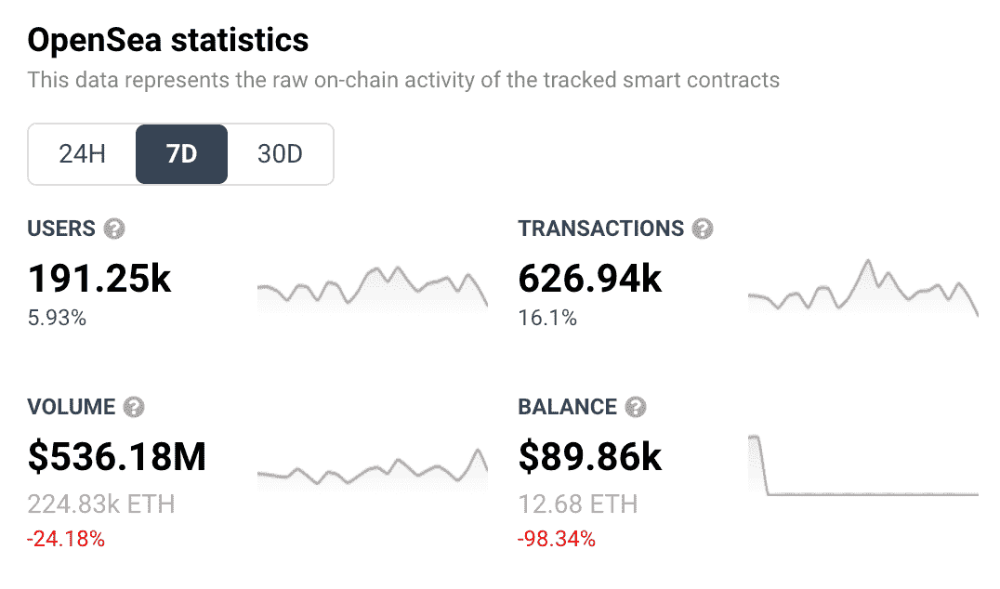

# X2Y2 在 OpenSea 上的吸血鬼攻击

> 原文：<https://web.archive.org/web/https://dappradar.com/blog/x2y2s-vampire-attack-on-opensea>

## 在竞争对手平台 OpenSea 向交易者空投代币后，NFT 分散市场 X2Y2 的用户增加了 816%

在过去的 7 天里，二级 NFT 市场 X2Y2 在其原生令牌(X2Y2)空投后，吸引了越来越多的用户使用其平台。这一举动在社区中被称为吸血鬼攻击，连接到该平台的唯一活跃钱包数量跃升了 816%。

吸血鬼攻击是典型的 Web3 现象。这是一种通过刺激竞争对手跳槽来窃取他们用户的行为。在这种情况下，X2Y2 向任何在 2022 年 1 月之前在 [OpenSea](https://web.archive.org/web/20230101230816/https://dappradar.com/multichain/marketplaces/opensea) 上以不到 1 ETH 的价格列出 NFT 的用户空投了 12%的原生令牌(X2Y2)。问题是:这些用户必须从 OpenSea 获取他们的 NFT，并以同样的价格在 X2Y2 上重新发布。

这些统计数据显示了 X2Y2 是如何因这一举措而全面增长的。过去一周，用户、交易和交易量都在上升。活动的高峰确实发生在空投之后，然后就逐渐消失了；但该平台的交易量仍然相对较高，成千上万以前不知道该平台的新用户将被介绍给 X2Y2。

X2Y2 7 day charts and analytics

如果我们从更长远的角度来看 X2Y2 的历史用户活动，我们可以看到，他们的大胆举动使该平台在拥挤的市场中得到了每个新兴企业所需要的东西:宣传和用户。正如我们在下图中看到的，在 2021 年 2 月 17 日空投之前，X2Y2 用户数量可以忽略不计。我们的[分析工具](https://web.archive.org/web/20230101230816/https://dappradar.com/ethereum/marketplaces/x2y2)显示，在月初，只有 8 个人使用这个平台。一周前接近垂直的峰值正好与吸血鬼袭击相吻合。

30 day chart showing X2Y2 user numbers

在空投消息传出后，该平台的原生令牌 X2Y2 也出现了增长。但这种上涨转瞬即逝，可能是因为代币持有者迅速获利了结。代币价格见顶 6 天后，已经跌至低于吸血鬼袭击前的水平。

30 day X2Y2 token price

## 受害者呢？

让我们在这里考虑一下 OpenSea。他们在打理自己的生意，为区块链爱好者提供一个诚实的平台来交易他们的[mfer](https://web.archive.org/web/20230101230816/https://dappradar.com/ethereum/collectibles/mfers)、[变种人](https://web.archive.org/web/20230101230816/https://dappradar.com/ethereum/collectibles/mutant-ape-yacht-club)和 [Meebits](https://web.archive.org/web/20230101230816/https://dappradar.com/ethereum/collectibles/meebits) 。然后出现了一个年轻的伪装者，用财富的承诺诱惑他们的用户。那么，OpenSea 受到了怎样的影响，长期的后果可能是什么？

我们可以从下面的图表中看到，OpenSea 在短期内既没有受到影响，也不可能有长期影响。在过去的 7 天里，OpenSea 的用户和交易数量都有所增加。成交量和平衡都下降了，但在这种情况下，相关性肯定不能说明因果关系。与 X2Y2 的行为相比，有更广泛的负外部性更有可能解释这些下跌。

OpenSea 7 day charts and analytics

如前所述，X2Y2 在进行吸血鬼攻击时有两个主要目标。该平台希望吸引用户并获得宣传。看着上面的图表，从他们的推特粉丝增加了 47%来判断，他们似乎在这两方面都取得了成功。随着越来越多的分散市场与 OpenSea 争夺市场份额，DappRadar 将继续关注 NFT 市场。今年早些时候，我们看到 LooksRare [采用了见不得人的“洗白”战术](https://web.archive.org/web/20230101230816/https://dappradar.com/blog/looksrare-nft-marketplace-hit-by-wash-trading-amidst-airdrop)，并使用他们自己的空投诡计作为吸引用户的手段。如果你想知道现在哪些是 NFT 表现最好的市场，看看 [DappRadar 顶级市场排名](https://web.archive.org/web/20230101230816/https://dappradar.com/nft/marketplaces)。此外，你还可以在 Twitter 上关注 DappRadar，抢先获得最新的 NFT 新闻。