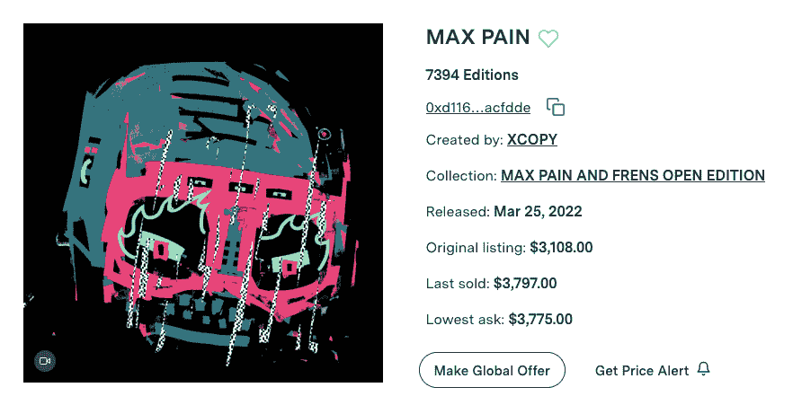
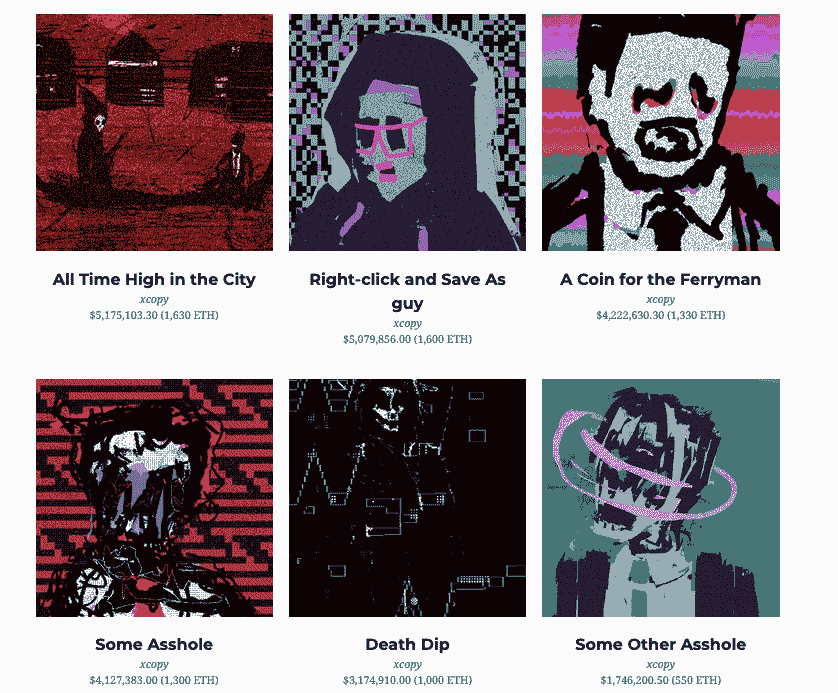

# XCOPY 通过 Nifty Gateway 在 10 分钟内卖出了 2300 万美元

> 原文：<https://web.archive.org/web/https://dappradar.com/blog/xcopy-sold-23-million-through-nifty-gateway-in-10-minutes>

## XCOPY 是 NFT 秘密艺术的领军人物之一

NFT 艺术家 XCOPY 刚刚通过 Nifty Gateway 在 10 分钟内卖出了 2300 万美元。完全匿名的 XCOPY 是加密艺术领域最著名的 NFT 艺术家之一

这位总部位于伦敦的加密艺术家与 NFT 市场 Nifty Gateway 合作，于周四推出了 MAX PAIN 和 FRENS T2 T3 NFT 系列。聚光灯下的作品叫做 [*MAX PAIN*](https://web.archive.org/web/20221007091711/https://niftygateway.com/marketplace/collection/0xd1169e5349d1cb9941f3dcba135c8a4b9eacfdde/1?filters[onSale]=true&sortBy=lowest) 。发行了 7394 期，每期 3100 美元，从下降中筹集的资金总额达到约 2300 万美元。收藏家们在 10 分钟内就完成了交易。

XCOPY，秘密艺术的鼻祖？

XCOPY 是最早尝试秘密艺术的艺术家之一。这位 NFT 艺术先驱向公众透露的个人信息很少，但这位艺术家的作品却名列畅销榜。XCOPY 以死亡或反乌托邦为主题的视觉风格让观众想起美国传奇艺术家[让·米歇尔·巴斯奎特](https://web.archive.org/web/20221007091711/https://en.wikipedia.org/wiki/Jean-Michel_Basquiat)的作品。五颜六色，混乱不堪，令人叹为观止。

XCOPY 最具标志性的作品之一是 [*右击并另存为盖伊*](https://web.archive.org/web/20221007091711/https://dappradar.com/hub/assets/eth/0x41a322b28d0ff354040e2cbc676f0320d8c8850d/1154) 。它嘲笑那些经常把密码艺术称为可以右键点击并免费保存的毫无价值的东西的人。名人 NFT 收藏家 Snoop Dogg 在 1600 ETH 从 SuperRare 购买了这件 1/1 版艺术品，价值约 700 万美元。Snoop Dogg 已经不是第一次光顾 XCOPYART 的艺术品了。去年 9 月，史努比·多格(Snoop Dogg)以 1300 ETH，约 400 万美元的价格从同一位艺术家手中买了一幅 NFT。

[rfc.art](https://web.archive.org/web/20221007091711/https://rfc.art/) 的创始人巴勃罗·罗德里格斯-弗雷勒，是 XCOPY 的另一位著名资助人。2021 年 4 月，巴勃罗从元宇宙苏富比购买了 XCOPY 的 [*乌合之众:#3 / #4 / #16(束)*。到目前为止，XCOPY 的加密艺术生涯已经产生了大约 6700 ETH 的交易量，564 个钱包收集了他的 NFT 艺术。](https://web.archive.org/web/20221007091711/https://metaverse.sothebys.com/natively-digital/lots/rabbles-bundle-3-4-16)

## XCOPY 前 1/1 的销售额

1.  [这座城市的最高价](https://web.archive.org/web/20221007091711/https://dappradar.com/hub/assets/eth/0x41a322b28d0ff354040e2cbc676f0320d8c8850d/11)——5175103.30 美元(1630 瑞士法郎)—[买家的钱包](https://web.archive.org/web/20221007091711/https://dappradar.com/hub/wallet/eth/0x63fed38f5d6f6fd6a899451c72322c44b9c5acb0)
2.  [右击并另存为盖伊](https://web.archive.org/web/20221007091711/https://dappradar.com/hub/assets/eth/0x41a322b28d0ff354040e2cbc676f0320d8c8850d/1154)–＄5，079，856.00 (1600 瑞士法郎)–[买家钱包](https://web.archive.org/web/20221007091711/https://dappradar.com/hub/wallet/eth/0xce90a7949bb78892f159f428d0dc23a8e3584d75)
3.  [给摆渡人的硬币](https://web.archive.org/web/20221007091711/https://dappradar.com/hub/assets/eth/0x41a322b28d0ff354040e2cbc676f0320d8c8850d/10)——4222630.30 美元(1330 瑞士法郎)—[买家的钱包](https://web.archive.org/web/20221007091711/https://dappradar.com/hub/wallet/eth/0xe8e974b98c320741adf9235c0a5702eb8e68233f)
4.  [某个混蛋](https://web.archive.org/web/20221007091711/https://dappradar.com/hub/assets/eth/0x41a322b28d0ff354040e2cbc676f0320d8c8850d/7)412738300 美元(1300 瑞士法郎)—[买家的钱包](https://web.archive.org/web/20221007091711/https://dappradar.com/hub/wallet/eth/0xce90a7949bb78892f159f428d0dc23a8e3584d75)
5.  [死亡跳水](https://web.archive.org/web/20221007091711/https://dappradar.com/hub/assets/eth/0x41a322b28d0ff354040e2cbc676f0320d8c8850d/14)——317491000 美元(1000 瑞士法郎)—[买家的钱包](https://web.archive.org/web/20221007091711/https://dappradar.com/hub/wallet/eth/0xce90a7949bb78892f159f428d0dc23a8e3584d75)
6.  [另一个混蛋](https://web.archive.org/web/20221007091711/https://dappradar.com/hub/assets/eth/0x41a322b28d0ff354040e2cbc676f0320d8c8850d/2123)——1746200.50 美元(550 瑞士法郎)—[买方墙](https://web.archive.org/web/20221007091711/https://dappradar.com/hub/wallet/eth/0x54a973a5da508d551edf9ee50842e7c36faa1d87)