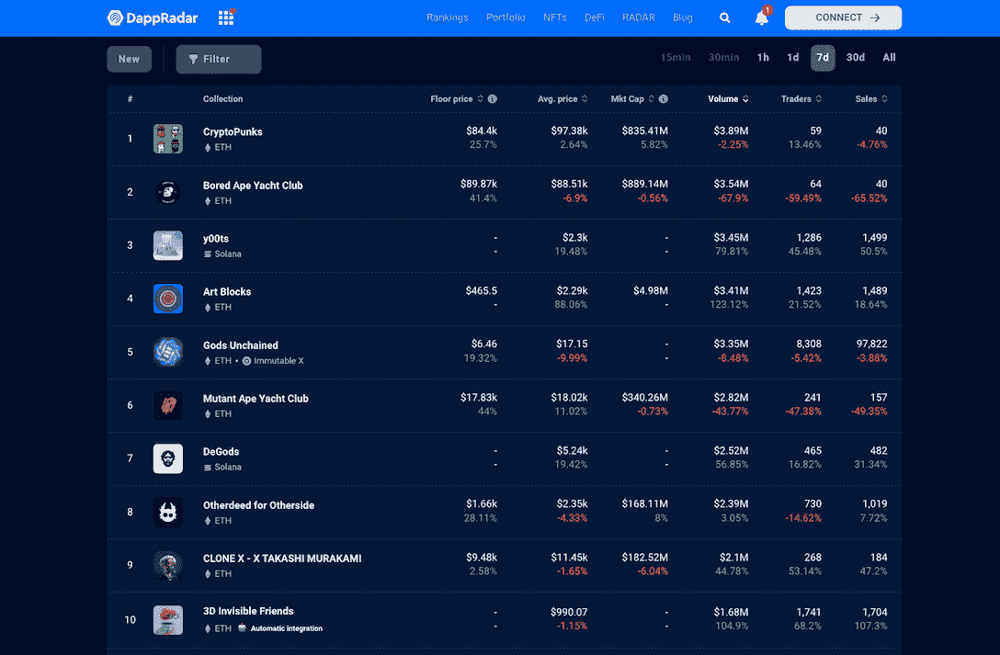
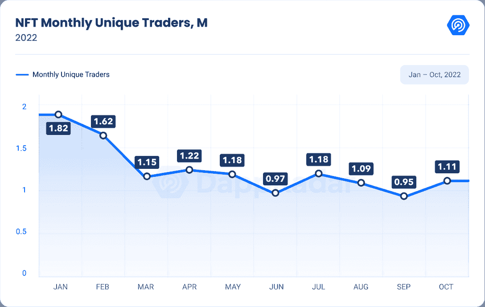
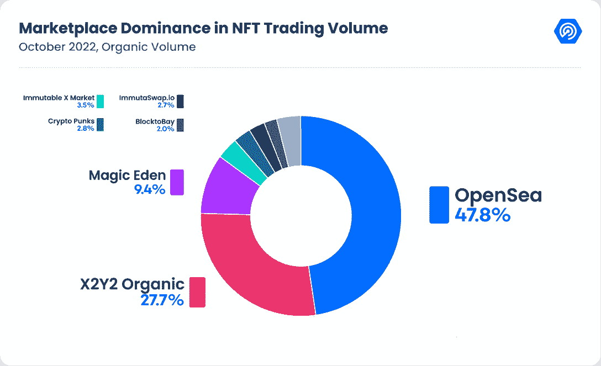

# y00s NFT 系列越来越接近无聊的猿人和神秘的朋克

> 原文：<https://web.archive.org/web/https://dappradar.com/blog/y00ts-nft-collection-gets-closer-to-bored-apes-and-cryptopunks>

## 查看 2022 年 11 月 29 日至 12 月 5 日期间的 NFT 销售亮点排名。

虽然 y00ts 不是市场上最贵的非功能性金融工具，但交易活动正在飞速增长。和《看不见的朋友》一起，这个系列强势回归，在 NFT 十大系列中仅次于无聊的猿和神秘的朋克。与此同时，CryptoPunks 继续主导着大多数高价 NFT，尽管该列表中也出现了一些新名称。

## 前 10 名 NFT 藏品的底价上涨或保持稳定

*Data source:* [*DappRadar NFT Rankings*](https://web.archive.org/web/20221205123522/https://dappradar.com/nft/collections)

根据达普拉达 NFT 探险家，前 10 大收藏要么增加或保持稳定的 7 天底价。在 DappRadar 上，底价是基于某个时间段内某个系列最便宜的销售价格。

上图显示，Bored Ape 游艇俱乐部(BAYC) 7 天底价涨幅超过 40%。在 FTX 的崩溃中，一些受影响的 BAYC 持有人不得不以较低的价格出售他们在 NFT 的优质资产，如 BAYC，以弥补他们在中央交易所的损失。

[View more BAYC stats](https://web.archive.org/web/20221205123522/https://dappradar.com/ethereum/collectibles/bored-ape-yacht-club)

事件发生两个多星期后，加密用户已经从他们的交易策略到心态都安定下来。因此，我们也看到了海湾合作委员会底价的回升。随着非功能性食品价格的上涨，我们现在看到市场信心增强。

BAYC 的交易量和销售额都下降了 65%以上。这两个数字反映了用户的活跃程度。这两个数字的下降可能意味着持有者期望 BAYC 作为 NFT 资产以更高的价格交易。此外，翻转活动可能有所减少。

这些暗示的依据来自于 ApeCoin staking 即将推出的消息。持有来自贝克或 MAYC 收藏的 NFT 会给那些赌硬币的人带来更高的兴趣。因此，不卖贝可或 MAYC 能带来额外的经济利益。

> 我对这个用户界面很满意，但是仍然有一些验证要做，以确保所有的赌注都在你的钱包里，但是我认为我们已经有了一个替代的开源赌注解决方案！pic.twitter.com/hj3TlDGcBP
> 
> — The Ape Collector 🍌 (@ApeCollector) [November 26, 2022](https://web.archive.org/web/20221205123522/https://twitter.com/ApeCollector/status/1596370142945890304?ref_src=twsrc%5Etfw)

## y00t NFT 跑马圈地带来了积极的指标增长

ApeCoin 的发展已经在 y00ts 生态系统中发生。y00ts 是 Solana 区块链上最受欢迎的最新 NFT 系列，由 DeGods 的创始人 Dust Labs 于今年推出。上周，该项目向用户开放了 NFT staking，开启了其社区参与式生成艺术之旅的新阶段。

> 你现在可以下注了。(1/2)[https://t.co/K3z3bFcbWy](https://web.archive.org/web/20221205123522/https://t.co/K3z3bFcbWy)[pic.twitter.com/jjfKqBH83B](https://web.archive.org/web/20221205123522/https://t.co/jjfKqBH83B)
> 
> — y00ts (@y00tsNFT) [November 28, 2022](https://web.archive.org/web/20221205123522/https://twitter.com/y00tsNFT/status/1597340794502774784?ref_src=twsrc%5Etfw)

3D 隐形朋友目前交易底价 0.478 ETH。该项目在过去一周创造了 169 万美元的收入，增长了 104%。此外，交易人数达到 1752 人，成交 1712 笔，同比分别增长 68%和 107%。

[View more 3D Invisible Friends stats](https://web.archive.org/web/20221205123522/https://dappradar.com/hub/nft-collection/3d-invisible-friends)

## 查看 NFT 销售亮点列表

*注意:出售时给出的美元价值是正确的。*

每周，DappRadar 不仅会重点报道 NFT 最昂贵的[销售](https://web.archive.org/web/20221205123522/https://dappradar.com/nft/sales)，还会报道过去七天中最有趣的销售。虽然庞大的数字肯定会占据头条，但突出新兴趋势并让 DappRadar 社区保持领先也是至关重要的。

*   [crypto punk # 4181](https://web.archive.org/web/20221205123522/https://dappradar.com/hub/assets/eth/0xb47e3cd837ddf8e4c57f05d70ab865de6e193bbb/4181)-$ 187220/148.5 ETH-[主人的钱包](https://web.archive.org/web/20221205123522/https://dappradar.com/hub/wallet/eth/0x1919db36ca2fa2e15f9000fd9cdc2edcf863e685?utm_source=rankings&utm_medium=nft&utm_campaign=nft_sales)
*   [志那都红豆# 9143](https://web.archive.org/web/20221205123522/https://dappradar.com/hub/assets/eth/0xed5af388653567af2f388e6224dc7c4b3241c544/9143)-$ 172160/135 ETH-[车主的钱包](https://web.archive.org/web/20221205123522/https://dappradar.com/hub/wallet/eth/0xd87051c7b10ea48da69f91395419774572cc197b?utm_source=rankings&utm_medium=nft&utm_campaign=nft_sales)
*   [BAYC # 1421](https://web.archive.org/web/20221205123522/https://dappradar.com/hub/assets/eth/0xbc4ca0eda7647a8ab7c2061c2e118a18a936f13d/1421)-$ 157，230/130 ETH-[车主的钱包](https://web.archive.org/web/20221205123522/https://dappradar.com/hub/wallet/eth/0x08c904a02578ed95a46c25a8cc510cd6ed9f2ed3?utm_source=rankings&utm_medium=nft&utm_campaign=nft_sales)
*   [fide nza # 845](https://web.archive.org/web/20221205123522/https://dappradar.com/hub/assets/eth/0xa7d8d9ef8d8ce8992df33d8b8cf4aebabd5bd270/78000845)-130，310 美元/107 ETH-[车主的钱包](https://web.archive.org/web/20221205123522/https://dappradar.com/hub/wallet/eth/0x36fea1ca849ab138aed5ede18c8adf9286529043)
*   [MAYC # 14977](https://web.archive.org/web/20221205123522/https://dappradar.com/hub/assets/eth/0x60e4d786628fea6478f785a6d7e704777c86a7c6/14977)-103030 美元/ 79.69 瑞士法郎-[车主的钱包](https://web.archive.org/web/20221205123522/https://dappradar.com/hub/wallet/eth/0x572d6f0628ef555061932f85687c9f8f85505ed1?utm_source=rankings&utm_medium=nft&utm_campaign=nft_sales)
*   [88888 . ETH](https://web.archive.org/web/20221205123522/https://dappradar.com/hub/assets/eth/0x57f1887a8bf19b14fc0df6fd9b2acc9af147ea85/114481274475595301576702176101306113967312594699620194631878775862283040251601)-$ 53172/41 ETH-[主人的钱包](https://web.archive.org/web/20221205123522/https://dappradar.com/hub/wallet/eth/0x82b28458e4f86881c98cdddcf1c204a6b28a97b2)
*   [other side # 81566](https://web.archive.org/web/20221205123522/https://dappradar.com/hub/assets/eth/0x34d85c9cdeb23fa97cb08333b511ac86e1c4e258/81566)-$ 28010/23.88 ETH-[车主的钱包](https://web.archive.org/web/20221205123522/https://dappradar.com/hub/wallet/eth/0x7eb413211a9de1cd2fe8b8bb6055636c43f7d206?utm_source=rankings&utm_medium=nft&utm_campaign=nft_sales)

[Check out all the NFT market trends](https://web.archive.org/web/20221205123522/https://dappradar.com/nft/sales)

## 其他值得注意的发现

根据 DappRadar 的最新行业报告，10 月份独特的 NFT 交易员人数增加了 18%，达到 111 万人。新用户正在进入 NFT 市场，这可能会转化为对 NFT 的接受度提高和需求增长。

此外，就作为交易平台的受欢迎程度而言，OpenSea 正在失去动力。曾经最受青睐的 NFT 交易市场 10 月份的市场份额比 8 月份下降了 8.3%，现在占整个市场的份额不到 50%。相比之下，OpenSea 的市场份额下降伴随着 X2Y2 和 Magic Eden 的出现。

[Read the full report](https://web.archive.org/web/20221205123522/https://dappradar.com/blog/october-blockchain-industry-report)

## 随身携带您的 Web3 之旅

使用 DappRadar 移动应用程序，再也不会错过 Web3。查看最受欢迎的 dapps 的性能，并关注您投资组合中的 NFT。您在 DappRadar 上的帐户会与我们的移动应用程序同步，这样您很快就可以选择实时接收提醒。

[Download the DappRadar app now](https://web.archive.org/web/20221205123522/https://dappradar.app.link/blog)[<picture></picture>](https://web.archive.org/web/20221205123522/https://play.google.com/store/apps/details?id=com.portfolio.dappradar) NewsletterUnsubscribe at any time. [T&Cs](https://web.archive.org/web/20221205123522/https://dappradar.com/terms) and [Privacy Policy](https://web.archive.org/web/20221205123522/https://dappradar.com/privacy-policy)