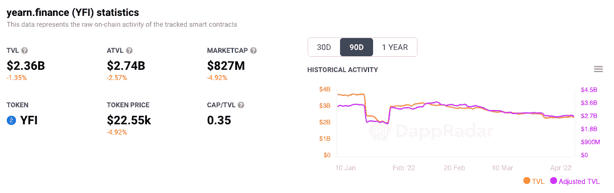

# 向往金融冠军 ERC-4626，并宣布大金库标准化

> 原文：<https://web.archive.org/web/https://dappradar.com/blog/yearn-finance-champions-erc-4626-and-announces-the-great-vault-standardization>

## 令牌化的 vault 标准已最终确定，并承诺结束修补作业和自定义连接器

昨日，渴望金融支持新的 ERC-4626 代币。它在 Twitter 上宣布，该平台的新 V3 Vault 将遵守新的令牌标准。

**总结**

*   ***非常简短的叙述 ERC-4626 至今的旅程***
*   ***[ERC 代币是什么？](https://web.archive.org/web/20220925071555/http://erc-tokens/)***
*   ***[ERC-4626 是怎么工作的？](https://web.archive.org/web/20220925071555/http://erc-4626/)***
*   ***[大跳马标准化](https://web.archive.org/web/20220925071555/http://great-standardization/)***[***向往金融***](https://web.archive.org/web/20220925071555/https://dappradar.com/ethereum/defi/yearn-finance-yfi) ***的地位***

1 月 4 日，一位名叫乔伊·桑托罗的开发者首次提出了 ERC-4626 令牌。3 月 17 日，“ERC-4626 现在是最终版本”。昨天，渴望金融在 Twitter 上发布消息称，他们已经完成了“令牌化保险库标准”，并且“大保险库标准化现在开始”。

一个新的令牌标准通常不会成为新闻，但当它承诺解决 DeFi 中一些长期存在的问题时，我们都会突然注意到它。目前，收益率令牌之间还没有标准的通信方式。ERC-4626 改变了这一切。

最终，ERC-4626 可能会彻底改变用户和平台下注代币和收取收益的方式。由于区块链技术荒谬的复杂性，大多数从中受益的人甚至不会意识到任何事情已经发生了变化。

## 什么是 ERC 代币？

大多数人都听说过 ERC 20 代币。它提供了一套指导方针，所有其他令牌都需要遵守，才能在以太坊区块链或遵循 EVM 标准的其他链上工作。ERC 代表以太坊请求评论，20 是开发者分配给该项目的建议号。

一旦 ERC-20 令牌标准被实现，每个为以太坊开发的人都知道他们必须遵守的规则，以便他们的项目能够工作。这为区块链系统引入了可组合性。以太坊上的代币是可以替换的。这意味着用户可以将一种类型的令牌换成另一种。，允许可伸缩性和更有趣的生态系统。

Fabian Vogelsteller 在 2015 年推出了 ERC-20 令牌。这对区块链科技来说是一个里程碑式的时刻，在很多方面都代表着一个巨大的飞跃。

其他你可能知道但不知道的 ERC 标准是 ERC-721 和 ERC-1155 令牌。

*   ERC-721 是第一个为开发人员设定嵌入不可替换令牌所有权的准则的标准。这是 NFTs 的诞生。
*   ERC-1155 令牌主要为 NFTs 提供标准。但是它是不可替换的，这意味着它对可替换和不可替换的令牌都有效。ERC-1155 降低了天然气价格，意味着更多的人可以参与。

现在我们有了一个新的 ERC-4626 令牌标准。

## ERC-4626 是如何工作的？

乔伊·桑托罗开发了 ERC-4626 来解决收益率代币的问题。到目前为止，收益率聚合器、金库、借贷市场和 xSUSHI 等原生收益率令牌的实现略有不同。

这意味着，任何人想要在一个有收益的令牌上构建一个应用程序，都需要编写多个插件和适配器，以使错位的代码片段能够相互对话。开发人员通过包装令牌解决了这个问题，但这不是一个完美的解决方案。

如果你曾经遇到过 WETH 或 WBTC，这意味着一个令牌被包装。在这些情况下，WETH 代表包裹的 ETH，WBTC 代表包裹的 BTC。它们都是一对一地与基础硬币挂钩，但采用不同的代币标准。包裹硬币有助于硬币在不同的区块链之间移动。这使得人们能够在不同的主网之间交换代币，这对于赌注和产量耕作过程来说是至关重要的。

但是包装令牌既昂贵又耗时，而且存在固有的安全缺陷。想象一个开发人员为不同产出令牌中的每一个独特变化设计定制连接器。做这件事需要时间和金钱。将未对齐的部分相互桥接会在系统中产生漏洞。归根结底，包装是一种桥接方式，我们最近都看到了这种方式有多糟糕。

ERC-4626 提供了一个标准，使得跨多个区块链的所有这些不同的令牌可以相互通信。像七年前的 ERC-20 令牌一样，这个新的令牌标准为生态系统带来了可组合性。

## 大金库标准化和为什么渴望金融支持很重要

“渴望金融”在推特上明确表示:“渴望 V3 + ERC-4626 =不可避免”。渴望金融是 DeFi 领域一个受欢迎的收益聚合工具。他们通过将赌注资产放在能产生最大收益的地方，为农民带来最大利润。

凭借其平台锁定的 29.2 亿美元的总价值，即使它不是该领域的市场领导者，也有足够的影响力。因此，当它宣布将它的令牌标准改为 ERC-4626 用于即将到来的 V3 拱顶时，其他类似的平台很可能会听从。

[DappRadar’s on-chain analytics for Yearn Finance](https://web.archive.org/web/20220925071555/https://dappradar.com/multichain/defi/yearn-finance-yfi)

向往金融也在其 Twitter 帖子中宣布，大金库标准化已经到来。保险库是在一个区块链上锁定代币的过程，以便可以铸造其他代币并在不同的区块链上使用。你可以把它想象成一种对等交换，人们可以把自己拥有的东西放在一个地方，然后在其他地方拿起不同但同等价值的东西。

这是 DeFi 背后的支柱之一，因为它支持打桩和产量农业。现在我们有了 ERC-4626 标准，保险存储过程很快就会在整个区块链实现。引用乔伊·桑托罗的话来说，以太坊的“生态系统越能协调开发工作，DeFi 就能越快发展壮大”。DappRadar 肯定会密切关注局势，看看这些希望是否会实现。

你也可以在这里跟踪渴望金融的链上分析[，并查看它在](https://web.archive.org/web/20220925071555/https://dappradar.com/multichain/defi/yearn-finance-yfi) [DappRadar 的 DeFi dapp 排名页面](https://web.archive.org/web/20220925071555/https://dappradar.com/rankings/category/defi)中的排名。渴望金融也有自己的本地令牌，名为 [YFI](https://web.archive.org/web/20220925071555/https://dappradar.com/hub/token/eth/YFI?from=0x0bc529c00c6401aef6d220be8c6ea1667f6ad93e) ，建于区块链以太坊之上。使用我们的[令牌资源管理器](https://web.archive.org/web/20220925071555/https://dappradar.com/hub/tokens/ethereum/all/1)来查看它的性能。