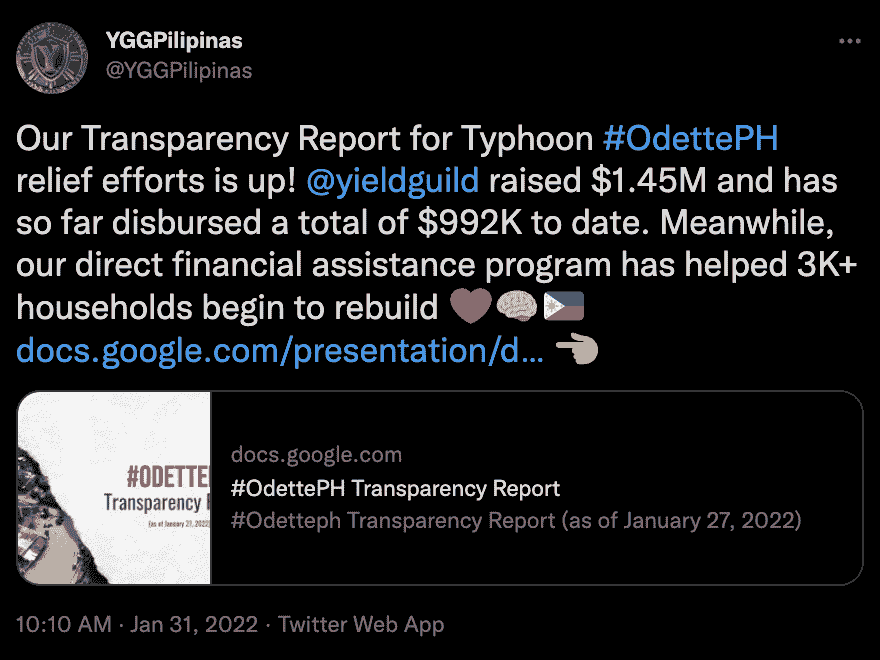

# Yield Guild Games 为台风 Odette 的救援任务筹集了 145 万美元

> 原文：<https://web.archive.org/web/https://dappradar.com/blog/yield-guild-games-raised-1-45-million-for-typhoon-odette-relief-mission>

## 12 月 16 日奥黛特遇袭后，该协会的菲律宾分会组织了这次慈善活动

**Yield Guild Games 是区块链最大的游戏社区之一，它已经成功筹集了超过 145 万美元来帮助受台风“奥德特”影响的菲律宾人民。在最近的透明度报告中，YGG 详细说明了它帮助了 3000 多个家庭。** **捐款帮助购买食品、照明和其他救灾产品等基本必需品。**

台风“奥德特”于 12 月 16 日袭击了菲律宾，并很快被认定为 5 级超强台风。强风的破坏性影响了全国成千上万的人。

由于 Yield Guild Games 与菲律宾有着密切的联系，该国经理 Luis Buenaventura 迅速组织了一次捐赠活动。仅在最初几天，来自世界各地的游戏玩家就捐赠了 crypto 和 fiat，募集了超过 11 万美元用于紧急救援。自那时以来，救济工作大幅增加，特派团已经筹集了 145 万多美元。

## 产出公会游戏团队与 Axie Infinity 球迷

菲律宾是第一个采用并开始玩赚取游戏的奇迹 Axie Infinity 的国家。考虑到那里庞大的玩家基础，游戏的创作者和几个 Axie 公会是台风奥德蒂之后参与救灾工作最多的。

Axie Infinity 的联合创始人 Jihoz Zirlin 在圣诞节当天捐赠了 1000 AXS，价值约 55400 美元。此外，根据透明报告，大部分进入 Yield Guild Games 钱包的捐款来自 AXS 或 SLP。

Axie Infinity 不是唯一一个寻求帮助受台风影响家庭的社区。虽然 Axie 已经创建了一个最大的游戏赚钱社区，但其他平台也在加入这一努力。

## 游戏赚钱社区回馈社会

和谐为基础的 DeFi 王国举行了一次社区投票，并批准从游戏的金库捐赠 50 万美元。此外，play-to-earn 平台的创始人决定进一步支持他们社区的决定，将他们自己的 25 万美元资金加入捐赠。

此外，疯狂防御英雄还组织了一场捐赠活动，平台上每一个唯一的活动钱包赠送 1 个塔代币。这场运动从 12 月 21 日持续到 12 月 31 日。根据 DappRadar 的报道，这相当于超过 120 万个塔台代币被用来减轻台风 Odette 造成的损失。

“边玩边赚”现象席卷了整个游戏世界。然而，这种现象最重要的一个方面是不可思议的社区游戏赚钱项目。游戏玩家聚集在一起，享受与彼此对战来赚取奖励。重要的是，当社区中的一部分人需要帮助时，其他人都会加入进来。

Yield Guild Games 在台风 Odette 之后创建了一个最大的救援活动。聚集巨大的游戏社区的帮助和能力帮助公会在几周内产生了可观的资金。最重要的是，这一努力表明，以游戏赚钱的社区有真正的力量来帮助有需要的人。

DappRadar 将继续监督 Yield 公会游戏，以及像 [Axie Infinity](https://web.archive.org/web/20230118181923/https://dappradar.com/multichain/games/axie-infinity) 和 [DeFi 王国](https://web.archive.org/web/20230118181923/https://dappradar.com/multichain/games/defi-kingdoms)这样的项目。要了解最新的游戏赚钱新闻，请关注 [Twitter](https://web.archive.org/web/20230118181923/https://twitter.com/dappradar) 上的 DappRadar。此外，您可以查看 [DappRadar PRO](https://web.archive.org/web/20230118181923/https://dappradar.com/token/pro) 。它给你提供了几个独家的 [Discord](https://web.archive.org/web/20230118181923/https://discord.gg/4ybbssrHkm) 频道和完整的 DappRadar 社区体验。

 NewsletterUnsubscribe at any time. [T&Cs](https://web.archive.org/web/20230118181923/https://dappradar.com/terms) and [Privacy Policy](https://web.archive.org/web/20230118181923/https://dappradar.com/privacy-policy)