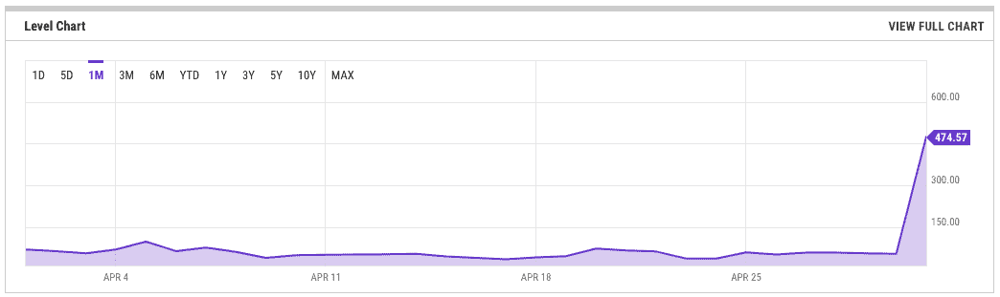
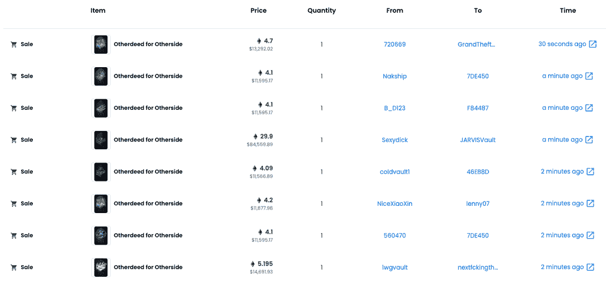
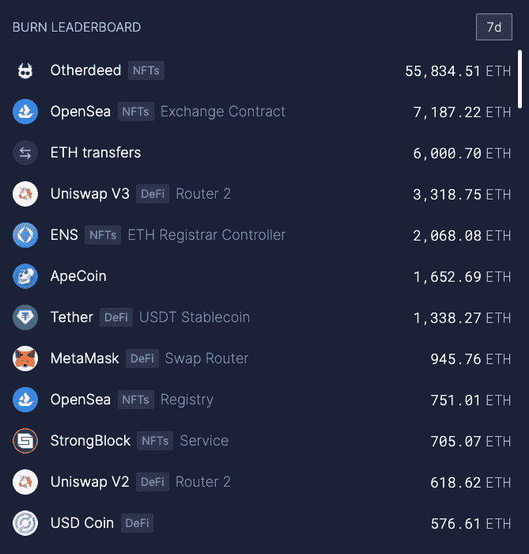
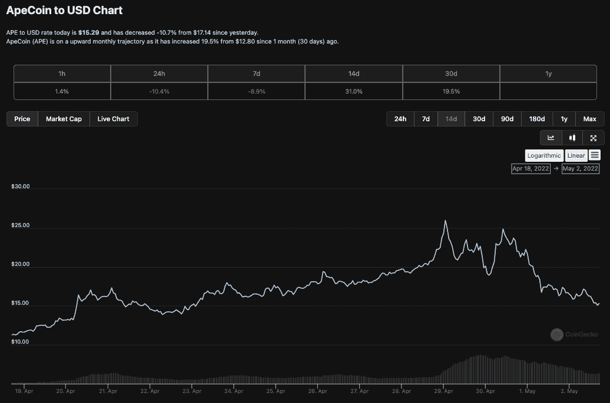

# 宇迦实验室 6 亿美元 NFT 土地拍卖创以太坊有史以来最高的天然气费

> 原文：<https://web.archive.org/web/https://dappradar.com/blog/yuga-labs-600m-otherside-nft-land-sale-records-highest-gas-fees-ever-on-ethereum>

## 投机者和投机者的投资翻了 3 倍，而以美元计价的汽油费达到了峰值

Web3 公司宇迦实验室看到投资者和爱好者支付以太坊有史以来最高的天然气费，以获得他们即将到来的虚拟世界“彼岸”中的 NFT 地块。社区已经期待了几周的土地出售，但宇迦实验室未能将 95，624 块土地顺利交付给买家。

大多数 NFT 和更广泛的密码行业耐心等待的事件已经尘埃落定。另一方面，在宇迦实验室元宇宙项目的土地出售后，我们看到了以太坊有史以来最高的天然气费用。买家为每块土地支付 6000 美元，而在销售高峰期，汽油费可能会翻倍。

## 摘要

*   95，000 份异地 NFT 每份售价约为 6000 美元，净收益约为 6 亿美元
*   5 月 1 日，以太坊燃气费达到了平均每笔 474 美元
*   贵州的汽油费达到了过去五年来的第三高点
*   土地底价一夜之间从 2 升至 6
*   自 5 月 1 日以来，价格已从 7 埃特的高点回落到 4 埃特左右
*   ApeCoin 从 4 月 30 日近 26 美元的高点跌至 15.20 美元

Otherside 可能是如今风靡一时的 NFT 无聊猿游艇俱乐部系列背后的公司推出的最重要的产品。对于试图加入这个排外俱乐部的投资者来说，[另一边](/web/20221004124555/https://dappradar.com/blog/otherside-bored-ape-top-nft-sales/)的地块代表了一个进入花园的低价值入口。交易者抢购了限量供应的 9.5 万份 Otherdeeds NFTs，代表即将到来的虚拟世界体验中的土地所有权。

## 有史以来最高价值的汽油费

尽管 NFT 以固定价格出售，但宇迦实验室没有想到销售会变成拍卖形式。然而，这次拍卖不是为非功能性测试而举办的；这是一场买家愿意支付最高天然气费用的战斗。

5 月 1 日周六，Ycharts 的平均费用达到了近 500 美元，较最近的平均 40 美元大幅上涨。然而，买家支付的实际费用可能高达 8000 吉威(T2)或 4000 美元左右。可以说，这一点，加上买家需要 KYC 他们的钱包，可能会阻止许多潜在客户参与进来。

## 24 小时内从 2 小时到 7 小时

尽管[高昂的天然气费用](/web/20221004124555/https://dappradar.com/blog/when-are-ethereum-gas-fees-lowest/)，但交易商们还是很活跃，到 5 月 2 日，二级市场上一块土地的购买价格已经从大约 2 ETH 上涨到 7 ETH，上涨了两倍多，大约 21，000 美元。即使在为这块地支付了 6000 美元，比如说，3000 美元的天然气费之后，那些快速移动的人的利润仍然值得努力，可能获得超过 1 万美元的利润。在 OpenSea 上的交易仍然活跃，在编写时，其他方面的陆地 NFT 以高达 10 万美元的价格易手。

超声波显示。超过 55，800 个以太币在书写时被烧毁是由金钱或其他非自然因素造成的。到目前为止，在 NFT 另一边的土地上已经花费了超过 1.65 亿美元的汽油费。相比之下， [OpenSea](https://web.archive.org/web/20221004124555/https://dappradar.com/ethereum/defi/metamask-swap) 在同一时间段内烧掉了大约 7000 个以太坊，而 [MetaMask Swap](https://web.archive.org/web/20221004124555/https://dappradar.com/ethereum/defi/metamask-swap) 在其整个存在期间还没有烧掉那么多。

## 硬币被击中了

相反，在经历了数周激进的价格上涨后，ApeCoin 遭遇了预期中的价格下滑。这主要是由于 ApeCoin 面临立即抛售的压力，因为它是用来购买对方土地的唯一货币。在 4 月 29 日上涨到将近 26 美元的高点后，它今天滑落到大约 15 美元[。](https://web.archive.org/web/20221004124555/https://dappradar.com/hub/token/eth/APE/ETH?from=0x4d224452801aced8b2f0aebe155379bb5d594381)尽管如此，那些关注细节并了解市场压力的人可能在过去两周获得了可观的利润。

## 赢家拿走所有东西

尽管存在汽油费问题，潜在买家需要掏钱，但毫无疑问，这笔交易将成为宇迦实验室和 BAYC 的巨大胜利。实际上，宇迦实验室基于当前数据创造了一个市值 55 亿美元的 NFT 收藏，令所有其他的 [NFT 收藏黯然失色。该组织最近从安德森·霍洛维茨(Andreessen Horowitz)那里筹集了 4.5 亿美元，最近进展顺利，但尽管这笔交易对该公司来说是一个明显的胜利，但对其他人来说却不那么成功。](https://web.archive.org/web/20221004124555/https://dappradar.com/nft)

在天然气费用相关的混乱之后，该公司发表了公开道歉，声明说

“这是历史上规模最大的 NFT 造币厂，规模是它的好几倍，然而在造币过程中使用的气体表明，需求远远超出了任何人最疯狂的预期。我们很抱歉暂时关闭以太坊的灯光。”

对于那些对 Otherside、BAYC 或[宇迦实验室](/web/20221004124555/https://dappradar.com/blog/how-yuga-labs-nfts-became-a-dominant-force-with-an-8-1b-market-cap/)不感兴趣的人来说，日常交易受到了 NFT 土地出售的严重影响。一笔简单交易的成本升至 500 美元，除了超级富豪转移数百万美元之外，对于一个发现 50 美元已经难以承受的普通交易者来说，这是太多了。此外，费用仍然很高，在交易平静下来之前，它们将保持不变。

天然气问题给以太坊作为首选网络以及其作为大型 NFT 项目长期平台的能力蒙上了更多阴影。宇迦实验室甚至在道歉帖子的末尾调侃说要建立自己的专用区块链:“很明显，ApeCoin 将需要迁移到自己的链中才能适当地扩展。我们想鼓励道开始朝这个方向思考。”然而，这是 ApeCoin 刀的决定，宇迦实验室一再重申，它不控制。

## 宇迦实验室现在怎么办？

经过数周的建设和疯狂的投机，大拍卖结束了，然而，另一边的土地持有者并不清楚他们持有什么。是的，他们有一个非常酷的视频预告片，会让任何人都想模仿，但幕后的另一面只会在未来几周和几个月变得更加明显。土地有不同的类型，在这些土地上，爱好者可以找到不同的资源。在你的土地上有一个 Koda 角色会增加价值。此外，低铸币厂数量应该更接近游戏世界的中心，可以说增加了土地的价值。

有一点非常清楚。宇迦实验室已经成为整个加密和 NFT 领域最重要的参与者之一。在过去的六个月里，[的一些权力动作](/web/20221004124555/https://dappradar.com/blog/yuga-labs-takeover-pushes-cryptopunk-meebit-sales-1000/)见证了他们成长为一个强大的内容、媒体和知识产权公司，有能力成为家喻户晓的名字，而最近的这次出售只会进一步巩固这一点。当然，他们破坏了以太坊网络，但这在很多方面都是一种荣誉。尽管如此，在他们决定透露更多关于另一边的信息之前，我们建议你观看预告片。

[https://web.archive.org/web/20221004124555if_/https://www.youtube.com/embed/wcOyqZtZs8g?feature=oembed](https://web.archive.org/web/20221004124555if_/https://www.youtube.com/embed/wcOyqZtZs8g?feature=oembed)

***以上不构成投资建议。此处给出的信息仅供参考。请行使尽职调查，做你的研究。作者持有多种加密货币的头寸，包括 BTC、瑞士法郎和雷达。***

 NewsletterUnsubscribe at any time. [T&Cs](https://web.archive.org/web/20221004124555/https://dappradar.com/terms) and [Privacy Policy](https://web.archive.org/web/20221004124555/https://dappradar.com/privacy-policy)