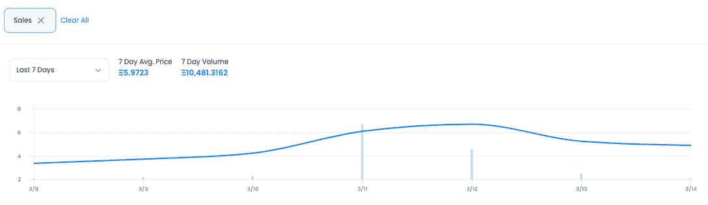
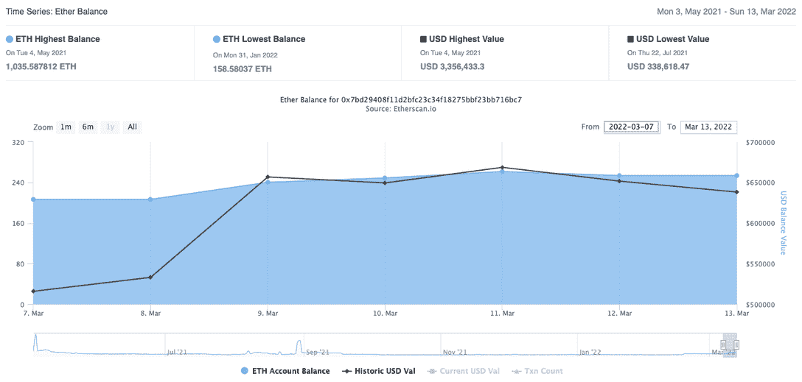
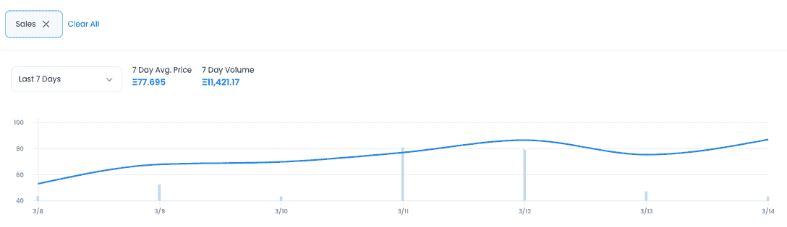
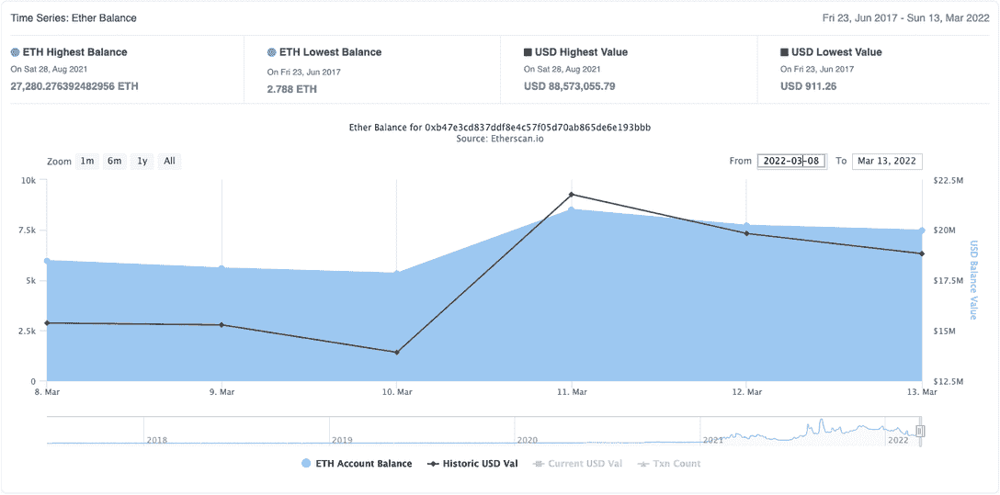
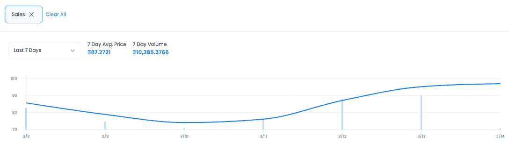

# 收购宇迦实验室推动 CryptoPunk & Meebit 销售额增长 1000%

> 原文：<https://web.archive.org/web/https://dappradar.com/blog/yuga-labs-takeover-pushes-cryptopunk-meebit-sales-1000>

## Bored Ape 游艇俱乐部背后的公司收购了 NFT 两个著名系列的知识产权，引发了 NFT 的交易狂潮

在宇迦实验室收购 CryptoPunks 和 Meebits 这两个品牌的消息冲击市场后，这两个品牌的平均销售价格和交易频率在本周末出现了爆炸式增长。3 月 11 日，Bored Ape 游艇俱乐部 NFT 系列的创造者 YugaLabs 宣布，他们成功收购了 Meebits 和 CryptoPunks 系列，使二级市场交易活动增加了 1000%以上。

宇迦从幼虫实验室获得了[密码朋克](https://web.archive.org/web/20220925085146/https://dappradar.com/ethereum/collectibles/cryptopunks)和[密比特](https://web.archive.org/web/20220925085146/https://dappradar.com/ethereum/collectibles/meebits) NFT 收藏 IP。这意味着宇迦现在拥有这两个系列的品牌、艺术版权和其他知识产权。此外，他们还获得了原本在幼虫实验室钱包里的 423 个密码朋克和 1711 个密比特。

[官方宣布](https://web.archive.org/web/20220925085146/https://twitter.com/yugalabs/status/1502420719543726080)美国西海岸 3 月 11 日下午 4 点左右坠落。几乎是同时，这两个收藏的交易量开始上升，大大提高了平均销售价格。更深入的分析更清楚地显示了这种增长，有趣的是，当 NFT 持有者收到消息时，交易是否增加了。在某种程度上，大规模抛售可能表明持有人认为他们的 NFT 在宇迦手中可能会贬值。另一方面，如此大规模的声明肯定会影响这两个系列的流动性。交易员可能只是在一个好时机兑现了。此外，看到对宇迦最初的 [BAYC](https://web.archive.org/web/20220925085146/https://dappradar.com/ethereum/collectibles/bored-ape-yacht-club) 和 [MAYC](https://web.archive.org/web/20220925085146/https://dappradar.com/ethereum/collectibles/mutant-ape-yacht-club) 系列的影响也很有趣。

## Meebits 交易上涨 995%

从 Meebits 在 OpenSea 的二级市场交易来看，公告后交易量的激增是显而易见的。3 月 10 日，一个米比特的平均售价为 4.2 ETH，约为 1.1 万美元，当天已有 87 笔交易。3 月 11 日，销售数量比前一天猛增 995%，达到 953 件，平均价格达到 6.1 ETH，约 1.6 万美元。

在 3 月 12 日宣布的 24 小时内，价格达到了 6.7 ETH 的最高点，约为 17，350 美元，销售了 478 辆。到 3 月 13 日，平均价格下降到 5.2 ETH，销售额急剧下降，接近公告前的水平。

*   第 10 次销售的平均价格为 4.2 ETH / 87
*   11 日的平均价格–6.1 ETH/953 销售额> > > %较前一天增长–995.4%
*   第 12 次销售的平均价格–6.7 ETH/478
*   13 日的平均价格–5.2 ETH/121 销售

## 密码朋克交易上涨 1000%

加密朋克的二级市场交易也紧随其后。3 月 10 日，预公告，只有五个销售平均价格为 69.8 ETH，或 181，500 美元左右。公告发布后，销售额增加了 1000%，达到 55 英镑，平均价格增加到 77 英镑，约合 200，200 美元。就像 Meebits 一样，峰值出现在 3 月 12 日，当时平均价格达到 86.5 ETH，约合 22.5 万美元，共发生了 47 次销售。到 3 月 13 日，销售额已经下降到接近公告前的水平，价格下跌了近 10 ETH。

*   第 10 次销售的平均价格为 69.8 ETH / 5
*   11 日的平均价格–77 ETH/55 sales > > > %较前一天上涨–1000%
*   第 12 次销售的平均价格为 86.5 ETH / 47
*   第 13 日的平均价格–75.4 ETH/10 销售额

## BAYC 冲击？

如前所述，宇迦实验室是大获成功的 BAYC 和 MAYC·NFT 系列背后的创造者。虽然公告影响了收购的两个集合，但有趣的是看到收购如何影响 BAYC 和 MAYC。可以说，BAYC 和 MAYC 系列可能会变得更受欢迎，因为现在这四个品牌在一个屋檐下，持有人预计会进行空投。同样，随着宇迦品牌的实力随着收购而增长，交易商可以预计，从长期来看，BAYC 和 MAYC NFTs 的价格都会飙升。

3 月 10 日，只有两笔平均价值为 74 ETH(约合 19.3 万美元)的 BAYC NFTs 交易。第二天，销售额猛增了 500%，12 笔交易的平均价格为 76.1 ETH。然后，不像 CryptoPunks 和 Meebits，他们的销售额在 11 日达到高峰后开始下降，BAYC 继续增长。到 3 月 13 日，价格达到了 95.2 ETH，约合 24.8 万美元，销售额与前一天持平。看看未来一周销售是否会继续增长会很有趣。

*   第 10 次销售的平均价格–74 ETH/2
*   11 日的平均价格–76.1 ETH/12 销售额> > > %较前一天增长–500%
*   12 日的平均价格–87.1 ETH/34 销售额> > > %较前一天增长–183.3%
*   13 日的平均价格–95.2 ETH/35 销售额

## MAYC 撞击？

变种人猿游艇俱乐部的 NFT 比 BAYC 便宜得多，所以空投猎人和收藏者被吸引到这个收藏而不是 BAYC 是有道理的。正如预期的那样，自 YugaLabs 收购以来，该数据遵循了与 BAYC 销售非常相似的趋势。3 月 10 日，有 44 笔交易的平均价格为 16.2 ETH，约合 4.2 万美元。第二天，随着价格的上涨，销售额略有增加。到 3 月 12 日，均价上涨了 3 ETH，当天销售额达到 74 的峰值。像 BAYC 一样，价格继续上涨，而不是像 CryptoPunks 和 MeeBits 那样在一系列活动之后回落。

总体而言，宇迦实验室收购这两个蓝筹品牌似乎提高了该组织及其 NFT 收藏的整体地位。

*   第 10 次–16.2 ETH/44 次销售的平均价格
*   第 11 次销售的平均价格为 17.8 ETH / 49
*   第 12 天的平均价格–19.2 ETH/74 销售> > > %较前一天上涨–51%
*   13 日的平均价格–21.5 ETH/68 销售

## 接下来会发生什么？

宇迦打算为 CryptoPunk 和 Meebits 系列增加额外的功能，但要以一种深思熟虑的、社区驱动的方式，没有时间压力。重要的是，宇迦表示，他们无意将加密朋克或密比特强行引入为 BAYC 开发的会员俱乐部模式。相反，他们勾勒出一个愿景，BAYC 是宇宙的中心，CryptoPunks 是一个历史收藏。

对于 CryptoPunks 和 Meebit NFTs 的持有者来说，现在这些品牌在宇迦的控制下，有一些重大变化值得注意。作为第一步，宇迦将很快授予 CryptoPunks 和 Meebits 持有者与 BAYC 和 MAYC 所有者一样的商业权利。通过移交这些权利，宇迦希望进一步将 crypto punk 和 Meebits 与 web3 的精神结合起来，并期望广泛的第三方开发者和社区创作者将 crypto punk 和 Meebits 纳入他们的 web3 项目。

 NewsletterUnsubscribe at any time. [T&Cs](https://web.archive.org/web/20220925085146/https://dappradar.com/terms) and [Privacy Policy](https://web.archive.org/web/20220925085146/https://dappradar.com/privacy-policy)

***以上不构成投资建议。此处给出的信息仅供参考。请行使尽职调查，做你的研究。作者持有 ETH、BTC、AGIX、HEX、LINK、GRT、CRO、OMI、不可变 X、GALA、AVASTR、GMEE、CUBE、RADAR、FLOW、FTM、BNB、SPS、WRLD、ATOM 和 ADA。***