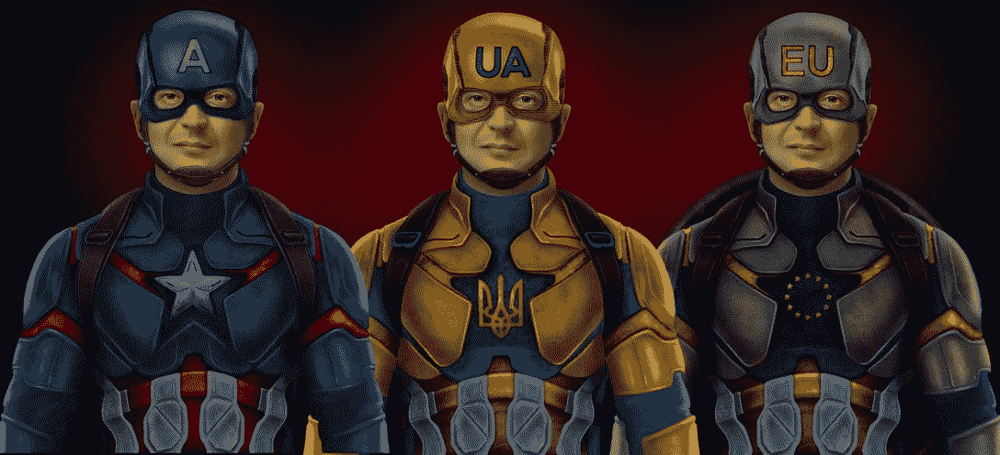
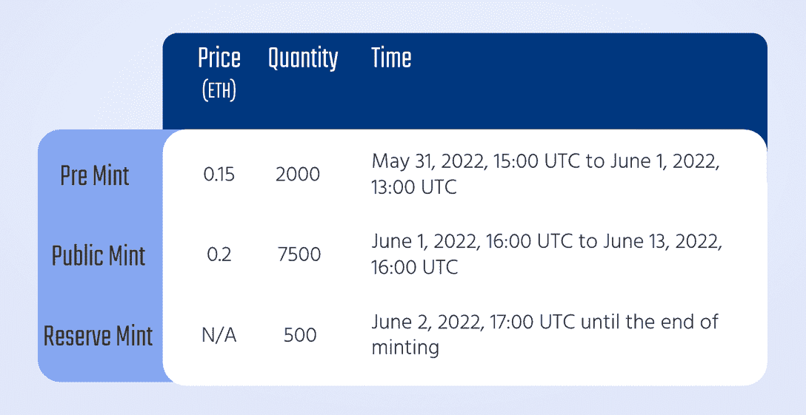
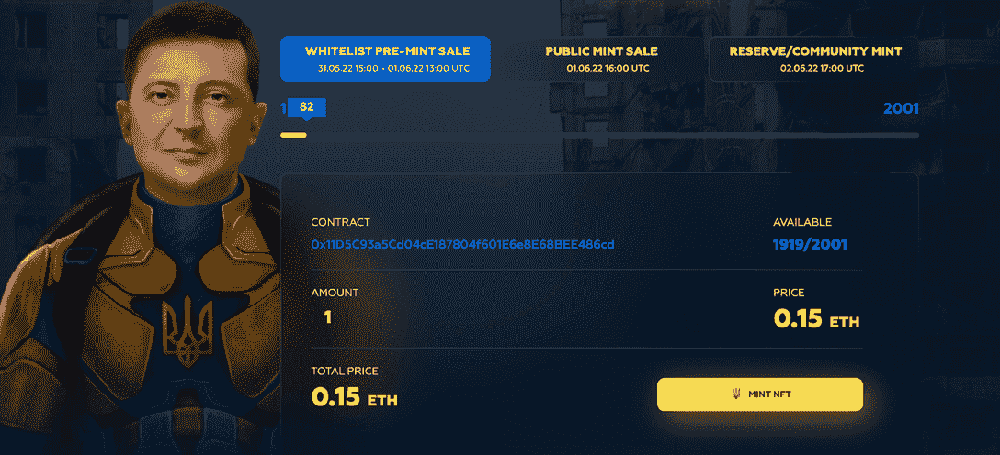

# Zelenskiy NFTs 支持乌克兰难民和人道主义事业

> 原文：<https://web.archive.org/web/https://dappradar.com/blog/zelenskiy-nfts-support-ukrainian-refugees-and-humanitarian-causes>

## 10,000 NFTs，以纪念乌克兰人民的英勇努力

[**泽伦斯基 NFT**](https://web.archive.org/web/20220705011700/https://dappradar.com/ethereum/collectibles/zelenskiy-nft) **收藏旨在支持乌克兰人民反抗俄国入侵的英勇努力。** [**泽伦斯基 NFT**](https://web.archive.org/web/20220705011700/https://dappradar.com/hub/nft-explorer/collection/zelenskiy-nft-iamukraine) **系列为其社区提供了广泛的福利，以回报他们对帮助乌克兰人民的慷慨和奉献。**

**总结**

*   [泽伦斯基 NFT](https://web.archive.org/web/20220705011700/https://dappradar.com/ethereum/collectibles/zelenskiy-nft) 是生活在[以太坊](https://web.archive.org/web/20220705011700/https://dappradar.com/rankings/protocol/ethereum) 区块链上的一万个独特的泽伦斯基 NFT 的集合。
*   该系列在公开销售阶段定价为每 NFT 0.2[ETH](https://web.archive.org/web/20220705011700/https://dappradar.com/hub/token/eth/ETH)，白名单用户可享受 25%的折扣。
*   60%的销售收入将捐给慈善机构。
*   Zelenskiy NFT 的持有者可以访问专属社区、有限的 merch、更广泛的活动、生态系统治理等。
*   该路线图强调了一系列坚实的计划，包括基金会合作伙伴关系、ChariFi dapp 开发、ZELIK token (ZLK)生态系统令牌设计等。

俄罗斯在乌克兰战争的爆发向人们展示了中央银行体系的严重弊端。在战争期间，当人们急需时，电汇需要几天才能到达收款人手中。

相反，在密码世界里只需要几分钟。除了加密汇款之外，许多创建者还利用 [NFTs](https://web.archive.org/web/20220705011700/https://dappradar.com/nft) 来提高意识，参与社区活动，实现支持乌克兰的目标。例如，IamUkraine 工作室推出了[泽伦斯基·NFT 系列](https://web.archive.org/web/20220705011700/https://dappradar.com/ethereum/collectibles/zelenskiy-nft)，让全球关注乌克兰的人道主义事业，并介绍一种有意义的方式来帮助这个国家的人民。

## 什么是泽伦斯基 NFT 系列？

Zelenskiy NFT 是以太坊上一万个独特的 NFT 的集合，旨在让乌克兰人民的英雄努力永垂不朽，并援助乌克兰难民和人道主义事业。该系列以具有生殖属性的艺术表达和泽伦斯基总统的形象为特色。

泽伦斯基·NFT 是第一个奖励收藏者善行的 ChariFi 项目，让持有者在帮助乌克兰的同时获得广泛的社区福利。Zelenskiy NFT 的持有者可以独家访问社区、有限的商业、更广泛的活动、生态系统治理等。

最重要的是，该项目的开发将深度整合社区驱动的元素，让用户交互式地参与其中。这样，用户的慈善影响就会给这个历史事件打上印记。这是一个独特的慈善机会，由 NFTs 促成，它是透明的、不可改变的、激励性的。

## 铸造快照

在撰写本文时，Zelenskiy NFTs 的 Pre-Mint 阶段已经开始运行。此阶段仅适用于成功加入白名单的用户。其他人可以参与公共铸造阶段，从 2022 年 6 月 1 日 16:00 UTC 开始。官方造币页面提供了关于造币的全部细节。铸造快照如下所示:

## NFT 经济学

该团队发起了这个项目，其核心目的是支持慈善事业，因此超过一半的收入将用于慈善事业。具体来说，该项目总共将捐赠 60%。最初的造币厂销售所得资金的 50%捐给乌克兰已建立的慈善机构，这些慈善机构致力于人道主义工作、资源援助、改善被战争毁坏的当地景观等。

首次造币销售所得的 10%将捐给欧盟的慈善机构。比如，很大一部分乌克兰难民目前被安置在欧洲各地的波兰、匈牙利和立陶宛等国。这些资金将向支持此类难民安置的非政府组织提供财政支持。

对于筹集的剩余资金，该项目将把 5%的资金放在流动资金池中，为非金融交易提供稳定性。20%将用于营销活动，以扩大信息和促进对乌克兰的捐赠。最后，10%将资助开发钱包和相关需求，5%将用于团队开发、管理和 Zelenskiy 社区治理中的工作。

将实施 10%的特许权使用费结构，以帮助生态系统的可持续性。具体分配如下:

*   NFT 持有者-2.5%
*   乌克兰和欧盟慈善机构-4%
*   团队-0.5%
*   项目负责人-1%
*   营销-1%
*   发展-1%

## 团结社区做好事的强大路线图

泽伦斯基 NFT 努力为项目创造长期价值，路线图充满了坚实的计划，以帮助其扩张。其中包括全球慈善基金会合作伙伴关系、ChariFi dapp 开发、ZELIK (ZLK)生态系统令牌设计、商品计划启动、公益事业数字服务等。

泽伦斯基 NFT 只是建立慈善生态系统的第一步，但也是至关重要的一步。该项目具有开创性，因为它允许有远见的 NFT 收藏家从第一天起就享受从项目的慈善精神中提取的永久红利。

## 最后的想法

密码在乌克兰抵御俄罗斯入侵的过程中发挥了重要作用。乌克兰政府已经筹集了超过 1 亿美元的秘密捐款，用于从军事装备到药品等各个方面的战争支出。

与此同时，非政府组织正在成为慈善事业的重要力量。值得注意的是，NFTs 可以提供有效的筹款渠道，并以包容性的方式参与社区活动。拥有所有这些特点，泽伦斯基 NFT 促进与社区和合作伙伴的有效关系。最终，该项目可以培养一个奉献的社区，为乌克兰和未来的人道主义事业提供支持。

了解有关 Zelenskiy NFTs 的更多信息:

[网站](https://web.archive.org/web/20220705011700/https://www.zelenskiynft.com/)

[推特](https://web.archive.org/web/20220705011700/https://twitter.com/ZelenskiyNFT_)

[不和](https://web.archive.org/web/20220705011700/https://discord.gg/ZelenskiyNFT)

[电报](https://web.archive.org/web/20220705011700/https://t.me/ZelenskiyNFT_News)

[中等](https://web.archive.org/web/20220705011700/https://www.medium.com/@zelenskiynft)

**免责声明** —这是一篇赞助文章。DappRadar 不认可本页面上的任何内容或产品。DappRadar 旨在提供准确的信息，但读者应该在采取行动之前总是自己做研究。DappRadar 的文章不能被认为是投资建议。

 NewsletterUnsubscribe at any time. [T&Cs](https://web.archive.org/web/20220705011700/https://dappradar.com/terms) and [Privacy Policy](https://web.archive.org/web/20220705011700/https://dappradar.com/privacy-policy)