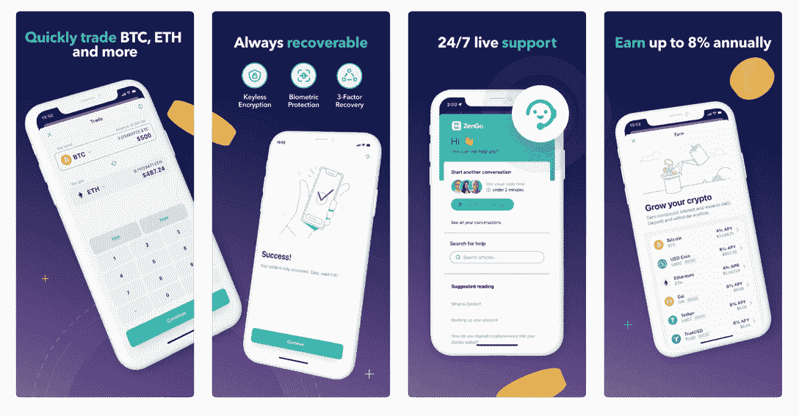
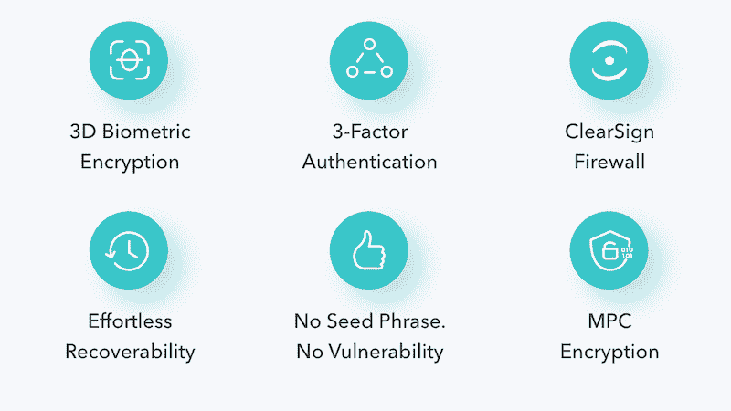
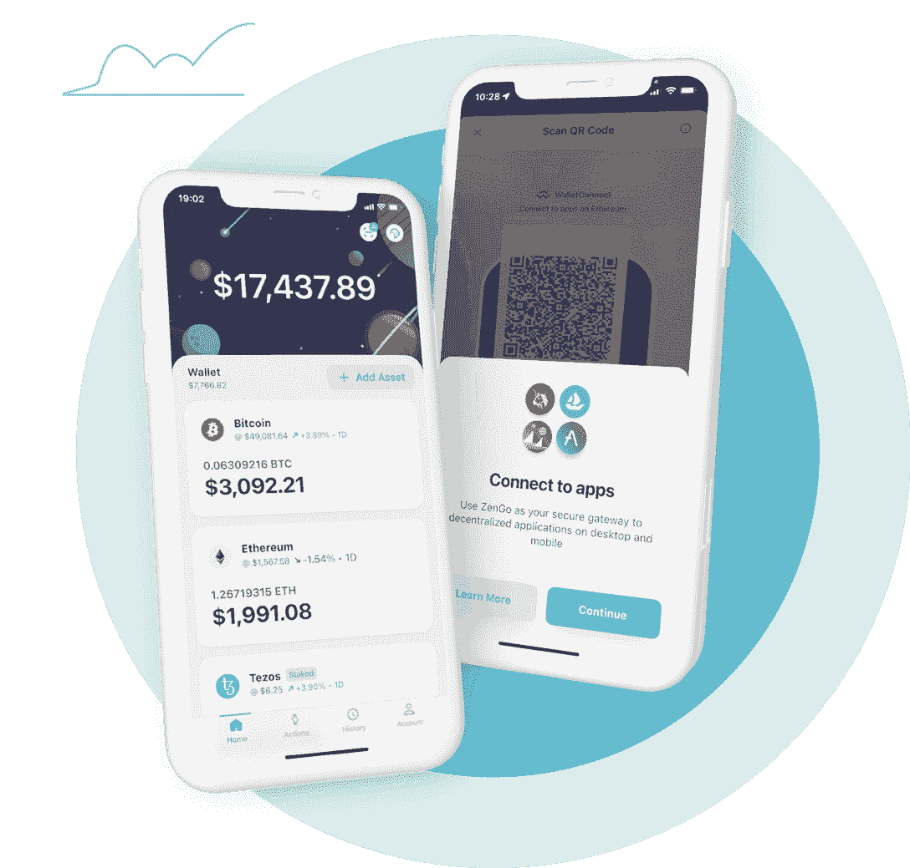

# ZenGo 钱包让用户免除了丢失私钥的焦虑

> 原文：<https://web.archive.org/web/https://dappradar.com/blog/zengo-wallet-frees-users-from-the-anxiety-of-losing-private-keys>

## ZenGo 是一个利用 MPC 加密技术的 Web3 钱包

ZenGo Wallet 希望将用户从丢失或忘记私人钥匙的麻烦中解放出来。Web3 加密钱包 ZenGo 采用三因素安全措施来确保最有效地保护用户的加密资产。

**概要:**

*   ZenGo 是一个一体化的加密钱包，用户可以安全地交易和存储他们的加密资产。
*   它支持 [BTC](https://web.archive.org/web/20221116080620/https://dappradar.com/hub/token/eth/WBTC?from=0x2260fac5e5542a773aa44fbcfedf7c193bc2c599) 、 [ETH](https://web.archive.org/web/20221116080620/https://dappradar.com/hub/token/eth/ETH) 、Dogecoin、Tezos，以及其他 70 多种加密资产。
*   而且，用户可以使用 [ZenGo](https://web.archive.org/web/20221116080620/https://zengo.com/) 访问各种 [DeFi](https://web.archive.org/web/20221116080620/https://dappradar.com/defi) 、 [NFT](https://web.archive.org/web/20221116080620/https://dappradar.com/nft) 、[游戏 dapp](https://web.archive.org/web/20221116080620/https://dappradar.com/rankings/category/games)，包括 [OpenSea](https://web.archive.org/web/20221116080620/https://dappradar.com/multichain/marketplaces/opensea) 、[沙盒](https://web.archive.org/web/20221116080620/https://dappradar.com/multichain/games/the-sandbox)、 [UniSwap](https://web.archive.org/web/20221116080620/https://dappradar.com/multichain/exchanges/uniswap-v3) 、 [Lido](https://web.archive.org/web/20221116080620/https://dappradar.com/multichain/defi/lido) 等等。
*   ZenGo 采用 MPC 技术，使用户能够毫不费力地找回钱包。
*   ZenGo 还有助于保护用户免受加密领域的恶意行为。
*   超过 500，000 名全球用户选择了 [ZenGo](https://web.archive.org/web/20221116080620/https://zengo.com/) 来安全地保存他们的加密资产。

加密货币的目的是将金融资产的所有权放回用户手中，但同时也将安全存储钱包私钥的责任放在用户肩上。但是，这让用户很头疼。

丢失和被盗的种子短语、放错地方的私钥以及其他私钥管理不当导致了大约 1000 亿美元的密码永远丢失。

但是，多亏了 ZenGo，这种压力可以结束了。

## ZenGo 是什么？

ZenGo 是一款简单易用且安全的加密钱包手机应用，可从[应用商店](https://web.archive.org/web/20221116080620/https://apps.apple.com/hk/app/zengo-crypto-bitcoin-wallet/id1440147115?l=en)和 [Google Play](https://web.archive.org/web/20221116080620/https://play.google.com/store/apps/details?id=com.zengo.wallet&shortlink=74480312&c=oth_zengo-website_android_button&pid=oth_zengo-website&af_channel=Other) 下载。利用 MPC 加密技术， [ZenGo](https://web.archive.org/web/20221116080620/https://zengo.com/) Web3 钱包使用户免于失去对其私钥的访问权。

ZenGo 让用户安全轻松地购买、交易和存储加密资产。最重要的是，它允许用户在比特币、以太和 70 多种其他加密资产上赚取高达 8%的利息。以下视频将指导用户如何将 [ZenGo](https://web.archive.org/web/20221116080620/https://zengo.com/) 连接到 WalletConnet，开始体验各种 DeFi、NFT 和游戏 dapps。

[https://web.archive.org/web/20221116080620if_/https://www.youtube.com/embed/UVz6hMlGuls?start=34&feature=oembed](https://web.archive.org/web/20221116080620if_/https://www.youtube.com/embed/UVz6hMlGuls?start=34&feature=oembed)

值得一提的是，如果用户在使用应用程序时遇到问题， [ZenGo 的](https://web.archive.org/web/20221116080620/https://zengo.com/) 24/7 应用内客服随时提供协助。

## 为什么 ZenGo 作为 Web3 钱包脱颖而出？

[加密钱包](/web/20221116080620/https://dappradar.com/blog/best-cryptocurrency-wallets-for-2022/)有各种各样的形状和大小，但是 [ZenGo](https://web.archive.org/web/20221116080620/https://zengo.com/) 通过实现各种独特的功能来区分自己和竞争对手。

ZenGo 采用多重安全措施，确保最有效地保护用户的加密资产。其中包括行业领先的生物特征加密、三因素身份验证(3FA)和多方计算(MPC)加密技术。

多年来，机构保管人一直使用 MPC 加密技术安全地存储着数十亿美元的密码。ZenGo 是最早使用 MPC 的 Web3 钱包之一，只不过它是为日常加密投资者而不是大型机构服务的。

MPC，也称为多方计算，涉及将传统的私钥分成几个独立的“部分”，可以说比单个脆弱点(私钥)更安全。

### ZenGo 如何让用户受益？

那么 [ZenGo 的](https://web.archive.org/web/20221116080620/https://zengo.com/)安全系统具体是如何惠及用户的呢？

使用 MPC，用户仍然可以完全控制他们的密码，而不依赖于私钥。因此，只要用户的钱包得到备份，他们就可以通过三步验证过程轻松恢复密码。

此外， [ZenGo](https://web.archive.org/web/20221116080620/https://zengo.com/) 通过 ClearSign 将用户成为不当行为受害者的几率降至最低，clear sign 就像一个 Web3 防火墙。与 ClearSign 整合后， [ZenGo](https://web.archive.org/web/20221116080620/https://zengo.com/) 可以通过签署或批准有风险的智能合约交易来防止用户丢失 cryptos 和 NFT。

ClearSign 的强大之处在于，在授权第三方访问用户的加密钱包之前，它提供了对用户正在签署的内容的前所未有的洞察。因此，它可以保护加密资产免受恶意网络钓鱼诈骗、不可信的 dapps 等攻击。

用户可以通过此链接了解更多关于 [ZenGo 的](https://web.archive.org/web/20221116080620/https://zengo.com/)行业领先的安全标准[。](https://web.archive.org/web/20221116080620/https://zengo.com/security)

## 用户喜爱 ZenGo 是因为它出色的体验

被 G2 评为[最高满意度](https://web.archive.org/web/20221116080620/https://www.g2.com/categories/cryptocurrency-wallets#grid)的领先加密钱包， [ZenGo](https://web.archive.org/web/20221116080620/https://go.zengo.com/uCxL/qfr1517k) 为用户带来增强的加密交易体验，同时确保他们的资产安全。

目前， [ZenGo](https://web.archive.org/web/20221116080620/https://zengo.com/) 已经赢得了超过 50 万全球用户的信任，而且这个数字还在不断增长。此外，超过 5000 名 Android 用户在 Google Play 上给 [ZenGo](https://web.archive.org/web/20221116080620/https://zengo.com/) 打了 4.7 颗星，这是该产品受欢迎的又一证明。

想要安全地交易和保存加密资产，赚取高达 8%的利息，并探索 NFTs、DeFi 和游戏 dapps？你现在可以从[应用商店](https://web.archive.org/web/20221116080620/https://apps.apple.com/hk/app/zengo-crypto-bitcoin-wallet/id1440147115?l=en)和 [Google Play](https://web.archive.org/web/20221116080620/https://play.google.com/store/apps/details?id=com.zengo.wallet&shortlink=74480312&c=oth_zengo-website_android_button&pid=oth_zengo-website&af_channel=Other) 下载自己的 [ZenGo](https://web.archive.org/web/20221116080620/https://zengo.com/) 钱包。

查找更多关于 ZenGo 的信息:

[网站](https://web.archive.org/web/20221116080620/https://zengo.com/)

[推特](https://web.archive.org/web/20221116080620/https://www.twitter.com/zengo)

[电报](https://web.archive.org/web/20221116080620/https://t.me/zengo)

[中等](https://web.archive.org/web/20221116080620/https://www.medium.com/zengo)

[Youtube](https://web.archive.org/web/20221116080620/https://youtube.com/zengo)

**免责声明** —这是一篇赞助文章。DappRadar 不认可本页面上的任何内容或产品。DappRadar 旨在提供准确的信息，但读者应该在采取行动之前总是自己做研究。DappRadar 的文章不能被认为是投资建议。