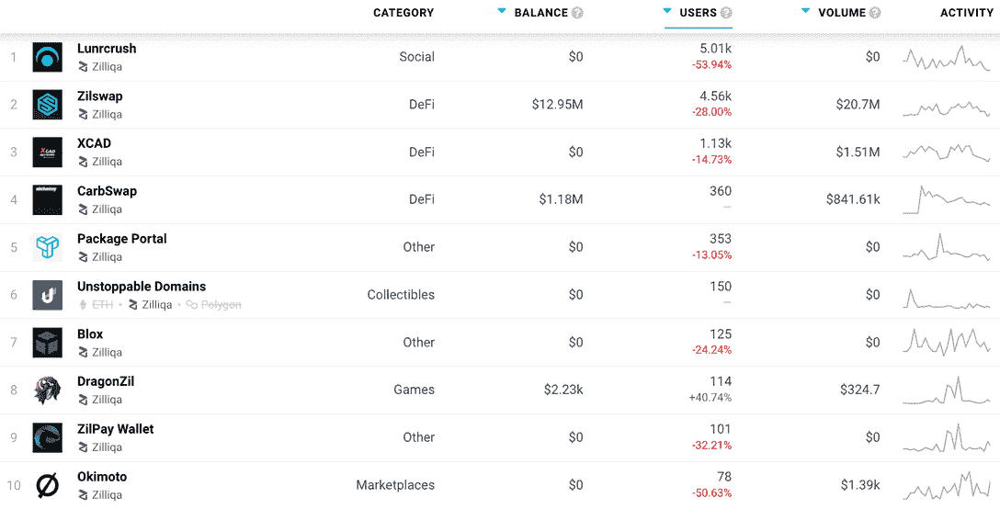
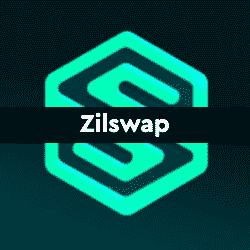

# Zilliqa 区块链 Dapps 现已在 DappRadar 上市

> 原文：<https://web.archive.org/web/https://dappradar.com/blog/zilliqa-blockchain-dapps-now-listed-on-dappradar>

## 通往区块链世界的门户，让用户友好的 dapps 变得更加容易

DappRadar 很高兴地宣布 [**与 Zilliqa 区块链**](https://web.archive.org/web/20221008201924/https://dappradar.com/rankings/protocol/zilliqa) **及其 dapps 生态系统的整合。DappRadar 每月 100 万的网站访问者现在可以通过 Zilliqa dapp 排名来分析哪些 dapp 吸引了最多的交易量，独特的用户钱包，或者处理了最多的交易。这样，每个人都可以了解哪些 dapps 和令牌在 Zilliqa 上构建了稳固的社区和价值。**

Zilliqa 在 2017 年推出了其[高通量公共区块链](https://web.archive.org/web/20221008201924/https://dappradar.com/rankings/protocol/zilliqa)平台，旨在扩展每秒数千笔交易，并增加了对 Web 3.0 效率、信任和透明度的关注。区块链无法快速扩展交易，这促使 Zilliqa 设计了一种不同的架构。通过将网络分成多个部分，他们推出了世界上第一个公共区块链分片架构，帮助满足了全球扩展需求。

## Win 4 万 ZIL

为了庆祝 Zilliqa 网络 dapps 与 DappRadar】的整合，Zilliqa 将赠送 40，000 枚 ZIL 代币。你所需要做的就是在[官方 DappRadar Twitter](https://web.archive.org/web/20221008201924/https://twitter.com/DappRadar/status/1526941934408851464) 上的整合公告评论中喜欢、转发并标记你最喜欢的 Zilliqa dapp，就有机会获胜！此外，如果你想了解更多关于 Zilliqa 的信息，那么在 2022 年 6 月 1 日，我们将在 UTC 时间下午 3 点与他们在 Discord 举办一场 [AMA。](https://web.archive.org/web/20221008201924/https://discord.gg/4QjGPh97)

ZIL 是 Zilliqa 区块链的本地令牌，旨在支持和扩展 dapps。持有人也可以使用 ZIL 支付产品和服务，购买和出售非功能性交易，等等。此外，下注 ZIL 是分散 Zilliqa 网络赢得奖励的好方法。

## Zilliqa dapp 在 DappRadar 上的排名

在发布时， [DappRadar 将在 Zilliqa 网络](https://web.archive.org/web/20221008201924/https://dappradar.com/rankings/protocol/zilliqa)上跟踪多个类别的 15 个 dapp，包括 DeFi 和交易所、NFT 收藏、市场和游戏，随着生态系统的扩展，未来将会有更多的 dapp。

[Lunrcrush](https://web.archive.org/web/20221008201924/https://dappradar.com/zilliqa/social/lunrcrush) 收集社交媒体上比特币、数千枚替代币和交易所的活动，并收集有影响力的人发布的信息。然后，它把它提炼成一小块一小块的。你用得越多，它就变得越聪明，知道你对什么感兴趣或不感兴趣。

Zilswap 是 Zilliqa 区块链的本地 DeFi 中心，为 ZRC-2 令牌交换提供完全分散的协议。ZRC 新协议代币和 ZIL 代币的持有人也可以向流动性池捐款，并从每次掉期交易中收取 0.3%的费用。

[<picture></picture>](https://web.archive.org/web/20221008201924/https://dappradar.com/rankings/protocol/zilliqa)

[Explore Zilliqa Dapps on DappRadar](https://web.archive.org/web/20221008201924/https://dappradar.com/rankings/protocol/zilliqa)

XCAD Network 是一个内容创作者令牌化平台，在这里你可以赚取和交易你喜欢的创作者的令牌。用户可以使用 XCAD 插件直接在 Youtube 上观看标记化创作者的内容，并获得他们的原生创作者令牌。

[Package Portal 旨在通过 Web3 平台在交付时重新连接品牌和消费者](https://web.archive.org/web/20221008201924/https://dappradar.com/zilliqa/other/package-portal),该平台将反馈标记化，以帮助开展忠诚度活动和购买后参与。Package Portal 不是像 big-tech 那样挖掘用户的数据，而是让用户通过简单地对他们的在线购买体验进行评级并完成调查来进行挖掘。

我们鼓励社区在 DappRadar now 上深入探索[Zilliqa dapps 的全部内容。](https://web.archive.org/web/20221008201924/https://dappradar.com/rankings/protocol/zilliqa)

## 面向 dapp 开发者的 Zilliqa

dappRadar 邀请 Dapp 开发者[向 DappRadar](https://web.archive.org/web/20221008201924/https://dappradar.com/submit-dapp) 提交他们的 Dapp，为 Zilliqa 生态系统在世界 Dapp 商店上创造更多的可见性。那些有兴趣了解更多关于 Zilliqa 及其可能性的人可以从 [Zilliqa 开发者文档](https://web.archive.org/web/20221008201924/https://www.zilliqa.com/our-platform)开始。

[<picture></picture>](https://web.archive.org/web/20221008201924/https://dappradar.com/zilliqa/social/lunrcrush)[<picture></picture>](https://web.archive.org/web/20221008201924/https://dappradar.com/rankings/protocol/zilliqa)[<picture></picture>](https://web.archive.org/web/20221008201924/https://dappradar.com/zilliqa/defi/zilswap) NewsletterUnsubscribe at any time. [T&Cs](https://web.archive.org/web/20221008201924/https://dappradar.com/terms) and [Privacy Policy](https://web.archive.org/web/20221008201924/https://dappradar.com/privacy-policy)