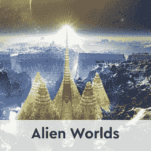
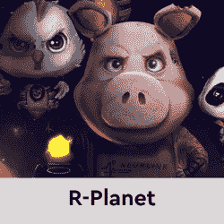
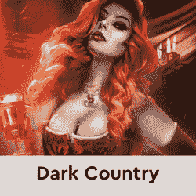

# Zynga 对 2022 年的 NFT 游戏有着宏伟的计划

> 原文：<https://web.archive.org/web/https://dappradar.com/blog/zynga-has-big-plans-for-nft-gaming-in-2022>

## 移动游戏巨头在比赛中脱颖而出

**移动游戏巨头 Zynga 已经宣布了针对区块链和 NFT 游戏的几大计划******。这家美国社交游戏开发商曾开发了《Farmville》和《黑手党战争》(Mafia Wars)等热门游戏，并披露了员工扩充、收购和可玩游戏的情况。然而，他们还没有宣布他们的区块链游戏的任何标题。****

 **在接受 Axios 采访时，Zynga 宣布计划在 2022 年底之前，从目前的 15 名团队成员增加到 100 人，组建新的区块链游戏团队。一位创意总监和 tokenomics 设计师在名单上名列前茅，因为 Zynga 开始试探他们确定无疑想要参与的空间。

围绕 NFT 注入区块链游戏的兴趣浪潮正在达到顶峰，因为它为玩家带来了使用 NFTs 将游戏中的对象与唯一 id 联系起来的能力。这些物品可以在公开市场上交易，允许玩家买卖，增加了现实世界的经济层面。虽然一些评论员和游戏玩家认为 NFT 只是游戏公司压榨他们利润的另一种方式，但其他人，可以说是对这项技术有更深入了解的人，看到了潜在的无数好处。大部分是给玩家的。Zynga 于 2009 年 6 月在脸书推出了其最知名的游戏 FarmVille，仅在六周内就达到了 1000 万日活跃用户，并于 2011 年 12 月 16 日在纳斯达克开始交易，代码为 ZNGA。2022 年 1 月，拥有 [Rockstar Games](https://web.archive.org/web/20221208171114/https://en.wikipedia.org/wiki/Rockstar_Games) 和 [2K](https://web.archive.org/web/20221208171114/https://en.wikipedia.org/wiki/2K_(company)) 的公司 [Take-Two Interactive](https://web.archive.org/web/20221208171114/https://en.wikipedia.org/wiki/Take-Two_Interactive) 宣布有意以 127 亿美元收购 Zynga。这笔交易还有待确认。

[<picture></picture>](https://web.archive.org/web/20221208171114/https://dappradar.com/wax/games/alien-worlds)[<picture></picture>](https://web.archive.org/web/20221208171114/https://dappradar.com/wax/games/r-planet)[<picture></picture>](https://web.archive.org/web/20221208171114/https://dappradar.com/wax/games/dark-country)

## 计划变更

Zynga 2021 年 NFT 计划的消息在这个游戏巨头周围引起了轰动。不过，猜测主要围绕 Zynga 将 NFTs 整合到其最受欢迎的游戏中的想法，如 Farmville 或 Words with Friends。然而，Zynga 表示，目前的计划是将其 NFT 游戏创意与其重磅产品分开。提到他们不想给玩家一些他们没有要求的东西来迷惑他们现有的游戏。

此外，Zynga 以吸收其他游戏制作工作室和游戏进入其组织而闻名，他们没有计划阻止这种事情。此外，这些团队将有权选择加入或退出任何 NFT 计划。此举可能是由 Team17、电子艺界和育碧等游戏公司抗议 NFTs 和令牌组学的传言推动的。

已经确定了明确的投资者受众，他们正在寻找像产量农业这样的机制，作为对寻求丰富的沉浸式游戏的玩家的一种姿态。Zynga 表示，其早期的区块链游戏将面向那些熟悉区块链游戏类型和 NFT 市场的人。

2021 年 12 月，作为《刺客信条》和汤姆·克兰西的《幽灵行动》等 AAA 级游戏的发行商，育碧发布了育碧石英。Tezos 区块链上运行的 NFT 市场平台允许玩家以 NFT 的形式购买游戏中的物品，他们可以拥有、出售和交易这些物品。虽然[育碧的声明受到了相当多的反对](https://web.archive.org/web/20221208171114/https://dappradar.com/blog/ubisoft-bringing-ghost-recon-game-nfts-to-tezos)，但他们已经声明他们致力于向玩家提供这项技术。

## 从玩到赚推动区块链的采用

根据[DappRadar 2022 年 1 月 Dapp 行业报告](/web/20221208171114/https://dappradar.com/blog/dapp-industry-report-january-2022/),[游戏类别](https://web.archive.org/web/20221208171114/https://dappradar.com/rankings/category/games)在围绕 NFTs 和加密货币的负面消息中显示出积极迹象，占 1 月份连接到 dapps 的所有用户的 52%。随着更多 GameFi dapps 的出现，为用户提供游戏化的金融工具，T4 的游戏赚钱运动不会消失，看起来只会加剧。

尽管围绕 NFTs 的所有负面影响已经成为传统游戏中更重要的一部分。这位作者认为，严肃的游戏玩家应该能够理解买卖游戏中物品的想法，而不是一次性支付代码。当然，在多年来游戏公司从根本上在一个非常垄断的环境中勒索玩家之后，怀疑是如此强烈。

然而，有明确的迹象表明，如果游戏巨头们想进入 Web3，他们最好先学习 Web3 的规则。主要是协作、社区和平等感。

 NewsletterUnsubscribe at any time. [T&Cs](https://web.archive.org/web/20221208171114/https://dappradar.com/terms) and [Privacy Policy](https://web.archive.org/web/20221208171114/https://dappradar.com/privacy-policy)

***以上不构成投资建议。此处给出的信息仅供参考。请行使尽职调查，做你的研究。作者持有 ETH、BTC、AGIX、HEX、LINK、GRT、CRO、OMI、不可变 X、GALA、AVASTR、GMEE、CUBE、RADAR、FLOW、FTM、BNB、SPS、WRLD、ATOM 和 ADA。*****